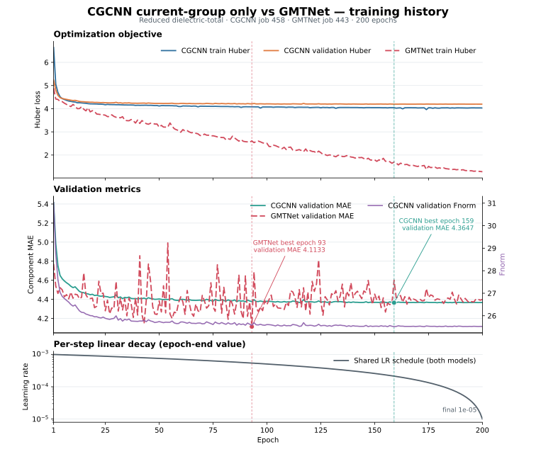
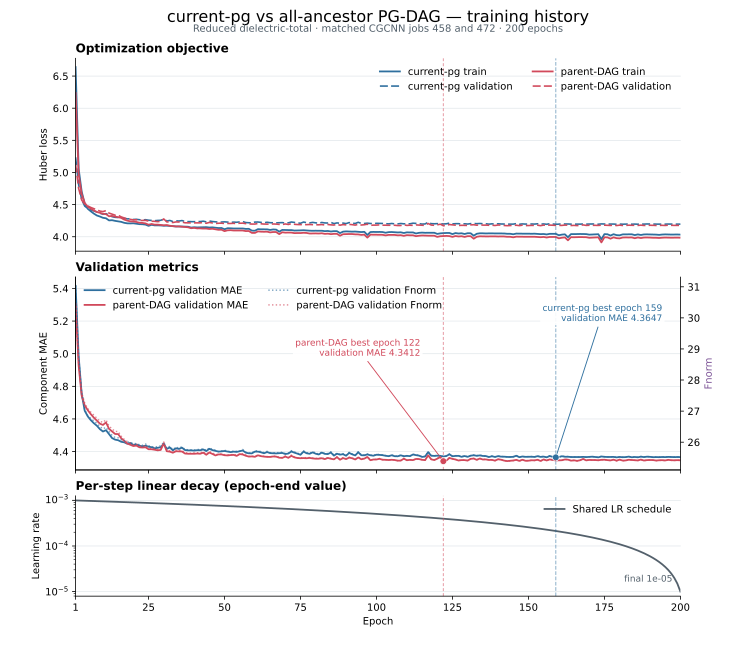
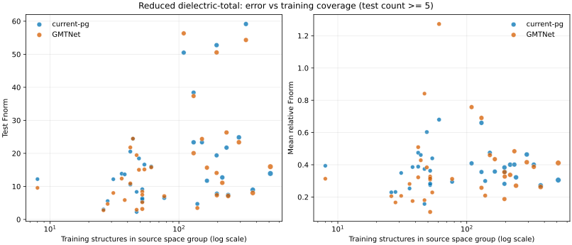

# Reduced dielectric-total: current-pg, all-ancestor PG-DAG, DPA4, and GMTNet

## Protocol

> Historical-width note: the reported full-PG runs predate the 2026-09-22 change from
> `[4, 1, 1, 1, 1]` to `[8, 2, 2, 2, 2]`. Their metrics remain valid for those immutable
> checkpoints, but they are not results for the current 56-component full-PG configuration.

- Dataset: `curated_reduced_total__dielectric`, 6,315 structures.
- Frozen splits: 5,001 train / 637 validation / 677 test.
- Dataset SHA-256: `6cfefc7c04734ceb4c7873e5aaa7d483251ea909a378e55034414d53f9110963`.
- Source-retained point groups: `2/m`, `mm2`, `mmm`, `4/mmm`, `-3m`, `-43m`, `m-3m`.
- DPA4 model (current-group only): `B+A+PGE+R`, `full_o3` adaptation/readout, `full_pg`
  experts; each sample activates only its detected current point-group expert.
- CGCNN full-PG model (current-group only): additive (non-DPA4) branch using GMTNet's fixed 92-component JARVIS CGCNN
  node descriptor, a learned `92 -> 128` even-scalar embedding, and the same
  `B+A+PGE+R/full_pg/full_o3` tensor architecture. Its expert registry is the deterministic union of
  canonical train/validation/test symmetries: `2/m`, `mm2`, `mmm`, `4/mmm`, `3m`, `-3m`, `6/mmm`,
  `-43m`, `m-3m`.
- CGCNN optimization follows GMTNet: Cartesian Huber loss (`delta=1`), AdamW, 200 full epochs,
  per-step linear learning-rate decay from `1e-3` to `1e-5`, and best-checkpoint selection by
  validation component MAE. The best checkpoint (epoch 159, validation MAE `4.3647098541`) was
  reloaded before test inference.
- CGCNN PG-parent-DAG uses the same feature cache, architecture, optimizer, split, seed, batch size,
  200-epoch schedule, and checkpoint rule. Its only intended model change is routing: each sample
  activates its current point-group expert plus every transitive parent in the frozen 32-group/
  80-cover-edge class DAG, with deduplicated equal-weight fusion. Test samples activate 1--11 experts
  (mean `5.2009`). Its best checkpoint is epoch 122 at validation MAE `4.3411664963`.
- GMTNet model: pinned official dielectric implementation.
- All rows use the same ordered 677 test IDs. The strict comparator additionally verifies symmetric
  target eigenvalue equivalence with `atol=2e-4`, `rtol=2e-5`.

## CGCNN current-group-only vs GMTNet training history

The curves come directly from the accepted 200-epoch summaries for CGCNN job 458 (SHA-256
`7070c4f66d57d5573b58d95a3219f780b0b776a662eab11426903544966fb536`) and GMTNet job 443
(SHA-256 `b4ded0b3696e87406fef4046b56685c0ae4d21b9bd5f9f3bd7cb1354abd9e6ae`). Dashed markers show
their validation-MAE-selected checkpoints at epochs 159 and 93. GMTNet's runner records training
Huber loss, validation MAE, and learning rate, but not validation loss or validation Fnorm; therefore
only its recorded series are overlaid. No metric was recomputed for this plot.

## CGCNN current-pg vs all-ancestor PG-DAG training history

This matched overlay uses accepted current-pg job 458 and parent-DAG job 472. Both summaries contain
200 contiguous epochs and the identical per-step learning-rate schedule. The parent-DAG run reaches
a slightly lower selected validation MAE (`4.3412` versus `4.3647`) and selects epoch 122 rather than
159. The figure shows only directly recorded train/validation Huber loss, validation MAE/Fnorm, and
learning rate; it does not derive or smooth any series. Source summary SHA-256 values are
`7070c4f66d57d5573b58d95a3219f780b0b776a662eab11426903544966fb536` and
`7c88bd2e7fd1eb9dd05f1dffe3f8f6cd05b5b73d06a218bf5d38f96fb9c37b50`.

## Metrics

- RMSE: component-wise root mean squared error over the full test tensors.
- Fnorm: mean per-sample Frobenius norm of the tensor error.
- EwT x%: percentage of samples satisfying
  `Fnorm(prediction - target) / (Fnorm(target) + 1e-5) < x%`.

## Results

| Model | RMSE ↓ | Fnorm ↓ | EwT 25% ↑ | EwT 10% ↑ | EwT 5% ↑ |
|---|---:|---:|---:|---:|---:|
| DPA4 B+A+PGE+R full_pg (current-group only) | 26.166445 | 31.539129 | 12.26% | 2.51% | 1.03% |
| GMTNet | **25.449894** | **19.169209** | **53.03%** | **18.32%** | **7.39%** |
| CGCNN B+A+PGE+R full_pg (current-group only) | 26.186150 | 19.496103 | 40.77% | 10.64% | 4.28% |
| CGCNN B+A+PGE+R full_pg (PG parent-DAG all ancestors) | 26.144173 | 19.204304 | 41.51% | 11.52% | 4.87% |

GMTNet is best on every reported test metric under this frozen protocol. Relative to the DPA4 row,
the additive CGCNN full-PG branch substantially improves Fnorm and every EwT threshold, while its
component RMSE is slightly higher (`+0.019705`). DPA4's best checkpoint was epoch 12
(`validation_loss=0.9333040631`); GMTNet's was epoch 93 (`validation_mae=4.1132789`); CGCNN's was
epoch 159 (`validation_mae=4.3647098541`) after completing all 200 epochs.

Relative to the matched CGCNN current-pg run, all-ancestor routing improves every reported test
metric: RMSE decreases by `0.041978`, Fnorm by `0.291799`, while EwT25/EwT10/EwT5 increase by
`0.74`/`0.89`/`0.59` percentage points. The gains are consistent but small: the parent-DAG model
remains behind GMTNet on all five metrics, although its Fnorm is only `0.035095` higher. This is
evidence for a modest benefit from class-ancestor expert sharing under the matched protocol, not a
large accuracy breakthrough. Because all ancestors are activated from class membership alone, the
result does not establish that those ancestors are realizable structural parents for each material.

## Errors by source space group

Job 463 joins both prediction files to the frozen dataset by exact record ID and groups by the
curated **source space-group number**. All 69 space groups represented in the 677-sample test set
are retained in the [complete table](reduced_dielectric_total_space_group_errors.md); the
[machine-readable CSV](reduced_dielectric_total_space_group_errors.csv) additionally contains
relative Fnorm, EwT10/EwT5, and paired current-pg-minus-GMTNet deltas.

The primary correlation cohort contains the 35 space groups with at least five test structures
(621/677 test samples). The sensitivity cohort contains the 19 groups with at least ten test
structures (516/677 samples). Correlations are unweighted across space groups and use
`log10(train_count)`.

| Cohort | Model | Error | Spearman rho | p | Pearson r | p |
|---|---|---|---:|---:|---:|---:|
| test >= 5 | current-pg | RMSE | 0.4260 | 0.0107 | 0.3590 | 0.0342 |
| test >= 5 | current-pg | Fnorm | 0.3271 | 0.0551 | 0.3652 | 0.0310 |
| test >= 5 | current-pg | relative Fnorm | 0.1290 | 0.4603 | 0.0532 | 0.7617 |
| test >= 5 | GMTNet | RMSE | 0.4880 | 0.0029 | 0.3869 | 0.0217 |
| test >= 5 | GMTNet | Fnorm | 0.3782 | 0.0251 | 0.3781 | 0.0251 |
| test >= 5 | GMTNet | relative Fnorm | 0.3002 | 0.0798 | 0.0875 | 0.6172 |
| test >= 10 | current-pg | RMSE | 0.1352 | 0.5810 | 0.0650 | 0.7915 |
| test >= 10 | current-pg | Fnorm | 0.1387 | 0.5711 | 0.1375 | 0.5745 |
| test >= 10 | current-pg | relative Fnorm | -0.1273 | 0.6035 | -0.2702 | 0.2633 |
| test >= 10 | GMTNet | RMSE | 0.1835 | 0.4521 | 0.0991 | 0.6866 |
| test >= 10 | GMTNet | Fnorm | 0.1431 | 0.5589 | 0.1340 | 0.5845 |
| test >= 10 | GMTNet | relative Fnorm | -0.0342 | 0.8893 | -0.2954 | 0.2196 |

This does **not** support the simple hypothesis that more training structures per space group
automatically reduce test error. In the primary cohort the absolute errors instead increase with
training count, while the scale-normalized error has no significant relationship; all associations
also disappear under the stricter test-count threshold. Absolute error is strongly associated with
the space group's mean target norm (Spearman rho `0.8955/0.9185` for current-pg RMSE/Fnorm and
`0.8081/0.8084` for GMTNet, all `p < 1e-4`). The observed training-count trend is therefore mainly a
group-difficulty/target-scale and cohort-composition diagnostic, not evidence that additional data
hurts learning or that data volume alone explains the model gap.

Among the 35 primary-cohort groups, current-pg has lower Fnorm than GMTNet in 12 and GMTNet in 23.
The largest current-pg advantages are SG 74 (`-11.12` Fnorm, 5 test), SG 11 (`-5.83`, 23 test),
SG 62 (`-4.59`, 25 test), SG 166 (`-3.96`, 24 test), and SG 164 (`-2.08`, 71 test). The largest
GMTNet advantages are SG 141 (`+7.77`, 6 test), SG 129 (`+5.31`, 20 test), SG 216 (`+4.84`, 27
test), SG 58 (`+4.16`, 5 test), and SG 136 (`+3.44`, 9 test), where positive deltas mean larger
current-pg error. Small-test groups should be treated as hypotheses for targeted resampling rather
than stable rankings.

## Acceptance evidence

- DPA4 Slurm job 451: 64/64 recovery partitions; zero-failure JUnit; 677 predictions.
- GMTNet Slurm job 443: zero-failure JUnit; 677 predictions.
- CGCNN Slurm job 458: summary status `passed`; 200/200 epochs; zero-failure JUnit
  (`tests=1`, `failures=0`, `errors=0`, `skipped=0`); 677 predictions.
- Strict three-model comparator Slurm job 459: status `passed`; 677 identical ordered IDs; symmetric
  target eigenvalue-equivalence gate passed.
- Static all-ancestor PG-DAG Slurm job 472: status `passed`; 200/200 epochs; best epoch 122; JUnit
  1/0/0/0; exact 5,001/637/677 splits; 677 predictions; routing identity and DAG asset hash verified.
- Strict four-model comparator Slurm job 473: status `passed`; all four prediction files contain the
  identical ordered 677 IDs and pass the symmetric target eigenvalue-equivalence gate.
- DPA4 prediction SHA-256:
  `a8745811e2f67a5810a2b862336898b0fb93049fb6905afaa58445a4e67436f5`.
- GMTNet prediction SHA-256:
  `484a4aa4137779013387f1470e5f9278d4f02c12523512c698128c7b4ca9d64c`.
- CGCNN prediction SHA-256:
  `ee22d732b810a1d75c442a29425bdbfc4c0c1c60a89675cdadf9cbaf7a1c48b4`.
- CGCNN summary SHA-256:
  `7070c4f66d57d5573b58d95a3219f780b0b776a662eab11426903544966fb536`.
- Parent-DAG prediction and summary SHA-256:
  `ecfd870541b8b43bf913b01d48e92bf8396fb6ce67f06fac9c4cb21d960cc6e2` and
  `7c88bd2e7fd1eb9dd05f1dffe3f8f6cd05b5b73d06a218bf5d38f96fb9c37b50`.
- Three-model comparison JSON SHA-256:
  `52091690cec9b61299a35a2f40acf4150f043f4bd7aed6ab338da4957c63e174`.
- Three-model comparison table SHA-256:
  `2a4ef5b8ef1fe82daa8a30e3389708f60e327cf93771e009fe96feb24fad07e7`.
- Four-model comparison JSON and table SHA-256:
  `d270599d45deaf2e98d51177c0b1c2f4eb47f0ae62fa7d5ed5b27c7a67fb2d58` and
  `2f6a02468f39eae24d280dcdae16f2e14c5121bc2b1a4eade9c76b9aae68d8e2`.
- Parent-DAG routing-comparison SVG/PNG SHA-256:
  `8d74a18cc87b9de49fb86fa7f037305a12995975abcfdb286ef7c2f849294226` and
  `c6499e9662e8f2d5eae7dca7c25872824d57739fa39d072b0024de7716d3e542`.
- Space-group analysis Slurm job 463: 69 observed test space groups and exact frozen counts
  5,001/637/677; stderr contains only known TorchScript annotation warnings and no traceback.
- Space-group JSON/CSV/Markdown/SVG SHA-256:
  `abebd7a9b07b68c0b257e4b2b97cef0f48ea35ee080ed344cf783a6460c1e474`,
  `f0e9e4b9c00ecbe5856a5400a6bed445cb046908954472d4ab423774cbd8da66`,
  `ef37f3bfcec074a433344e8cbda304e431bafc5eca0b9921f8a08dbbf8a04da2`, and
  `c052615fbfb7bc0d415a92ec492f7f3b4b1df8ee27dc81e84dd6bee4e8e89519`.

Generated evidence remains under ignored `results/reduced-benchmark/` on Guqq. Metric definitions
follow the [GMTNet paper](../ref/GMTNet.pdf).
