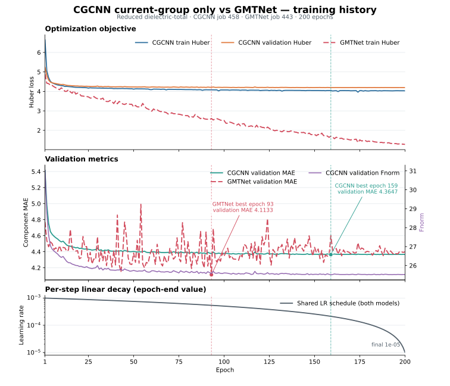
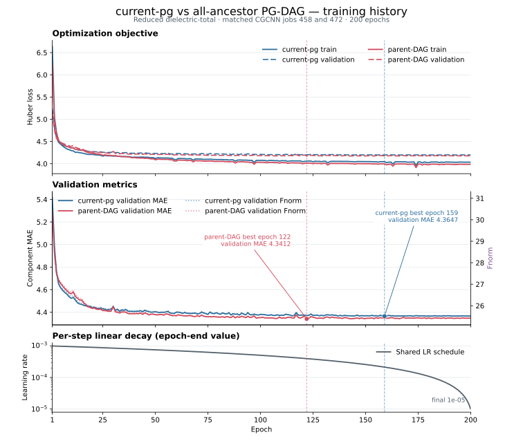
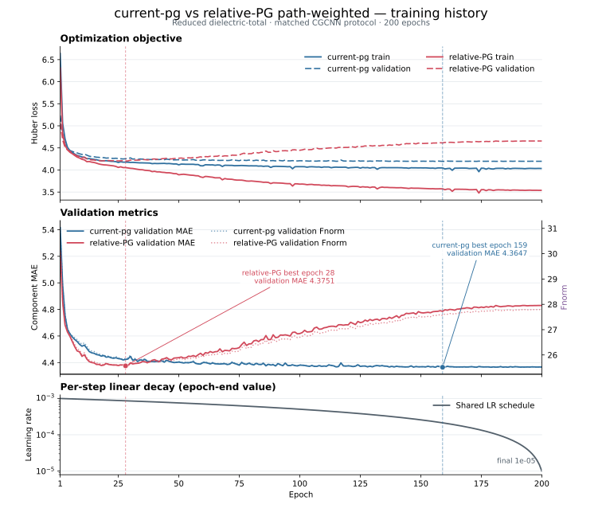
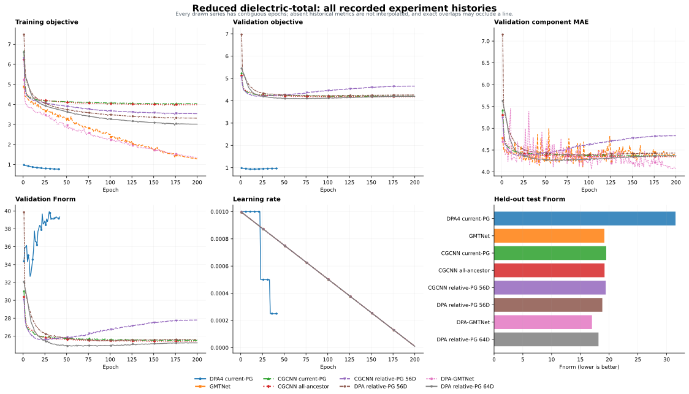
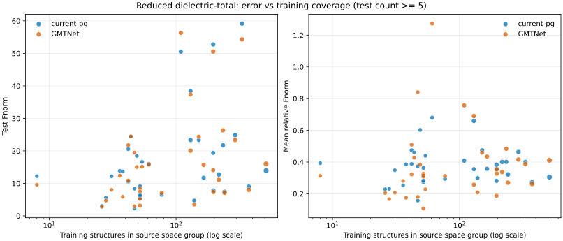

# Reduced dielectric-total: current-pg, parent-DAG variants, DPA4, and GMTNet

## Protocol

> Width note: the DPA4, CGCNN current-pg, and static all-ancestor full-PG runs predate the
> 2026-09-22 change from `[4, 1, 1, 1, 1]` to `[8, 2, 2, 2, 2]`. The relative-PG row is the first
> accepted result for the current 56-component configuration. Consequently, comparisons with the
> three historical full-PG rows measure the combined width-and-routing change, not a routing-only
> ablation.

- Dataset: `curated_reduced_total__dielectric`, 6,315 structures.
- Frozen splits: 5,001 train / 637 validation / 677 test.
- Dataset SHA-256: `6cfefc7c04734ceb4c7873e5aaa7d483251ea909a378e55034414d53f9110963`.
- Source-retained point groups: `2/m`, `mm2`, `mmm`, `4/mmm`, `-3m`, `-43m`, `m-3m`.
- DPA4 model (current-group only): `B+A+PGE+R`, `full_o3` adaptation/readout, `full_pg`
  experts; each sample activates only its detected current point-group expert.
- CGCNN full-PG model (current-group only): additive (non-DPA4) branch using GMTNet's fixed 92-component JARVIS CGCNN
  node descriptor, a learned `92 -> 128` even-scalar embedding, and the same
  `B+A+PGE+R/full_pg/full_o3` tensor architecture. Its expert registry is the deterministic union of
  canonical train/validation/test symmetries: `2/m`, `mm2`, `mmm`, `4/mmm`, `3m`, `-3m`, `6/mmm`,
  `-43m`, `m-3m`.
- CGCNN optimization follows GMTNet: Cartesian Huber loss (`delta=1`), AdamW, 200 full epochs,
  per-step linear learning-rate decay from `1e-3` to `1e-5`, and best-checkpoint selection by
  validation component MAE. The best checkpoint (epoch 159, validation MAE `4.3647098541`) was
  reloaded before test inference.
- CGCNN PG-parent-DAG uses the same feature cache, architecture, optimizer, split, seed, batch size,
  200-epoch schedule, and checkpoint rule. Its only intended model change is routing: each sample
  activates its current point-group expert plus every transitive parent in the frozen 32-group/
  80-cover-edge class DAG, with deduplicated equal-weight fusion. Test samples activate 1--11 experts
  (mean `5.2009`). Its best checkpoint is epoch 122 at validation MAE `4.3411664963`.
- CGCNN relative-PG parent-DAG uses the current 56-component hidden irreps and the same frozen data,
  optimizer, seed, batch size, 200-epoch schedule, and validation-MAE checkpoint rule. The offline DAG
  supplies every maximal current-PG-to-root path. Within each path, relative-position point-group
  edge residuals produce stick-breaking weights; path priors are normalized by node count, and
  duplicate destination PGs are summed then normalized. Test parent coverage is `86.71%`, with mean
  `4.2009` candidate parents and `3.6765` maximal paths per sample. Its best checkpoint is epoch 28 at
  validation MAE `4.3751330376`.
- DPA relative-PG uses the identical 56-component expert/router and GMTNet optimization protocol,
  replacing only the input representation with frozen DPA4 features. Per batch it groups structures
  by expert, executes each expert once over its collated sub-batch, and launches the 15 active expert
  buckets on 15 distinct CUDA streams. Job 488 completed 200 epochs, selected epoch 95 at validation
  MAE `4.3895916939`, and retained exact epoch-20 through epoch-200 archives.
- DPA relative-PG 64D changes only the hidden multiplicities from `[8,2,2,2,2]` to
  `[16,2,2,2,2]`, increasing the dataset-instantiated trainable count from 99,696 to 130,196 while
  preserving the frozen DPA4 input, 24 material edge gates, router, split, batch, seed, optimizer,
  schedule, and checkpoint protocol. Job 505 completed 200 epochs and selected epoch 69 at
  validation MAE `4.2565112114`.
- DPA relative-PG 80D instead changes the hidden multiplicities to `[8,3,3,3,3]`, widening every
  non-scalar irrep family while restoring the even-scalar multiplicity to eight. It has 199,754
  trainable parameters under the same 24-edge dataset contract and otherwise preserves the 56D/64D
  protocol. Job 506 completed 200 epochs and selected epoch 59 at validation MAE `4.3646082878`.
- DPA relative-PG scalar-heavy 80D changes the hidden multiplicities to `[32,2,2,2,2]`. It has
  203,492 trainable parameters and otherwise preserves the same cached DPA4 input, 24-edge router,
  split, batch, seed, optimizer, schedule, and checkpoint protocol. Job 508 completed 200 epochs and
  selected epoch 112 at validation MAE `4.1914272308`.
- DPA-embedded GMTNet keeps the pinned official GMTNet graph, message passing, symmetry masks,
  tensor readout, Huber/AdamW schedule, batch size, seed, split, and 200 epochs. Its sole model-input
  change is replacing the fixed 92D CGCNN descriptor with the frozen parity-completed DPA4 feature:
  signed even scalars and one norm per other irrep copy reduce `3200 -> 640`, followed by a learned
  `640 -> 128` atom projection. This adds 70,144 projection parameters versus `92 -> 128`, so the
  experiment is architecture/training matched but not parameter-count matched. Job 498 selected
  epoch 196 at validation MAE `4.0616760254` and retained exact epoch-20 through epoch-200 archives.
- DPA-embedded GMTNet 300e repeats the same non-attention model, frozen split/features, seed, batch,
  loss, optimizer, endpoint learning rates, and checkpoint rule while extending the linear schedule
  to 300 epochs. Job 512 selected epoch 170 at validation MAE/Fnorm `4.0326285362`/`23.6567325592`,
  retained all fifteen epoch-20 archives, and reloaded that best checkpoint for test inference.
- DPA-embedded GMTNet attention 300e changes only `use_equiv_attn=true` relative to that 300-epoch
  protocol. Job 514 selected epoch 163 at validation MAE/Fnorm `3.9996964931`/`23.3941822052`,
  retained all fifteen epoch-20 archives, and reloaded the MAE-selected checkpoint for test inference.
- DPA-embedded GMTNet attention 200e is the exact Job-498-length attention ablation: same frozen
  split/features, seed, batch, Huber/AdamW settings, per-step `1e-3 -> 1e-5` trajectory, checkpoint
  interval, and validation-MAE selection, with only `use_equiv_attn=true`. Job 516 selected epoch 111
  at validation MAE/Fnorm `3.9724941254`/`23.2336750031` and retained all ten interval archives.
- DPA-embedded GMTNet constant-tail 300e post-100 rerun (job 519) exactly reuses job 498's first-200 per-step
  `1e-3 -> 1e-5` trajectory, then holds `1e-5` through epoch 300. Independent validation-MAE and
  validation-Fnorm selectors may only select `epoch > 100`; both selected epoch 140 and report the
  same aggregate test metrics. Consequently this is one training-history/result row rather than two
  experiments. The superseded job-515 result used the old unrestricted selector and is retained only
  as audit evidence, not as the accepted comparison row.
- GMTNet model: pinned official dielectric implementation.
- All rows use the same ordered 677 test IDs. The strict comparator additionally verifies symmetric
  target eigenvalue equivalence with `atol=2e-4`, `rtol=2e-5`.

## CGCNN current-group-only vs GMTNet training history

The curves come directly from the accepted 200-epoch summaries for CGCNN job 458 (SHA-256
`7070c4f66d57d5573b58d95a3219f780b0b776a662eab11426903544966fb536`) and GMTNet job 443
(SHA-256 `b4ded0b3696e87406fef4046b56685c0ae4d21b9bd5f9f3bd7cb1354abd9e6ae`). Dashed markers show
their validation-MAE-selected checkpoints at epochs 159 and 93. GMTNet's runner records training
Huber loss, validation MAE, and learning rate, but not validation loss or validation Fnorm; therefore
only its recorded series are overlaid. No metric was recomputed for this plot.

## CGCNN current-pg vs all-ancestor PG-DAG training history

This matched overlay uses accepted current-pg job 458 and parent-DAG job 472. Both summaries contain
200 contiguous epochs and the identical per-step learning-rate schedule. The parent-DAG run reaches
a slightly lower selected validation MAE (`4.3412` versus `4.3647`) and selects epoch 122 rather than
159. The figure shows only directly recorded train/validation Huber loss, validation MAE/Fnorm, and
learning rate; it does not derive or smooth any series. Source summary SHA-256 values are
`7070c4f66d57d5573b58d95a3219f780b0b776a662eab11426903544966fb536` and
`7c88bd2e7fd1eb9dd05f1dffe3f8f6cd05b5b73d06a218bf5d38f96fb9c37b50`.

## CGCNN current-pg vs relative-PG path-weighted training history

This overlay uses accepted current-pg job 458 and 56D relative-PG job 478. The relative-PG run
selects epoch 28 at validation MAE `4.3751`; after that point its training objective continues to
decrease while validation loss, MAE, and Fnorm rise, so reloading the early best checkpoint is
material to the reported test result. The figure contains only recorded train/validation loss,
validation MAE/Fnorm, and learning-rate history. Job-478 summary and curve SVG/PNG SHA-256 values are
`3be671cb61a2b9c066046891ca5d98701cb8de200a88e5afd9b4043e3571debc`,
`d92632a5210bc4e6d7915943d5602d409ba2613ce5081ea2202474a1ed77f1a7`, and
`889937f8958092445790bf87e77bbc995fbdd3bba033f7bc6dbc59a5d18e069c`.

## All accepted training histories under post-100 checkpoint selection

The six-panel figure covers fourteen experiments, draws only fields actually present in each SHA-pinned
summary, and does not interpolate historical gaps. Every drawn line contains contiguous epochs;
distinct line styles/markers expose exact overlaps that previously looked like broken curves.
DPA relative-PG converges much more stably than CGCNN relative-PG:
after its epoch-95 selection point, validation Fnorm changes only from `25.4673` to `25.6309` by
epoch 200, whereas CGCNN relative-PG selects epoch 28 and ends at `27.7946`. GMTNet still shows the
largest train/validation separation, but its historical runner did not record validation loss or
validation Fnorm, so those series are intentionally absent. DPA-embedded GMTNet uses that same
history schema; it selects epoch 196 at validation MAE `4.0617`, below original GMTNet's `4.1133`.
The 64D relative-PG run selects epoch 69 at validation MAE `4.2565`, substantially below the 56D
run's `4.3896`. Its validation MAE/Fnorm bottom earlier and then rise mildly while training loss
continues downward, so the best-checkpoint reload remains important; the curve is contiguous rather
than broken. The 80D run selects epoch 59 at validation MAE/Fnorm `4.3646`/`25.3518` and ends at
`4.4929`/`25.9475`; it also overfits after its selected checkpoint and does not improve on 64D.
The scalar-heavy 80D run selects epoch 112 at validation MAE/Fnorm `4.1914`/`24.3932` and ends at
`4.2736`/`24.7818`. Its post-selection drift is mild, and its selected validation MAE is the best of
the four relative-PG width variants.
The 300-epoch DPA-GMTNet run adds the validation-Fnorm series absent from historical job 498. It
selects epoch 170, then training loss falls from `1.7830` to `1.1294` while validation MAE/Fnorm rise
from `4.0326`/`23.6567` to `4.1967`/`24.8652` by epoch 300, directly showing post-selection overfit.
The attention run selects epoch 163 at validation MAE/Fnorm `3.9997`/`23.3942`; by epoch 300 its
training loss falls further while validation MAE/Fnorm rise to `4.2173`/`24.5586`. Attention therefore
also overfits after its selected checkpoint, although its selected validation values are the best of
the three DPA-GMTNet trajectories.
The post-100 constant-tail rerun selects epoch 140 by both validation MAE and Fnorm
(`4.1180`/`24.0768`). Despite
holding the smaller learning rate for another 100 epochs, validation MAE/Fnorm end at
`4.2677`/`25.0196`; the extra tail therefore does not reverse the post-selection overfit.
The matched 200-epoch attention run selects epoch 111 at validation MAE/Fnorm `3.9725`/`23.2337`,
the best selected validation pair among the DPA-GMTNet runs. Its training loss continues from
`3.0713` to `2.2761` while validation MAE/Fnorm rise to `4.2943`/`25.1734` by epoch 200, so it also
shows clear post-selection overfit despite the improved validation minimum.

## Metrics

- RMSE: component-wise root mean squared error over the full test tensors.
- Fnorm: mean per-sample Frobenius norm of the tensor error.
- EwT x%: percentage of samples satisfying
  `Fnorm(prediction - target) / (Fnorm(target) + 1e-5) < x%`.

## Results

| Model | Best epoch | 训练/评测时长† | RMSE ↓ | Fnorm ↓ | EwT 25% ↑ | EwT 10% ↑ | EwT 5% ↑ |
|---|---:|---:|---:|---:|---:|---:|---:|
| DPA4 B+A+PGE+R full_pg (current-group only) | 12 | 02:21:27 | 26.166445 | 31.539129 | 12.26% | 2.51% | 1.03% |
| GMTNet | 93 | 01:31:31 | 25.449894 | 19.169209 | 53.03% | 18.32% | 7.39% |
| CGCNN B+A+PGE+R full_pg (current-group only) | 159 | 10:56:41 | 26.186150 | 19.496103 | 40.77% | 10.64% | 4.28% |
| CGCNN B+A+PGE+R full_pg (PG parent-DAG all ancestors) | 122 | 31:07:22 | 26.144173 | 19.204304 | 41.51% | 11.52% | 4.87% |
| CGCNN B+A+PGE+R full_pg (relative-PG path-weighted, [8, 2, 2, 2, 2]) | 28 | 56:36:29 | 26.259335 | 19.407409 | 42.39% | 10.04% | 4.58% |
| DPA4 B+A+PGE+R full_pg (relative-PG path-weighted, [8, 2, 2, 2, 2]) | 95 | 07:57:47 | 25.168913 | 18.816113 | 46.68% | 14.48% | 5.76% |
| DPA4 B+A+PGE+R full_pg (relative-PG path-weighted, [16, 2, 2, 2, 2]) | 69 | 08:00:45 | 24.567671 | 18.150909 | 47.12% | 14.48% | 5.32% |
| DPA4 B+A+PGE+R full_pg (relative-PG path-weighted, [8, 3, 3, 3, 3]) | 59 | 08:37:56 | 25.724415 | 19.069616 | 46.53% | 13.88% | 6.20% |
| DPA4 B+A+PGE+R full_pg (relative-PG path-weighted, [32, 2, 2, 2, 2]) | 112 | 08:09:52 | 25.081018 | 18.268654 | 50.37% | 15.81% | 6.06% |
| DPA-embedded GMTNet | 196 | 00:33:15 | 23.795513 | **17.019165** | **64.40%** | **25.85%** | 9.60% |
| DPA-embedded GMTNet (300 epochs) | 170 | 00:49:28 | 25.039696 | 17.379377 | 58.20% | 24.37% | **9.90%** |
| DPA-embedded GMTNet + equivariant attention (300 epochs) | 163 | 00:51:40 | **23.093098** | 17.121731 | 54.80% | 19.94% | 7.98% |
| DPA-embedded GMTNet (300 epochs, Job-498 LR then constant tail, epoch > 100) | 140 | 00:49:43 | 24.195375 | **16.655451** | 59.23% | 21.27% | 7.98% |
| DPA-embedded GMTNet + equivariant attention (200 epochs) | 111 | 00:34:44 | 24.280762 | 17.646751 | 54.06% | 14.33% | 4.73% |

† 时长格式为 `HH:MM:SS`，来自各 accepted run 的零失败 JUnit runner wall time。它覆盖缓存读取、
训练、逐 epoch 验证、best-checkpoint 重载和测试推理；不包含在该 runner 之外预先完成的 DPA
特征或图缓存生成，因此不能直接解释为完整 Slurm 作业从提交到结束的端到端耗时。

The five DPA-GMTNet variants split metric leadership: 300e attention has the lowest RMSE, the
post-100 constant-tail rerun has the lowest Fnorm, job 498 has the highest EwT25/EwT10, and job 512
has the highest EwT5. Relative to original GMTNet,
job 498's
RMSE/Fnorm fall by `1.654383`/`2.150045`, while EwT25/EwT10/EwT5 rise by
`11.37`/`7.53`/`2.22` percentage points. Relative to DPA relative-PG, RMSE/Fnorm fall by
`1.373400`/`1.796947`, and the three EwT rates rise by `17.73`/`11.37`/`3.84` points. This directly
supports using frozen DPA features inside GMTNet, although the wider atom projection adds 70,144
trainable weights and prevents a strictly parameter-matched attribution.

Extending DPA-GMTNet to 300 epochs does not improve overall held-out performance. Against job 498,
the 300-epoch run lowers selected validation MAE by `0.029047`, but test RMSE/Fnorm worsen by
`1.244183`/`0.360212`; EwT25 and EwT10 fall by `6.20`/`1.48` percentage points. Only EwT5 improves,
by `0.30` points. The schedule is not a literal continuation: keeping the same endpoint learning
rate over 300 epochs slows decay (LR `4.39e-4` at selected epoch 170). Together with the rising
post-selection validation Fnorm, the result favors the accepted 200-epoch job 498 overall.

Equivariant attention produces the lowest RMSE in the full comparison, improving on job 498 by
`0.702415` and on the matched 300-epoch non-attention job 512 by `1.946598`. The result is not a
uniform improvement: versus job 498, Fnorm worsens by `0.102566` and EwT25/EwT10/EwT5 fall by
`9.60`/`5.91`/`1.62` percentage points. Versus job 512, attention improves Fnorm by `0.257647` but
still lowers the three EwT rates by `3.40`/`4.43`/`1.92` points. This means attention reduces the
large absolute component errors that dominate RMSE while producing fewer samples below each
target-normalized threshold; it is preferable only if RMSE is the primary objective. Against the
original CGCNN-feature GMTNet, it improves RMSE/Fnorm by `2.356798`/`2.047480` and raises all three
EwT rates by `1.77`/`1.62`/`0.59` points.

At the matched 200-epoch schedule, equivariant attention improves the selected validation MAE/Fnorm
over job 498 by `0.089182`/`0.556331`, but this does not transfer to the held-out set. Job 516 worsens
test RMSE/Fnorm by `0.485249`/`0.627586` and lowers EwT25/EwT10/EwT5 by
`10.34`/`11.52`/`4.87` percentage points. Extending the same attention model to 300 epochs improves
all five test metrics relative to job 516: RMSE/Fnorm fall by `1.187664`/`0.525021`, while the three
EwT rates rise by `0.74`/`5.61`/`3.25` points. Thus attention is not beneficial under the strict
Job-498-length protocol; its strongest result depends on the longer schedule and remains
metric-dependent rather than uniformly better than non-attention job 498.

The post-100 constant-tail rerun is mixed against job 498: RMSE worsens by `0.399862`, while Fnorm
improves by `0.363714`; EwT25/EwT10/EwT5 fall by `5.17`/`4.58`/`1.62` percentage points. Against the
stretched 300-epoch job 512, RMSE/Fnorm improve by `0.844320`/`0.723927` and EwT25 rises by `1.03`
points, while EwT10/EwT5 fall by `3.10`/`1.92` points. Both selectors choose epoch 140, so epochs
201--300 still cannot affect the selected test checkpoint; this result evaluates the faster decay
and the enforced post-100 selection boundary, not the utility of the final constant-LR tail.
The rerun diverges from job 515 from epoch 1 despite identical learning rates, seed, data and model,
so CUDA training is not bitwise deterministic here. Its metric change cannot be attributed solely
to moving the selection lower bound; job 515 remains an old-rule audit run rather than a controlled
counterfactual checkpoint re-selection.

Relative to the matched DPA relative-PG 56D run, widening only the even scalar channel to 64D lowers
RMSE by `0.601242` and Fnorm by `0.665203`, raises EwT25 by `0.44` percentage points, leaves EwT10
unchanged, and lowers EwT5 by `0.44` points. Thus the additional scalar capacity clearly improves
absolute tensor error and the looser relative threshold, but does not improve the strictest relative
tail. The 64D model also selects earlier (epoch 69 versus 95) and has 30,500 more parameters
(`130,196` versus `99,696`). It beats original GMTNet on RMSE/Fnorm by `0.882225`/`1.018301`, but
remains behind it on EwT25/EwT10/EwT5 by `5.91`/`3.84`/`2.07` points. DPA-embedded GMTNet remains
best on all five held-out metrics; its RMSE/Fnorm advantages over 64D relative-PG are
`0.772158`/`1.131744`.

Widening the higher-order families to 80D is worse than the 64D scalar-widened model on four of five
metrics: RMSE/Fnorm increase by `1.156744`/`0.918707`, and EwT25/EwT10 decrease by `0.59`/`0.59`
percentage points. Only EwT5 improves, by `0.89` points. It is also worse than the 56D model on
RMSE/Fnorm by `0.555502`/`0.253504`, with EwT25/EwT10 lower by `0.15`/`0.59` points and EwT5 higher
by `0.44` points. Thus the extra 69,558 parameters over 64D do not improve overall generalization;
among the relative-PG width ablations, 64D remains the best absolute-error configuration, while 80D
only improves the strictest relative-error tail.

The scalar-heavy 80D model adds 73,296 parameters over 64D (`203,492` versus `130,196`). It improves
EwT25/EwT10/EwT5 by `3.25`/`1.33`/`0.74` percentage points, but RMSE/Fnorm worsen by
`0.513348`/`0.117744`; therefore 64D remains the best relative-PG model on absolute errors, while
scalar-heavy 80D is best on EwT25/EwT10 and second on EwT5. Against the nearly
parameter-matched higher-order 80D model (3,738 fewer parameters), scalar-heavy 80D lowers
RMSE/Fnorm by `0.643396`/`0.800962` and raises EwT25/EwT10 by `3.84`/`1.92` points, with EwT5 lower
by `0.15` points. Concentrating the extra capacity in scalars is consequently much more effective
than widening all higher-order families, but DPA-embedded GMTNet still leads scalar-heavy 80D by
`1.285505` RMSE, `1.249489` Fnorm, and `14.03`/`10.04`/`3.55` EwT points.

Relative to the DPA4 current-group row, DPA relative-PG reduces RMSE/Fnorm by
`0.997532`/`12.723013` and raises EwT25/EwT10/EwT5 by `34.42`/`11.96`/`4.73` percentage points.
DPA4 current-group's best checkpoint was epoch 12
(`validation_loss=0.9333040631`); GMTNet's was epoch 93 (`validation_mae=4.1132789`); CGCNN's was
epoch 159 (`validation_mae=4.3647098541`) after completing all 200 epochs.

Relative to the matched-width historical CGCNN current-pg run, static all-ancestor routing improves
every metric: RMSE/Fnorm decrease by `0.041978`/`0.291799`, while EwT25/EwT10/EwT5 rise by
`0.74`/`0.89`/`0.59` percentage points. This remains the strongest CGCNN parent result on Fnorm,
EwT10, and EwT5, although it activates ancestors from class membership alone and does not establish
material-specific structural realizability.

The new 56D relative-PG result is mixed rather than uniformly better. Versus historical current-pg,
Fnorm improves by `0.088693`, EwT25 by `1.62` points, and EwT5 by `0.30` points, while RMSE worsens by
`0.073184` and EwT10 by `0.59` points. Versus static all-ancestor routing, it gains `0.89` points on
EwT25 but worsens RMSE/Fnorm by `0.115162`/`0.203105` and EwT10/EwT5 by `1.48`/`0.30` points. It is
substantially better than DPA4 on Fnorm and all EwT thresholds, but among the five pre-existing rows
GMTNet remains best on all five metrics; the CGCNN relative-PG gaps to GMTNet are `+0.809441` RMSE, `+0.238200` Fnorm, and
`-10.64`/`-8.27`/`-2.81` EwT percentage points. Because the new run also doubles the hidden irrep
multiplicities, these cross-width deltas cannot isolate the causal effect of residual path weighting.

DPA relative-PG improves on CGCNN relative-PG across all five metrics: RMSE/Fnorm fall by
`1.090422`/`0.591297`, while EwT25/EwT10/EwT5 rise by `4.28`/`4.43`/`1.18` percentage points. Versus
GMTNet it improves RMSE by `0.280983` and Fnorm by `0.353098`, but remains lower on EwT25/EwT10/EwT5
by `6.35`/`3.84`/`1.62` points. Thus the absolute-error ranking and relative-error ranking differ:
the new model reduces large absolute tensor errors, while GMTNet still places more samples below
each target-normalized error threshold.

## Errors by source space group

Job 463 joins both prediction files to the frozen dataset by exact record ID and groups by the
curated **source space-group number**. All 69 space groups represented in the 677-sample test set
are retained in the [complete table](reduced_dielectric_total_space_group_errors.md); the
[machine-readable CSV](reduced_dielectric_total_space_group_errors.csv) additionally contains
relative Fnorm, EwT10/EwT5, and paired current-pg-minus-GMTNet deltas.

The primary correlation cohort contains the 35 space groups with at least five test structures
(621/677 test samples). The sensitivity cohort contains the 19 groups with at least ten test
structures (516/677 samples). Correlations are unweighted across space groups and use
`log10(train_count)`.

| Cohort | Model | Error | Spearman rho | p | Pearson r | p |
|---|---|---|---:|---:|---:|---:|
| test >= 5 | current-pg | RMSE | 0.4260 | 0.0107 | 0.3590 | 0.0342 |
| test >= 5 | current-pg | Fnorm | 0.3271 | 0.0551 | 0.3652 | 0.0310 |
| test >= 5 | current-pg | relative Fnorm | 0.1290 | 0.4603 | 0.0532 | 0.7617 |
| test >= 5 | GMTNet | RMSE | 0.4880 | 0.0029 | 0.3869 | 0.0217 |
| test >= 5 | GMTNet | Fnorm | 0.3782 | 0.0251 | 0.3781 | 0.0251 |
| test >= 5 | GMTNet | relative Fnorm | 0.3002 | 0.0798 | 0.0875 | 0.6172 |
| test >= 10 | current-pg | RMSE | 0.1352 | 0.5810 | 0.0650 | 0.7915 |
| test >= 10 | current-pg | Fnorm | 0.1387 | 0.5711 | 0.1375 | 0.5745 |
| test >= 10 | current-pg | relative Fnorm | -0.1273 | 0.6035 | -0.2702 | 0.2633 |
| test >= 10 | GMTNet | RMSE | 0.1835 | 0.4521 | 0.0991 | 0.6866 |
| test >= 10 | GMTNet | Fnorm | 0.1431 | 0.5589 | 0.1340 | 0.5845 |
| test >= 10 | GMTNet | relative Fnorm | -0.0342 | 0.8893 | -0.2954 | 0.2196 |

This does **not** support the simple hypothesis that more training structures per space group
automatically reduce test error. In the primary cohort the absolute errors instead increase with
training count, while the scale-normalized error has no significant relationship; all associations
also disappear under the stricter test-count threshold. Absolute error is strongly associated with
the space group's mean target norm (Spearman rho `0.8955/0.9185` for current-pg RMSE/Fnorm and
`0.8081/0.8084` for GMTNet, all `p < 1e-4`). The observed training-count trend is therefore mainly a
group-difficulty/target-scale and cohort-composition diagnostic, not evidence that additional data
hurts learning or that data volume alone explains the model gap.

Among the 35 primary-cohort groups, current-pg has lower Fnorm than GMTNet in 12 and GMTNet in 23.
The largest current-pg advantages are SG 74 (`-11.12` Fnorm, 5 test), SG 11 (`-5.83`, 23 test),
SG 62 (`-4.59`, 25 test), SG 166 (`-3.96`, 24 test), and SG 164 (`-2.08`, 71 test). The largest
GMTNet advantages are SG 141 (`+7.77`, 6 test), SG 129 (`+5.31`, 20 test), SG 216 (`+4.84`, 27
test), SG 58 (`+4.16`, 5 test), and SG 136 (`+3.44`, 9 test), where positive deltas mean larger
current-pg error. Small-test groups should be treated as hypotheses for targeted resampling rather
than stable rankings.

## Acceptance evidence

- DPA4 Slurm job 451: 64/64 recovery partitions; zero-failure JUnit; 677 predictions.
- GMTNet Slurm job 443: zero-failure JUnit; 677 predictions.
- CGCNN Slurm job 458: summary status `passed`; 200/200 epochs; zero-failure JUnit
  (`tests=1`, `failures=0`, `errors=0`, `skipped=0`); 677 predictions.
- Strict three-model comparator Slurm job 459: status `passed`; 677 identical ordered IDs; symmetric
  target eigenvalue-equivalence gate passed.
- Static all-ancestor PG-DAG Slurm job 472: status `passed`; 200/200 epochs; best epoch 122; JUnit
  1/0/0/0; exact 5,001/637/677 splits; 677 predictions; routing identity and DAG asset hash verified.
- Strict four-model comparator Slurm job 473: status `passed`; all four prediction files contain the
  identical ordered 677 IDs and pass the symmetric target eigenvalue-equivalence gate.
- Relative-PG Slurm job 478: status `passed`; 200/200 contiguous epochs; best epoch 28; exact
  5,001/637/677 splits; 677 predictions; JUnit 1/0/0/0; finite five-metric report; routing identity,
  complete offline path topology, edge stick-breaking, path prior, and duplicate-PG reduction
  metadata verified by strict acceptance job 482.
- DPA relative-PG Slurm job 488: artifact-driven strict acceptance passed 200/200 contiguous epochs,
  best epoch 95, exact 5,001/637/677 splits, 677 ordered predictions, JUnit 1/0/0/0, finite metrics,
  ten byte/SHA-verified interval archives, and 15/15 asynchronous CUDA expert streams with up to 37
  structures in one expert sub-batch. Slurm accounting is disabled, so terminal status is established
  by the complete accepted artifact set rather than `sacct`.
- DPA-embedded GMTNet Slurm job 498: local strict acceptance passed 200/200 contiguous epochs, best
  epoch 196, exact 5,001/637/677 splits, 677 manifest-ordered finite symmetric predictions, clean
  JUnit, recomputed metrics, `[128, 640]` atom-projection checkpoint shape, and ten byte/SHA-verified
  interval archives. Its source/input/output provenance is `3200 -> 640 -> 128`.
- DPA-embedded GMTNet 300e Slurm job 512: local strict acceptance passed 300/300 contiguous finite
  epochs, exact minimum-MAE best epoch 170, 5,001/637/677 splits, 677 manifest-ordered finite
  symmetric predictions, exact targets and float32 metric recomputation, clean JUnit, `[128, 640]`
  atom projection, and fifteen byte/SHA/embedded-epoch-verified interval archives. Slurm had purged
  the job record; completion is established by the passed summary, JUnit, logs, and complete artifacts.
- DPA-embedded GMTNet attention 300e Slurm job 514: local strict acceptance passed 300/300 contiguous
  finite epochs, exact minimum-MAE best epoch 163, 5,001/637/677 splits, 677 manifest-ordered finite
  symmetric predictions, exact frozen targets and metric recomputation, clean JUnit, `[128, 640]`
  atom projection, twelve attention parameter tensors, and fifteen byte/SHA/embedded-epoch-verified
  archives. Slurm had purged the job record; completion is established by the passed summary, logs,
  JUnit, and complete artifacts. The submission/runtime Git revisions differ only by job-record docs.
  Summary/prediction SHA-256 values are
  `1ca7ef0f8d8e2381c375d015fa596efb1b39dc64a11bc5e78c15ec894a118547` and
  `9393da9e36a7be846d70dcaaee9fa044bfb80d779381684352a483401dd204f4`.
- DPA-embedded GMTNet attention 200e Slurm job 516: local strict acceptance passed 200/200 contiguous
  finite epochs, the exact Job-498 learning-rate sequence, minimum-MAE best epoch 111, exact
  5,001/637/677 splits, 677 frozen-order finite symmetric predictions, exact frozen targets and
  float32 metric recomputation, clean JUnit/logs, `[128,640]` projection, attention parameters, and
  all ten byte/SHA/embedded-epoch archives. The launch-time revision is `bfe0beb`; the end-of-run
  metadata reports `2383f74` because the shared worktree advanced during execution, but that commit
  adds only disjoint global-experts/docs/profiling files and changes no imported DPA-GMTNet source.
  Summary/prediction SHA-256 values are
  `30a6571b8fa0b9ee948165b68262829de060e8af30287d3dd55e6a59fa2b669b` and
  `149dc8a180629f38208a30dff2b6143ca7f944a49d6c42a50527da524fe7161b`.
- DPA-embedded GMTNet constant-tail post-100 Slurm job 519: local strict acceptance passed 300/300
  contiguous finite epochs, exact job-498 first-200 learning rates, constant `1e-5` epochs 201--300,
  explicit exclusive threshold 100, and exact eligible MAE/Fnorm minima at epoch 140. Both best
  checkpoints embed epoch 140, threshold 100, the pinned official commit and dataset SHA; both
  independently reproduce the same aggregate metrics over 677 frozen-order predictions with exact
  accepted targets. Their GPU inference files differ by at most `6.1035e-5` per component. Clean
  JUnit/logs and all fifteen byte/SHA/embedded-epoch archives pass. Summary SHA-256 is
  `4036ea0829135ba1c22f29794e920268dea20e78aace407fcb7afe04901e76b2`; MAE/Fnorm prediction SHA-256
  values are `f48d12e997f2654f1580d6c98475799526e21f23a670ab7992a86b77959ebeb6` and
  `8d1c4e96e2dceeb9f8822467268db4051c2821202c50c685b345700c70d32848`.
  The launch revision is `5866ac9`; the shared remote worktree later advanced only through disjoint
  concurrent work. Superseded job 515 is retained as old-rule evidence and is not plotted or tabulated.
- DPA relative-PG 64D Slurm job 505: remote and local strict acceptance passed 200/200 contiguous
  finite epochs, best epoch 69, exact 5,001/637/677 splits, 677 manifest-ordered finite symmetric
  predictions, clean JUnit, exact float32 metric recomputation, 15/15 asynchronous CUDA streams,
  and ten byte/SHA-verified interval archives. Its hidden profile/dimension/parameter provenance is
  `[16,2,2,2,2]` / 64 / 130,196.
- DPA relative-PG 80D Slurm job 506: remote and local strict acceptance passed 200/200 contiguous
  finite epochs, best epoch 59, exact 5,001/637/677 splits, 677 manifest-ordered finite predictions,
  clean JUnit, exact float32 metric recomputation, 15/15 asynchronous CUDA streams, and ten
  independently SHA-verified interval archives. Its hidden profile/dimension/parameter provenance is
  `[8,3,3,3,3]` / 80 / 199,754.
- DPA relative-PG scalar-heavy 80D Slurm job 508: remote artifact audit and local strict acceptance
  passed 200/200 contiguous finite epochs, best epoch 112, exact 5,001/637/677 splits, 677
  manifest-ordered finite predictions, clean JUnit, exact float32 metric recomputation, 15/15
  asynchronous CUDA streams, and ten independently SHA-verified interval archives. Its hidden
  profile/dimension/parameter provenance is `[32,2,2,2,2]` / 80 / 203,492.
- Five-model comparator job 479: status `passed`; all five files contain the identical ordered 677
  IDs and pass the symmetric target eigenvalue-equivalence gate. Curve job 480 produced the accepted
  SVG/PNG. Replacement manifest job 484 (for the environment-only failure of job 483) completed with
  empty stderr and atomically verified 19/19 final artifact sizes and SHA-256 values.
- DPA4 prediction SHA-256:
  `a8745811e2f67a5810a2b862336898b0fb93049fb6905afaa58445a4e67436f5`.
- GMTNet prediction SHA-256:
  `484a4aa4137779013387f1470e5f9278d4f02c12523512c698128c7b4ca9d64c`.
- CGCNN prediction SHA-256:
  `ee22d732b810a1d75c442a29425bdbfc4c0c1c60a89675cdadf9cbaf7a1c48b4`.
- CGCNN summary SHA-256:
  `7070c4f66d57d5573b58d95a3219f780b0b776a662eab11426903544966fb536`.
- Parent-DAG prediction and summary SHA-256:
  `ecfd870541b8b43bf913b01d48e92bf8396fb6ce67f06fac9c4cb21d960cc6e2` and
  `7c88bd2e7fd1eb9dd05f1dffe3f8f6cd05b5b73d06a218bf5d38f96fb9c37b50`.
- Three-model comparison JSON SHA-256:
  `52091690cec9b61299a35a2f40acf4150f043f4bd7aed6ab338da4957c63e174`.
- Three-model comparison table SHA-256:
  `2a4ef5b8ef1fe82daa8a30e3389708f60e327cf93771e009fe96feb24fad07e7`.
- Four-model comparison JSON and table SHA-256:
  `d270599d45deaf2e98d51177c0b1c2f4eb47f0ae62fa7d5ed5b27c7a67fb2d58` and
  `2f6a02468f39eae24d280dcdae16f2e14c5121bc2b1a4eade9c76b9aae68d8e2`.
- Relative-PG prediction, summary, JUnit, and acceptance SHA-256:
  `666c32a449372998182143e5dec26f87ed3e09bf887efda73a681dd0eb31dec5`,
  `3be671cb61a2b9c066046891ca5d98701cb8de200a88e5afd9b4043e3571debc`,
  `93eb6b1943f9f741ccf4adfa9eb152331772a46e5ba78562aae91999211ae91c`, and
  `022cbf0edc64d9387d5eda5d979859b174278463ee56b3b25961647b118cf49d`.
- DPA relative-PG prediction and summary SHA-256:
  `f9b11754e213d773887fccb04f0231ecc7dcd8f9ea9469db1a4fecc5f1764ecb` and
  `7d1ec3aa604fa5885164232b2bc77276f4f177bd1ef8ef44519638db6614ed93`.
- DPA-embedded GMTNet prediction and summary SHA-256:
  `de9c44069b4e595b0a8c24d9ce7cc13b1ac4ed2b3382136fdf05fe0ac69e0f42` and
  `4e554775dacd000297f8b6ca0fcaf1b2fe3c522785302c33751dc0201c176b31`.
- DPA relative-PG 64D prediction, summary, and JUnit SHA-256:
  `78f0bd0cb6c1b9170dc06b11bebcae6de21228a3fad86bfc9da03427f8b9d699`,
  `45f328671a23c122def7ba77d142472f92f26d7c36394b46940bb28539202780`, and
  `e55def7711cf81e56b6bb84b84f3596c169fae0c07b6418642d25f9a1101e596`.
- DPA relative-PG 80D prediction, summary, and JUnit SHA-256:
  `1fa93889139e5585243881e5896866517c7b431fbe501c314c3f916373b4f955`,
  `88e56eace2a3172f4cfb363abb9ead2a1f3232b5b3ac53bdd132ae86e5f48cbf`, and
  `199c0c9dde581b16b22b1a4c266ddfa967da9dffa2974e728dac23fb0b47b03f`.
- DPA relative-PG scalar-heavy 80D prediction, summary, and JUnit SHA-256:
  `05da00622acd4b77b730e7dc5729c2e65cc781614d8b1e7de89bafc45b273101`,
  `4c98113e3944ee4c8c1237f218eb8bf499b9277635c9d606f4ab60f5f0e930c2`, and
  `fd803437eb057ecfab63ce5970bc9b8552882c7474b11627c23f90d382d7504f`.
- DPA-embedded GMTNet 300e prediction, summary, JUnit, and best-checkpoint SHA-256:
  `8d793f92eb7e6ca07f81b6a5e03be8c06e2d1a8a0ba2dfc2a7cd2c1144daa3aa`,
  `664d24d60f31ce79fad599c02007ccc5bf3209601e4eeae3ea1a6409b9bb7fb1`,
  `4c20d775a409080ab8c82eec1b420b80d7eba7b70e3402b7d66c07cf47524e25`, and
  `770932805cbcfe89d4318ff493e4234c90268a7941c00f988e9d125315b3c489`.
- Unified eleven-model history SVG/PNG SHA-256:
  `d53f40a0f6094338cbebfc5dcdc2f58efc02be7e5dc79af31e6f60ac95b4e3a5` and
  `800d2db0a5e5ebce5f67684b5323095e66afc10a15544e430f6b13ef99bb2b4b`.
- Five-model comparison JSON and table SHA-256:
  `ddf28f44be8f9272fb39ee6c813081f242c38c69cc39e7a6dd402be9e23f426e` and
  `f8751f301500a9d3c14d7d074a2c6351f59b4dc45ee3e65974dbc291d409f0ea`.
- Final 19-artifact manifest SHA-256:
  `06973993e5a43f6627fba07a2a77f958e452b6d974e4183ab6688adc14e7a01e`.
- Parent-DAG routing-comparison SVG/PNG SHA-256:
  `8d74a18cc87b9de49fb86fa7f037305a12995975abcfdb286ef7c2f849294226` and
  `c6499e9662e8f2d5eae7dca7c25872824d57739fa39d072b0024de7716d3e542`.
- Space-group analysis Slurm job 463: 69 observed test space groups and exact frozen counts
  5,001/637/677; stderr contains only known TorchScript annotation warnings and no traceback.
- Space-group JSON/CSV/Markdown/SVG SHA-256:
  `abebd7a9b07b68c0b257e4b2b97cef0f48ea35ee080ed344cf783a6460c1e474`,
  `f0e9e4b9c00ecbe5856a5400a6bed445cb046908954472d4ab423774cbd8da66`,
  `ef37f3bfcec074a433344e8cbda304e431bafc5eca0b9921f8a08dbbf8a04da2`, and
  `c052615fbfb7bc0d415a92ec492f7f3b4b1df8ee27dc81e84dd6bee4e8e89519`.

Raw generated evidence remains under ignored `results/reduced-benchmark/` on Guqq; all 19 final
artifacts were independently hash-checked after local transfer, and the accepted relative-PG curve
was promoted beside this report. Metric definitions follow the [GMTNet paper](../ref/GMTNet.pdf).
