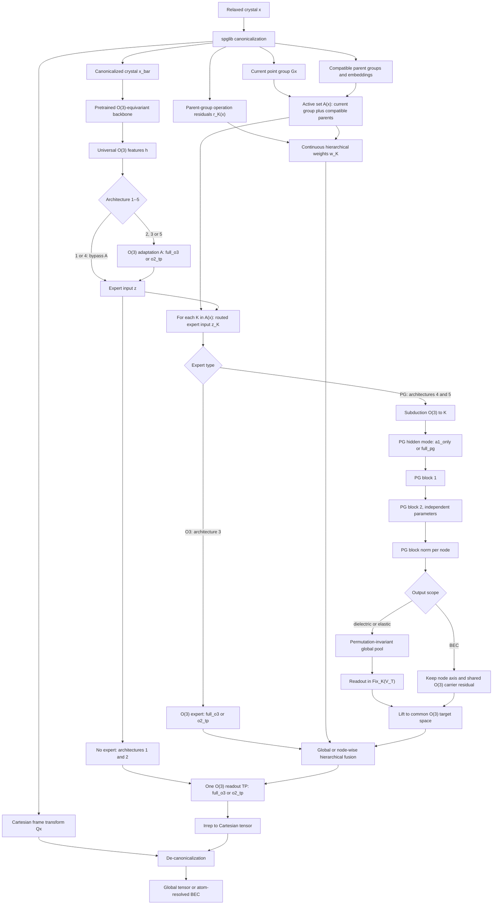
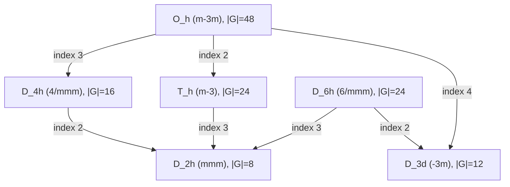

# 开题报告草案：面向晶体张量性质预测的预训练 O(3) 表示与连续层级点群特化

> **暂定题目（中文）**：面向平衡晶体张量性质预测的预训练 O(3)-等变表示与连续层级点群特化学习  
> **Tentative Title (English)**: **Pretrain at the Universal Symmetry Level, Specialize along the Symmetry-Breaking Hierarchy: Continuity-Aware Point-Group Equivariant Learning for Crystal Tensor Properties**  
> **版本**：Proposal v0.1  
> **日期**：2026-09-04

---

## 摘要

晶体材料的介电张量、弹性张量等性质不仅取决于化学组成和局域几何环境，还严格受到晶体对称性的约束。近年来，基于 O(3)/E(3) 等变神经网络的模型已经能够从原子结构直接预测张量性质，并保证坐标旋转或反射下的物理协变性。然而，标准 O(3)-等变网络通常只利用“任意三维旋转/反射下的连续群对称性”，并未显式利用 relaxed equilibrium crystal 所具有的、结构依赖的离散 stabilizer symmetry，即 crystallographic point group。与此同时，当前高质量张量标签仍显著少于能量、力和结构数据，使得直接为每个张量任务或每个点群从头训练模型存在明显的数据效率问题。

本研究拟提出一种 **pretrained O(3)-equivariant backbone + optional O(3) adaptation + symmetry-routed O(3)/PG experts + O(3) readout** 的晶体表示框架。顶层只保留五个 architecture branches：`B+R`、`B+A+R`、`B+A+O3E+R`、`B+PGE+R` 与 `B+A+PGE+R`。PG expert 的 hidden representation 保留参数高效的 `a1_only` 与保留全部 finite-group irreps 的 `full_pg` 两种完整实现；adaptation、O(3) expert 与 readout 中实际存在的 O(3) tensor product 均可在 `full_o3` 与 complete local `o2_tp` 间切换。对每个激活群 \(K\)，PG 分支先执行 \(O(3)\rightarrow K\) subduction，再按配置执行 \(A_1\otimes A_1\rightarrow A_1\) 或完整 \(\Gamma_1\otimes\Gamma_2\rightarrow\Gamma_3\) message passing。global dielectric / elastic 在 PG norm 后执行 global pooling 与 \(\mathrm{Fix}_K(V_T)\)-constrained readout；atom-resolved BEC 保留节点轴，并由共享 O(3) node carriers 与 PG-specialized node features共同进入 node-wise equivariant head。各 expert 分支输出在公共 O(3) tensor-irrep space 中，根据当前结构与各父群 symmetry operations 之间的 normalized residual 构造连续、O(3)-invariant gates 并进行层级加权平均；最后经一个 O(3)-equivariant readout 转换回 Cartesian basis 和原始输入坐标系。子群分支权重在父群对称性恢复时严格趋于零，从而同时利用跨点群迁移、离散对称性特化与结构形变路径上的连续性。

本研究第一阶段同时覆盖 relaxed equilibrium structures 上的 **global dielectric / elastic tensors** 与 **atom-resolved Born effective charge（BEC）**。global 任务执行 permutation-invariant pooling，BEC 保持 \(N\times3\times3\) 节点级输出。主实验采用 **JARVIS tensor / JARVIS-DFPT BEC benchmark** 与 **MatTen elastic benchmark**。研究将系统区分并量化四类增益：**pretraining gain、expert specialization gain、hierarchical continuity gain 和 point-group representation gain**。同时通过 anisotropy-conditioned analysis、irrep-wise error、symmetry violation、symmetry-breaking path continuity、sample-efficiency curve、parameter-matched ablation 等实验回答一个更一般的科学问题：

> **How can universally pretrained O(3)-equivariant representations be efficiently specialized to the discrete stabilizer symmetries of equilibrium crystals for tensorial property prediction?**

本研究的核心 thesis 可概括为：

> **Pretrain at the universal symmetry level, specialize at the material symmetry level.**

---

# 1. 研究背景

## 1.1 从标量性质预测走向张量性质预测

材料机器学习长期以 formation energy、band gap、bulk modulus 等标量性质为主要预测对象。对于标量目标，只需要保证模型输出对整体旋转和平移不变：

$$
f(Rx)=f(x).
$$

然而大量关键材料性质具有明确的方向依赖，例如：

- dielectric tensor \(\epsilon_{ij}\)；
- elastic tensor \(C_{ijkl}\)；
- piezoelectric tensor \(e_{ijk}\)；
- Born effective charge \(Z^*_{\kappa,ij}\)；
- magnetic susceptibility；
- thermal conductivity 等。

对于这些量，旋转晶体结构后，预测结果必须按照对应的张量表示同步变换，而不能保持不变。例如 rank-2 tensor 满足：

$$
T' = RTR^\top,
$$

rank-4 elastic tensor 满足：

$$
C'_{ijkl}
=
R_{ia}R_{jb}R_{kc}R_{ld}C_{abcd}.
$$

因此，张量性质预测不仅是一个数值回归问题，更是一个：

> **representation learning under symmetry constraints**

的问题。

---

## 1.2 O(3)-equivariant neural networks 的作用与局限

现代等变神经网络通过在 O(3)/SO(3) irreducible representations（irreps）上组织特征，将网络内部表示写为：

$$
h=\bigoplus_{\ell,p}n_{\ell,p}D^{(\ell,p)},
$$

其中 \(\ell\) 表示 angular momentum order，\(p\) 表示 parity。

旋转或反射输入结构时：

$$
h^{(\ell,p)}(Rx)
=
D^{(\ell,p)}(R)h^{(\ell,p)}(x).
$$

通过 Clebsch–Gordan tensor product，可以在保持等变性的同时进行不同 angular channels 之间的非线性交互：

$$
D^{(\ell_1)}
\otimes
D^{(\ell_2)}
=
\bigoplus_{\ell=|\ell_1-\ell_2|}^{\ell_1+\ell_2}
D^{(\ell)}.
$$

Tensor Field Networks、e3nn、NequIP、MACE、Equiformer 等工作已经证明，O(3)/E(3)-等变表示对于三维原子系统具有很高的数据效率与物理一致性。针对材料张量预测，MatTen、AnisoNet、GMTNet 等进一步证明了等变模型能够直接预测 elasticity、dielectric 等方向相关性质。

但标准 O(3)-equivariant network 存在一个关键结构性限制：

对于固定 \(\ell\)，它把整个 \((2\ell+1)\)-dimensional subspace 视为一个连续旋转群 irrep；网络参数不能根据一个具体晶体所具有的离散 point-group symmetry，对同一个 \(\ell\) 内不同 symmetry-adapted subspaces 使用不同的交互规则。

换句话说，O(3)-equivariance 告诉模型：

$$
f(Rx)
=
\rho(R)f(x),
\qquad
R\in O(3),
$$

但对 equilibrium crystal \(x\)，还存在一个非平凡 stabilizer subgroup：

$$
G_x
=
\{g\in O(3)\mid gx=x\}.
$$

因此对于：

$$
g\in G_x,
$$

有：

$$
f(x)=\rho(g)f(x).
$$

标准 O(3) 模型能够在原则上“学到”这种约束，却通常不会在参数化层面显式利用 \(G_x\) 的离散结构。

---

## 1.3 为什么 equilibrium crystal 的 point group 值得显式利用

对于 relaxed equilibrium structures，晶体结构的空间群/点群通常是一个稳定且具有物理意义的结构属性。

根据 Neumann principle，材料物性的对称性必须包含晶体点群的对称操作。因此目标 tensor 并非分布在任意 tensor space 中，而是位于当前点群允许的固定子空间：

$$
\mathrm{Fix}_G(V_T)
=
\left\{
T\in V_T
\mid
\rho_T(g)T=T,
\ \forall g\in G
\right\}.
$$

因此不同点群对应不同的：

1. tensor independent components；
2. symmetry-forbidden components；
3. O(3) irreps 在离散群下的 branching / subduction；
4. symmetry-adapted nonlinear interaction channels。

例如，同一个 \(\ell=2\) O(3) irrep 在不同点群中会分解为不同的有限群 irreps：

$$
D^{(2)}
\downarrow_G
=
\bigoplus_{\Gamma\in\widehat G}
m_{2,\Gamma}\Gamma.
$$

这种 within-\(\ell\) specificity 正是 point-group-aware representation 相比纯 O(3) representation 可以利用的额外信息。

PGEqNN 的近期工作进一步表明：将 O(3)/SO(3) rotational order 进一步按照 point-group irreps 划分，可以在部分 dielectric / elastic 任务中提取额外的 symmetry-specific signal。

其分析还表明，许多 global equilibrium tensor 的主要预测信息集中于 trivial irrep \(A_1\) subspaces，而 full point-group representation 的额外优势主要在存在真正可学习 anisotropic signal 的场景中出现。

这说明：

> **point-group awareness 并非“任何数据上都自动有效”，而需要针对 anisotropy、tensor order 和 point-group structure 进行机制化验证。**

---

## 1.4 为什么先使用 pretrained O(3)-equivariant backbone？

这是本研究需要主动回答的核心 reviewer question。

### 原因 1：利用 universal pretraining 提升 label efficiency

高质量 tensor labels 的规模通常只有：

$$
10^3\sim10^4,
$$

远小于能量、力或通用结构预训练可利用的数据量。

如果对每个 tensor task、每个 point group 都从头学习：

- chemistry；
- coordination；
- bonding；
- local geometry；
- many-body interactions；

会造成大量重复学习。

因此采用：

$$
\text{large-scale atomistic pretraining}
\rightarrow
\text{universal representation}
\rightarrow
\text{small tensor dataset specialization}
$$

可以提高下游样本效率。

---

### 原因 2：O(3)-equivariant features 保留 tensor task 所需方向信息

如果 pretrained backbone 只输出 invariant scalars：

$$
h_{\mathrm{inv}}(Rx)
=
h_{\mathrm{inv}}(x),
$$

则与局域方向、键角、各向异性相关的信息可能已经被压缩，后续 PG module 需要重新恢复方向结构。

而 O(3)-equivariant pretrained representation 保留：

$$
h
=
h^{(0)}
\oplus
h^{(1)}
\oplus
h^{(2)}
\oplus\cdots,
$$

使 downstream tensor task 能直接利用具有正确 transformation law 的 directional features。

---

### 原因 3：O(3) 是所有 crystallographic point groups 的共同母空间

对于任意 crystallographic point group：

$$
G\subset O(3).
$$

因此可以形成自然的 symmetry hierarchy：

$$
\boxed{
O(3)
\rightarrow
G
\rightarrow
\mathrm{Fix}_G(V_T)
}.
$$

这意味着 pretrained O(3) representation 可以作为跨所有 point groups 的统一 representation interface。

不同结构只需在下游根据其 stabilizer group 做 specialization，而不必分别预训练 32 套完全独立的模型。

---

### 原因 4：跨点群 transferable chemistry 与 PG-specific physics 应当解耦

局域 Si–O coordination、transition-metal polyhedra、chemical bonding motifs 等知识本质上可跨 point groups 共享。

将所有知识都交给独立 PG model 会导致：

$$
\text{data fragmentation}.
$$

因此我们希望把知识分解为：

$$
\underbrace{
\theta_{\mathrm{pre}}
}_{\text{universal chemistry / geometry}}
+
\underbrace{
\Delta\theta_{\mathrm{task}}
}_{\text{tensor-task adaptation}}
+
\underbrace{
\left\{
w_K(r(x))\Delta\theta_K
\right\}_{K\in\mathcal A(x)}
}_{\text{hierarchical symmetry specialization}}.
$$

本研究因此不是“用 point group 替代 O(3)”，而是主张：

> **Point-group symmetry should specialize universal equivariant representations rather than replace them.**

---

# 2. 研究问题与科学假设

## 2.1 总体研究问题

> **How can universally pretrained O(3)-equivariant representations be efficiently specialized to the discrete stabilizer symmetries of equilibrium crystals for tensorial property prediction?**

中文可表述为：

> 如何将大规模预训练得到的通用 O(3)-等变晶体表示，高效特化到 relaxed equilibrium crystal 的离散点群 stabilizer symmetry，从而提高全局张量性质预测的数据效率、对称性一致性与各向异性建模能力？

---

## 2.2 子问题

### RQ1：Universal pretraining 是否显著提高 tensor label efficiency？

比较：

$$
\text{same architecture from scratch}
\quad\text{vs.}\quad
\text{pretrained O(3) backbone}.
$$

重点不只关注 full-data accuracy，而要关注达到同一误差所需的 labels 数量。

---

### RQ2：O(3) adaptation 是否具有独立价值？

比较：

$$
\text{B+R}
\quad\text{vs.}\quad
\text{B+A+R}.
$$

该实验回答：

> **shared task adaptation**

是否具有独立价值。

---

### RQ3：point-group routing 本身是否有价值？

比较：

$$
\text{B+A+R}
\quad\text{vs.}\quad
\text{B+A+O3E+R}.
$$

该实验回答：

> **group-conditioned expert specialization without changing the O(3) carrier space**

是否具有独立价值。

---

### RQ4：PG-aware representation 在什么条件下真正有效？

重点考察：

- anisotropy 强弱；
- tensor order；
- point-group symmetry level；
- 每个 PG 的数据规模；
- \(\ell=0,2,4\) 等 harmonic channels 的可学习程度。

---

### RQ5：O(3) adaptation 与 PG expert 是否具有互补性？

假设：

- shared O(3) adaptation 学习跨 point group transferable 的 tensor knowledge；
- 比较 `B+PGE+R` 与 `B+A+PGE+R`，判断 shared task adaptation 是否仍能改善 PG-specialized representation。

---

### RQ6：中间 non-trivial PG irreps 是否带来额外收益？

模型保留 `a1_only` 与 `full_pg` 两种正式实现，并在相同任务、backbone 与 active-parameter/FLOPs 口径下比较：

$$
\text{Full PG intermediate representation}
\quad\text{vs.}\quad
A_1\text{-only intermediate representation}.
$$

---

## 2.3 核心科学假设

### H1 — Pretraining hypothesis

预训练 O(3) backbone 的主要收益体现为：

> **label efficiency**

尤其在 low-data regime 下更加明显。

---

### H2 — Hierarchical continuity hypothesis

O(3) expert 或 PG expert 都按当前点群及其物理兼容父群运行，并使用连续、O(3)-invariant 的 symmetry-breaking gates 融合输出。这样可以在保留 specialization 的同时缓解 hard point-group switching 导致的表示不连续；当父群对称性恢复时，相应子群 expert 权重必须趋于零。

---

### H3 — Representation specialization hypothesis

将 task-adapted O(3) representation 分别 subduce 到当前点群及兼容父群，并在各分支进行：

$$
PG\ tensor\ product
+
PG\text{-equivariant nonlinear processing}
$$

可以进一步利用 within-\(\ell\) 的离散 symmetry specificity。

---

### H4 — Anisotropy hypothesis

PG-aware model 相比纯 O(3) model 的收益应随可学习 anisotropic signal 增强而上升，而不是在所有样本、所有点群上均匀增加。

---

### H5 — Long-tail hypothesis

在每个 PG 的数据量较少时：

$$
\text{B+A+PGE+R}
>
\text{B+PGE+R},
$$

因为 shared O(3) adaptation 能跨点群迁移 tensor-task knowledge，降低数据碎片化。

---

# 3. 研究对象与任务范围

## 3.1 结构对象

第一阶段仅研究：

> **relaxed equilibrium crystal structures**

原因包括：

1. equilibrium symmetry 具有清晰物理意义；
2. 可以通过 spglib / pymatgen 获得 point group、space group 和 standard setting；
3. Neumann principle 对 equilibrium bulk tensor 约束直接；
4. 避免第一阶段同时处理 thermal disorder、defect、phonon displacement 和 approximate symmetry。

后续扩展可研究：

- weakly symmetry-broken structures；
- strained structures；
- finite-temperature snapshots；
- defects / substitutions；
- 更一般的 subgroup DAG、近似 symmetry embeddings 与有限温结构上的连续 gate。

---

## 3.2 第一阶段目标性质

### 3.2.1 Dielectric tensor

选择 symmetric rank-2 dielectric tensor：

$$
\epsilon_{ij}
=
\epsilon_{ji}.
$$

其 O(3)/SO(3) irreducible decomposition 为：

$$
V_\epsilon
\cong
D^{(0,+)}
\oplus
D^{(2,+)}.
$$

其中：

- \(\ell=0\)：isotropic trace；
- \(\ell=2\)：traceless anisotropic part。

它是研究：

> isotropic vs anisotropic signal

以及 point-group specialization 的理想起点。

---

### 3.2.2 Elastic tensor

Elastic tensor 满足 intrinsic symmetries：

$$
C_{ijkl}
=
C_{jikl}
=
C_{ijlk}
=
C_{klij}.
$$

因此其独立维度为 21，并可在 SO(3) 下分解为：

$$
V_C
\cong
2D^{(0,+)}
\oplus
2D^{(2,+)}
\oplus
D^{(4,+)}.
$$

维度检查：

$$
2\times1
+
2\times5
+
9
=
21.
$$

相比 dielectric，elastic tensor 拥有更高 angular order 和更复杂的 anisotropic structure，因此预计更能体现 PG specialization 的价值。

---

### 3.2.3 Atom-resolved Born effective charge

BEC 是第一阶段正式 benchmark、实现范围、参数量统计与验收条件的一部分，但与 global dielectric / elastic 使用不同的 pooling 与 head。

Born effective charge 是 atom-resolved rank-2 tensor：

$$
Z^*_{\kappa,\alpha\beta}
=
\frac{\partial P_\alpha}
{\partial u_{\kappa\beta}}.
$$

BEC 是一般的 \(3\times3\) 张量，不预设对称性；其 O(3) representation 为：

$$
V_Z
\cong
D^{(0,+)}
\oplus
D^{(1,+)}
\oplus
D^{(2,+)},
$$

维数为 \(1+3+5=9\)。其直接约束不仅来自 global crystal point group，还涉及：

- site symmetry；
- Wyckoff orbit；
- symmetry-related atoms 之间的 permutation-covariance。

模型按任务显式区分 global 与 node-wise 路径：

$$
\begin{aligned}
\text{dielectric / elastic:}&\quad \{q_i\}\rightarrow \operatorname{Pool}_i(q_i)\rightarrow \text{global readout},\\
\text{BEC:}&\quad \{h_i^{\mathrm{shared}}\oplus q_i^{\mathrm{PG}}\}
\rightarrow \{\text{shared node-wise equivariant readout}\}.
\end{aligned}
$$

BEC 不做 global pooling，输出完整的 \(N\times3\times3\) tensor。BEC head 的输入必须保留未经过 per-node \(A_1\) restriction 的 shared O(3) node carriers；`a1_only` 模式将 PG-specialized trivial channels 作为额外 conditioning，`full_pg` 模式则同时提供 non-trivial PG node carriers。两种模式都不得把每个原子分别投影到 global \(\mathrm{Fix}_K(V_Z)\)。对任意空间群操作 \(g=(R_g,t_g)\)，逐原子输出必须满足：

$$
\hat Z^*_{\pi_g(\kappa)}
=
R_g\hat Z^*_{\kappa}R_g^\top,
$$

其中 \(\pi_g\) 由

$$
W_gs_i+t_g=s_{\pi_g(i)}+n_{g,i},
\qquad n_{g,i}\in\mathbb Z^3,
$$

确定，并保持元素种类。这里需要修正一个容易混淆的表述：**PG feature-fiber equivariance 单独并不定义节点置换，但它与 message-passing GNN 的 permutation-equivariance 以及 PBC graph constructor 的空间群协变性组合后，会内蕴推出所需的联合等变性。** 具体地，若

$$
F(R_gx)=\rho(g)F(x),
\qquad
F(P_{\pi_g}x)=P_{\pi_g}F(x),
$$

并且真实晶体对称操作使旋转后的周期图与原图仅相差 node/edge permutation，则

$$
\rho(g)F(x)=P_{\pi_g}F(x).
$$

因此 \(\pi_g\) 不需要、也不得作为默认模型 forward 的额外输入或 learned routing signal；它只由 symmetry metadata 离线派生并缓存，用于 graph-automorphism audit、BEC equivariance test，以及非默认的 hard-projection control。主模型的 BEC 约束必须来自 PBC graph covariance、GNN permutation-equivariance 与 feature-fiber equivariance 本身，不能依赖 projector 才成立。`a1_only` 不是满足 BEC 约束的障碍：在 trivial fiber 上联合关系退化为同一 Wyckoff orbit 的 scalar channels 相等；但逐节点 \(A_1\) 压缩可能降低表达完备性，因此 BEC head 必须保留上述 shared O(3) carrier residual，并以 `full_pg` 作为正式对照。

默认策略明确为：

$$
\boxed{
\text{model forward: no }\pi_g
\quad;\quad
\text{audit / optional projector: use }\pi_g
}
$$

在图构造严格协变时，末端联合 Reynolds projector 理论上是恒等操作；实现中只将其保留为 diagnostic 和非默认 hard-enforcement control：

$$
(\Pi_{G,Z}\hat Z)_i
=
\frac{1}{|G|}
\sum_{g\in G}
R_g\hat Z_{\pi_g^{-1}(i)}R_g^\top.
$$

该投影不做 pooling、不增加可学习参数，输出仍为原子级 \(N\times3\times3\) 张量。headline 结果必须首先报告不使用该 projector 的 raw forward。第一版同时实现 acoustic sum rule 投影

$$
\sum_\kappa \hat Z^*_{\kappa,\alpha\beta}=0,
$$

并报告 hard projection / ASR 前后的误差与 violation。ASR 只在原子轴上汇总 BEC 并消除总和残差，不需要 \(\pi_g\)，与联合空间群 projector 是相互独立的物理约束。

---

# 4. 数学基础

## 4.1 O(3)-equivariance

给定输入空间和特征空间上的群表示：

$$
\rho_{\mathrm{in}},
\qquad
\rho_{\mathrm{out}},
$$

函数 \(f\) 对群 \(G\) 等变，当且仅当：

$$
f(\rho_{\mathrm{in}}(g)x)
=
\rho_{\mathrm{out}}(g)f(x),
\qquad
\forall g\in G.
$$

对于三维材料，完整 frame transformation 可考虑 \(O(3)\)，包括 rotations 与 inversion / reflection。

---

## 4.2 O(3) irreducible representations

网络特征组织为：

$$
h
=
\bigoplus_{\ell,p}
h^{(\ell,p)}.
$$

每个 \(\ell\) block 在旋转下：

$$
h^{(\ell)}
\mapsto
D^{(\ell)}(R)h^{(\ell)}.
$$

Scalar、vector、quadrupolar 等分别对应：

$$
\ell=0,1,2,\ldots
$$

---

## 4.3 O(3) tensor product

两个 irreps 的 tensor product 经 Clebsch–Gordan decomposition 得到允许的输出 angular orders：

$$
h^{(\ell_1)}
\otimes
h^{(\ell_2)}
\xrightarrow{CG}
\bigoplus_{\ell=|\ell_1-\ell_2|}^{\ell_1+\ell_2}
h^{(\ell)}.
$$

本文中的 TP 不是脱离图结构的单次 feature product，而是在原子/周期分子图上构造并聚合消息。设有向边 \(j\to i\) 的源节点为 \(j=\mathrm{src}\)，边的等变特征为 \(e_{ij}\)，则一条允许的 CG path \(\pi\) 产生：

$$
m_{i\leftarrow j,\pi}
=
w_\pi\!\left([h_j^{\mathrm{inv}}\mid h_i^{\mathrm{inv}}]\right)
\left[
h_j^{(\ell_1,p_1)}\otimes e_{ij}^{(\ell_2,p_2)}
\right]_{\pi\rightarrow(\ell_{\mathrm{out}},p_{\mathrm{out}})},
$$

其中：

$$
w_\pi\!\left([h_j^{\mathrm{inv}}\mid h_i^{\mathrm{inv}}]\right)
=
\operatorname{MLP}_\pi\!\left([h_j^{\mathrm{inv}}\mid h_i^{\mathrm{inv}}]\right),
$$

其中 \([h_{\mathrm{src}}\mid h_{\mathrm{tgt}}]\) 表示 source 与 target node features 的 concatenation，\(w_\pi\) 是该 TP path 的标量权重。随后在目标节点聚合：

$$
u_i
=
\sum_{j\in\mathcal N(i)}
\sum_{\pi}m_{i\leftarrow j,\pi}.
$$

这里 MLP 的两部分输入必须分别取 source 与 target 节点的 invariant/scalar channels，或由各自节点 irreps 构造的不变量；不能将非平凡 irrep components 直接送入普通 MLP 生成路径权重。这样 \(w_\pi\) 在 O(3) 下为标量，整个消息构造与邻域求和才保持 equivariance。

shared O(3) adaptation 的图消息 TP 保留两种可切换实现，由独立配置参数控制：

$$
\texttt{shared\_adaptation\_tp\_backend}
\in
\{\texttt{full\_o3},\texttt{o2\_tp}\}.
$$

- `full_o3`：直接枚举允许的完整 O(3) Clebsch–Gordan paths；
- `o2_tp`：参考 [《Complete O(3) Interactions from Wigner-6j Recoupling to Local O(2) Frames》](<docs/ref/o2 tp.pdf>)，以 edge direction \(n_{ij}=\widehat r_{ij}\) 为参考轴，将 declared global O(3) irreps 旋转并 restriction 到 local O(2) layout，在其中执行 `O2Linear → O2TensorProduct/O2Gate → inverse Wigner-D`，再聚合回目标节点。

`o2_tp` 不是仅满足 proper rotations 的普通 SO(2) reduction。对 global \((\ell,p)\) block，其 local \(m=0\) component 必须按

$$
q_0=p(-1)^\ell\in\{+1,-1\}
$$

登记为 \(0e\) 或 \(0o\)，并在所有 \(m>0\) blocks 上保留 parent \((\ell,p)\) provenance；polar 与 pseudo irreps 不得合并。实现必须使用 real-valued learnable weights，分别处理 \(0e/0o\)，只允许 \(0e\) bias，并只以 odd activation 作用于 \(0o\)。O2TensorProduct 必须遵守完整 real-O(2) fusion rules，包括 \(m_1\ne m_2\) 时的 \(|m_1-m_2|\oplus(m_1+m_2)\) 以及 \(m\otimes m\) 中的 \(0e\oplus0o\oplus2m\)。

两种 backend 必须具有相同的 global O(3) input/output irrep contract，因而后续 \(O(3)\rightarrow K\) subduction 与 PG branches 无需改变；但二者可以有不同的内部参数化，不能假设未经参数转换时逐值相等。`o2_tp` 还必须显式通过 improper rotations、edge reversal、local-frame gauge 与 polar/pseudo coexistence tests。该开关只作用于 shared O(3) adaptation；后续 finite-group PG TP 始终保留完整 PG fusion rules。

---

## 4.4 Equivariant MLP

Equivariant MLP 在消息聚合后对每个节点分别作用：

$$
h_i'
=
\operatorname{EqMLP}_{O(3)}(u_i).
$$

它不跨节点完成邻域聚合，也不对 irrep component 随意使用普通 element-wise MLP，而是在 multiplicity / channel space 中进行线性 mixing，并配合允许的 equivariant / gated nonlinearities。所有跨节点通信均由前述 TP message passing 完成。

抽象记为：

$$
\mathrm{EqMLP}_{O(3)}:
\bigoplus_{\ell,p}
n_{\ell,p}D^{(\ell,p)}
\rightarrow
\bigoplus_{\ell,p}
n'_{\ell,p}D^{(\ell,p)}.
$$

---

## 4.5 Crystallographic point group 是 O(3) 的有限子群

对于 equilibrium crystal，记 point group 为 \(G\)：

$$
G\subset O(3).
$$

在 canonical frame 中，\(G\) 的对称轴具有标准方向，因此可以使用预先构造的：

- group representation matrices；
- character tables；
- Clebsch–Gordan coefficients；
- symmetry-adapted bases。

---

## 4.6 Subduction / restriction：O(3) → point group

参考 Heilman 与 Yan 的 PGEqNN（arXiv:2607.16871，Eq. (2)）所采用的 point-group harmonics（PGH）构造，对每个 O(3) irrep \(D^{(\ell,p)}\) 及嵌入已固定的 crystallographic point group \(K\subset O(3)\)，其 restriction 分解为：

$$
D^{(\ell,p)}
\downarrow_K
=
\bigoplus_{\Gamma\in\widehat K}
m_{\ell p,\Gamma}\Gamma,
$$

其中 \(\widehat K\) 表示 \(K\) 的 irreps 集合，重数可由 character inner product 得到：

$$
m_{\ell p,\Gamma}
=
\frac{1}{|K|}
\sum_{g\in K}
\chi^{(\ell,p)}(g)
\chi^\Gamma(g)^*.
$$

在 standard real spherical-harmonic basis \(\{Y_m^{(\ell,p)}\}_{m=-\ell}^{\ell}\) 与 PGH basis 之间定义完整、不降维的 unitary basis change：

$$
H_{\Gamma a\mu}^{(\ell,p)}
=
\sum_{m=-\ell}^{\ell}
\left[U_K^{(\ell,p)}\right]_{\Gamma a\mu,m}
Y_m^{(\ell,p)},
$$

其中 \(a=1,\ldots,m_{\ell p,\Gamma}\) 区分 repeated copies，\(\mu=1,\ldots,d_\Gamma\) 是 irrep \(\Gamma\) 内部的 component index。维数保持关系为：

$$
\sum_{\Gamma\in\widehat K}
m_{\ell p,\Gamma}d_\Gamma
=
2\ell+1.
$$

与 PGEqNN Eq. (2) 一致，\(U_K^{(\ell,p)}\) 将 standard harmonic basis 变为 symmetry-adapted basis，并同时 block-diagonalize \(K\) 中的所有表示矩阵：

$$
U_K^{(\ell,p)}
D^{(\ell,p)}(g)
U_K^{(\ell,p)\dagger}
=
\bigoplus_{\Gamma\in\widehat K}
\left(
I_{m_{\ell p,\Gamma}}
\otimes
D^\Gamma(g)
\right),
\qquad g\in K.
$$

因此 \(U_K^{(\ell,p)}\) 是 restriction representation 与 PG-irrep direct sum 之间的 intertwiner。选择 orthonormal PGH 时：

$$
U_K^{(\ell,p)\dagger}U_K^{(\ell,p)}
=
U_K^{(\ell,p)}U_K^{(\ell,p)\dagger}
=I.
$$

对带 channel index \(c\) 的 feature，完整正向 subduction 为：

$$
h^{PG}_{c,\Gamma a\mu}
=
\sum_{m=-\ell}^{\ell}
\left[U_K^{(\ell,p)}\right]_{\Gamma a\mu,m}
h^{O(3)}_{c,m}.
$$

若没有丢弃任何 \(\Gamma\) block，则 inverse basis change 为：

$$
h^{O(3)}_{c,m}
=
\sum_{\Gamma,a,\mu}
\left[U_K^{(\ell,p)}\right]^*_{\Gamma a\mu,m}
h^{PG}_{c,\Gamma a\mu},
$$

即：

$$
h^{O(3)}
=
U_K^{(\ell,p)\dagger}h^{PG}.
$$

PGEqNN 使用 real spherical harmonics 和实 PGH matrices；在该 convention 下 \(U_K^{(\ell,p)}\) 为实正交矩阵，因而：

$$
U_K^{(\ell,p)\dagger}
=
U_K^{(\ell,p)\top}.
$$

若采用 complex harmonics，则必须保留 Hermitian transpose \(U^\dagger\)，不能直接写 \(U^\top\)。该步骤本质上是同维度的 symmetry-adapted basis change，而不是降维；只有随后显式选择部分 PG irreps 时才发生 restriction / projection。

### 4.6.1 符号含义与来源

| 符号 | 含义 | 如何得到 |
| --- | --- | --- |
| \(K\) | 当前分支采用的、embedding 已固定的 crystallographic point group | 由 canonicalized structure、spglib symmetry operations 与 compatible-parent embedding metadata 确定 |
| \(g\in K\) | \(K\) 的一个群元素 | 对应 canonical frame 中的正交矩阵 \(R_g\)；涉及原子映射时还同时保存空间群平移 \(t_g\) |
| \(\widehat K\) | \(K\) 的全部 inequivalent irreps 构成的集合 | 来自固定 point-group convention / character table |
| \(\ell\) | O(3)/SO(3) angular order，标准 basis 的维数为 \(2\ell+1\) | 由 backbone feature layout 或目标张量的 harmonic decomposition 给定 |
| \(p\in\{+1,-1\}\) | O(3) irrep 在 inversion 下的 parity | 由 feature/target 的 polar、axial 与 tensor-product 类型确定 |
| \(m\) | standard spherical-harmonic basis 中的 component index，\(m=-\ell,\ldots,\ell\) | 固定 basis label，不学习 |
| \(Y_m^{(\ell,p)}\) | standard real spherical-harmonic / O(3)-irrep basis vector | 由选定的 harmonic normalization、axis 和 parity convention 固定 |
| \(\Gamma\) | point group \(K\) 的一个 irrep | 来自固定 convention 下的 character table / representation library |
| \(D^\Gamma(g)\) | \(g\) 在 irrep \(\Gamma\) 中的 representation matrix | 从 character-table-compatible irrep matrices / MultiPie 获得 |
| \(\chi^\Gamma(g)\) | \(\Gamma\) 的 character | \(\chi^\Gamma(g)=\operatorname{Tr}D^\Gamma(g)\) |
| \(d_\Gamma\) | \(\Gamma\) 的维数 | \(d_\Gamma=\chi^\Gamma(e)\) |
| \(m_{\ell p,\Gamma}\) | \(\Gamma\) 在 \(D^{(\ell,p)}\downarrow_K\) 中出现的次数 | 由 character inner product 计算 |
| \(a\) | repeated \(\Gamma\) copies 的编号 | \(a=1,\ldots,m_{\ell p,\Gamma}\)，通过确定性的 copy-order convention 固定 |
| \(\mu\) | irrep \(\Gamma\) 内部的 component index | \(\mu=1,\ldots,d_\Gamma\) |
| \(H_{\Gamma a\mu}^{(\ell,p)}\) | 按 \((\Gamma,a,\mu)\) 标记的 point-group harmonic basis vector | 由 \(U_K^{(\ell,p)}Y^{(\ell,p)}\) 得到 |
| \(c\) | 相同 \(D^{(\ell,p)}\) 的 learnable channel/copy index | 由网络宽度 \(n_{\ell,p}\) 给定；subduction 不混合该 index |
| \(n_{\ell,p}\) | 网络 feature 中 \(D^{(\ell,p)}\) 的 channel multiplicity | 由 architecture configuration 指定 |
| \(U_K^{(\ell,p)}\) | standard harmonic basis 到 PGH basis 的 subduction / basis-change matrix | 从群表示矩阵确定性构造，或按 PGEqNN 从 MultiPie/已核验表格读取；不是可学习参数 |
| \(P_{\Gamma;\mu\nu}^{(\ell,p)}\) | 从 \(D^{(\ell,p)}\) 空间抽取 \(\Gamma\) 型子空间的 matrix-valued projection operator | 由 \(D^\Gamma(g)\) 与 \(D^{(\ell,p)}(R_g)\) 的有限群求和得到 |

对于 proper 与 improper operations，先在 canonical Cartesian frame 中构造完整的 O(3) representation：

$$
D^{(\ell,p)}(R_g)
=
p^{(1-\det R_g)/2}
D^{(\ell)}\!\left((\det R_g)R_g\right),
$$

其中 \((\det R_g)R_g\in SO(3)\)，并定义：

$$
\chi^{(\ell,p)}(g)
=
\operatorname{Tr}D^{(\ell,p)}(R_g).
$$

这说明 character multiplicity 公式中的 \(\chi^{(\ell,p)}\) 不是额外数据标签，而是由 spglib 返回的 canonical-frame rotations、parity convention 和 Wigner-\(D\) implementation 直接计算。

记号上，\(e\) 表示群的 identity element，\(^*\) 表示复共轭，\({}^\top\) 表示 transpose，\({}^\dagger\) 表示 conjugate transpose；real orthonormal convention 下 \({}^\dagger={}^\top\)。

### 4.6.2 \(U_K^{(\ell,p)}\) 的确定性构造

首先必须把 spglib operations 与 irrep library 中的抽象群元素一一对齐。设 canonical lattice matrix 为 \(A\)，spglib 给出的 fractional-coordinate rotation 为 \(W_g\)，则在本文固定的 column-vector lattice convention 下：

$$
R_g
=
A W_g A^{-1}.
$$

若代码采用 row-vector lattice convention，则应使用相应的 transpose 形式，不能混用。利用已固定的 group embedding、矩阵乘法表和 tolerance，将每个 \(R_g\) 与 library 中同一个 \(g\) 的 \(D^\Gamma(g)\) 配对；仅按 conjugacy class 配对不足以确定多维 irrep 的 component matrices。

第一种实现与 PGEqNN 一致：在固定 point-group setting、real spherical-harmonic convention、irrep naming 和 component order 后，从 MultiPie 或预计算 PGH tables 读取 \(U_K^{(\ell,p)}\)。载入后必须验证前述 intertwining relation、unitarity 和 dimension sum。

若自行生成，可使用 finite-group projection operators：

$$
P_{\Gamma;\mu\nu}^{(\ell,p)}
=
\frac{d_\Gamma}{|K|}
\sum_{g\in K}
\left[D^\Gamma(g)\right]^*_{\mu\nu}
D^{(\ell,p)}(R_g).
$$

具体流程为：

1. 对每个 \(\Gamma\) 计算 \(m_{\ell p,\Gamma}\)，只处理 multiplicity 非零的 blocks；
2. 将 \(P_{\Gamma;\mu\nu}^{(\ell,p)}\) 作用于一组 deterministic seed vectors；
3. 使用 SVD/QR 提取其 image，并在 repeated-copy space 中正交化；
4. 按固定的 \((\Gamma,a,\mu)\) 顺序堆叠所得 basis vectors，形成 \(U_K^{(\ell,p)}\) 的 rows；
5. 固定每个 basis vector 的 sign/phase、degenerate-copy gauge 和 irrep component order；
6. 数值验证
   \[
   UDU^\dagger=\bigoplus_\Gamma(I_m\otimes D^\Gamma),
   \qquad
   UU^\dagger=U^\dagger U=I.
   \]

其中 SVD/QR 只用于离线生成固定 matrices，不参与训练。所有数据 split 和所有模型必须复用同一套 \(U\)、sign/phase 与 copy-order convention，否则不同 PG branches 的 coefficients 不能安全地 inverse-subduce 到同一公共空间。

---

## 4.7 Point-group tensor product

在 PG representation space 中，设 source、edge/filter 与 output irreps 分别为 \(\Gamma_s,\Gamma_e,\Gamma_o\)。其 fusion rule 为：

$$
\Gamma_s
\otimes
\Gamma_e
=
\bigoplus_{\Gamma_o\in\widehat K}
N^{\Gamma_o}_{\Gamma_s\Gamma_e}
\Gamma_o,
$$

其中 fusion multiplicity 为：

$$
N^{\Gamma_o}_{\Gamma_s\Gamma_e}
=
\frac{1}{|K|}
\sum_{g\in K}
\chi^{\Gamma_s}(g)
\chi^{\Gamma_e}(g)
\chi^{\Gamma_o}(g)^*.
$$

若 \(N^{\Gamma_o}_{\Gamma_s\Gamma_e}>0\)，使用

$$
\eta
=
1,\ldots,
N^{\Gamma_o}_{\Gamma_s\Gamma_e}
$$

标记重复的 fusion channels。定义固定的 finite-group Clebsch-Gordan intertwiner：

$$
C^{K;\Gamma_o,\eta}:
V_{\Gamma_s}\otimes V_{\Gamma_e}
\rightarrow
V_{\Gamma_o},
$$

满足：

$$
C^{K;\Gamma_o,\eta}
\left[
D^{\Gamma_s}(g)
\otimes
D^{\Gamma_e}(g)
\right]
=
D^{\Gamma_o}(g)
C^{K;\Gamma_o,\eta},
\qquad g\in K.
$$

对 \(x^{\Gamma_s}\in V_{\Gamma_s}\) 与 \(y^{\Gamma_e}\in V_{\Gamma_e}\)，一次无参数的 PG tensor product contraction 为：

$$
\left[
x^{\Gamma_s}
\otimes_K
y^{\Gamma_e}
\right]_{\mu_o}^{\Gamma_o,\eta}
=
\sum_{\mu_s=1}^{d_{\Gamma_s}}
\sum_{\mu_e=1}^{d_{\Gamma_e}}
C_{\mu_o;\mu_s\mu_e}^{K;\Gamma_o,\eta}
x_{\mu_s}^{\Gamma_s}
y_{\mu_e}^{\Gamma_e}.
$$

这里：

- \(\mu_s,\mu_e,\mu_o\) 分别是三个 irreps 内部的 component indices；
- \(\eta\) 区分同一 \(\Gamma_o\) 的 repeated fusion copies；
- \(C^{K;\Gamma_o,\eta}\) 是由 \(D^{\Gamma_s},D^{\Gamma_e},D^{\Gamma_o}\) 离线求解 intertwiner space、正交化并固定 gauge 后得到的常数，也可由经过 convention 核验的 finite-group CG library 读取；
- CG coefficients 不参与学习；可学习参数只能作用在 channel、copy、path multiplicity 等不会破坏 irrep component transformation law 的空间上。

因此 PG TP 的表示分量 contraction 由群论固定，而网络学习“哪些允许路径应具有多大权重”。与纯 O(3) TP 相比，它允许对不同 \(\Gamma\)、subduction copy \(a\) 与 fusion copy \(\eta\) 分配不同参数，从而形成更细粒度的 within-\(\ell\) parameterization。

---

## 4.8 Neumann principle 与 fixed subspace

对于目标 tensor representation \(V_T\)，物理允许空间为：

$$
\mathrm{Fix}_G(V_T)
=
\left\{
T\in V_T
\mid
\rho_T(g)T=T,
\ \forall g\in G
\right\}.
$$

在 point-group adapted basis 中，该空间对应 trivial representation \(A_1\) 的 copies。

因此 final readout 应 hard enforce：

$$
\hat T_G
\in
\mathrm{Fix}_G(V_T).
$$

---

## 4.9 Reynolds projection

任意预测 \(\hat T\) 都可以通过群平均投影到 fixed subspace：

$$
P_G(\hat T)
=
\frac{1}{|G|}
\sum_{g\in G}
\rho_T(g)\hat T.
$$

这是一个极强的 conceptual baseline，因为它可以在不修改 internal representation 的情况下确保输出满足 point-group symmetry。

本研究必须证明：

> internal PG specialization 的价值不仅是让输出“合法”，而是改善 representation learning 和 sample efficiency。

---

# 5. Our Method

## 5.1 总体思想

完整分支采用以下 hierarchy；其余四个分支按 §7.1 的定义跳过 adaptation 或替换/跳过 expert：

$$
\boxed{
\text{Universal O(3) representation}
\rightarrow
\text{task/symmetry-conditioned O(3) adaptation}
\rightarrow
\text{point-group representation}
\rightarrow
\text{symmetry-allowed tensor}
}
$$

核心结构为：

1. spglib canonicalization；
2. pretrained O(3)-equivariant backbone；
3. 由 architecture selector 决定是否执行一层 shared O(3) adaptation；
4. expert-free 分支直接进入 readout；expert 分支确定当前点群 \(G_x\)、物理兼容的父群集合及其嵌入关系；
5. 根据当前结构对各父群操作的连续 parent-group residual 构造 hierarchical gates；
6. `O3E` 对每个激活群运行保持 O(3) representation 的 routed expert；`PGE` 则先 subduce，并按 `pg_hidden_mode: a1_only | full_pg` 运行两个参数独立的 PG blocks；
7. global dielectric / elastic 对节点执行 pooling；PG expert 额外读取 \(\mathrm{Fix}_K(V_T)\)。BEC 始终保留节点轴，并保留合法的 O(3) node carriers；
8. 将各 expert 分支输出置于统一 O(3) tensor-irrep space；PG 输出需要 inverse subduction；
9. 使用满足父群极限条件的 invariant scalar weights 做 global 或 node-wise hierarchical fusion；
10. 五个分支均执行一个 O(3)-equivariant TP readout，正式 backend 仅为 `full_o3 | o2_tp`；BEC head 输出 \(0e\oplus1e\oplus2e\)；
11. 统一执行 irrep-to-Cartesian；
12. de-canonicalization 回原始输入 frame；BEC 同时恢复原始 site order，并可选执行联合空间群投影与 ASR 投影。

这里的“父群”不是当前点群的所有抽象 supergroups，而是具有明确 orientation / setting embedding、并对应可实现结构畸变路径的 compatible parent groups。

---

## 5.2 架构图



---

## 5.3 Step 1：Canonicalization 与 symmetry metadata

输入 relaxed structure \(x\)，首先使用 spglib 获取当前结构的 symmetry record：

- standardized / idealized structure \(\bar x\)；
- current point-group symbol \(G_x\)；
- symmetry operations；
- transformation matrix / standard setting；
- Cartesian rigid rotation；
- atom index mapping，以及每个空间群操作诱导的 site permutation \(\pi_g\) 等。

随后依据当前 space-group / Hall number、structure family / prototype 与 composition，从准备阶段生成并通过验证的 **parent-embedding registry** 查询：

- compatible parent candidates；
- 具体 parent-to-child subgroup embeddings 与 reference settings；
- common-cell / supercell transforms；
- parent-to-child atom correspondence、Wyckoff splitting 与 domain variants。

最后才使用这些固定候选 parent operations 与 embeddings 计算 normalized parent-group operation residuals。spglib 在此负责当前 symmetry detection、standardization，以及在已知 Hall number 时提供对应的 space-group operations；它不负责自动枚举物理兼容 parents、确定真实 parent phase 或生成 parent DAG。不得通过增大 `symprec` 并把偶然检测到的高对称群直接当作 parent-discovery procedure。

抽象写为：

$$
C(x)
=
(\bar x,G_x,\mathcal A(x),r(x),Q_x,\mathcal S),
$$

其中 \(\mathcal A(x)\) 表示当前点群与物理兼容父群构成的激活集合，\(r(x)=\{r_K(x)\}_{K\in\mathcal A(x)}\) 表示当前结构相对各父群的连续 symmetry residuals，\(Q_x\) 表示从原始 Cartesian frame 到 canonical frame 所需记录的正交变换信息，\(\mathcal S\) 保存各激活群的实际 symmetry representation 与 embedding metadata。

需要特别注意：

> **lattice change-of-basis matrix 与 Cartesian tensor rotation matrix 不是同一个对象。**

spglib 的标准化也并非严格唯一，可能存在 group-equivalent choices。

因此模型仍需对 canonical frame 中剩余的 group-equivalent choices 保持一致性。

PG-equivariant stage 正好提供这一保证。

---

## 5.4 Step 2：Pretrained SO(3)/O(3)-equivariant backbone 与 O(3) feature wrapper

主实验固定比较四个 backbone family：**MACE、GRACE、DPA4 / SeZM 与 EquiformerV2**。其中，MACE 与 GRACE 按其 checkpoint 的显式 O(3)/parity convention 接入；DPA4 与 EquiformerV2 只按官方保证视为 SO(3)-equivariant，必须先经过下述 test-time Reynolds averaging / parity projection，才能进入统一的 O(3) feature interface。

| Backbone | 原始连续对称性 | 预训练域 | 高阶 feature 与接入方式 |
|---|---|---|---|
| MACE | O(3)，显式 parity irreps | MPTrj / OMat 等 | checkpoint-dependent；常用公开权重通常低于 \(\ell=4\)，缺失高阶由 shared O(3) TP lift 产生 |
| GRACE | O(3)-compatible real-parity ACE features | OMat / OAM 等 | 1L medium/large 内部可达 \(\ell=4\)；在 scalar readout 前提取并统一 convention |
| DPA4 / SeZM | 官方保证 SO(3)/SE(3) | MPtrj 等 | 内部 node state 可保留到 \(\ell\ge4\)；在 scalar readout 前提取，再做 parity projection |
| EquiformerV2 | SO(3) | OMat24 / MPTrj 等 | 选择实际含 \(L_{\max}\ge4\) 的 checkpoint，在内部 node coefficients 上做 parity projection |

所有模型必须以**具体 checkpoint**为单位登记 `pretraining_dataset`、每层 `irreps/layout`、\(\ell_{\max}\)、cutoff、元素覆盖、license 与 feature-tap 位置；不能仅依据 architecture family 的理论能力认定某个 checkpoint 含有 \(\ell=4\)。

对只保证 SO(3) 的 backbone，记其第 \(\ell\) 阶 node feature 为 \(f^{(\ell)}\)，取 inversion \(\iota=-I\)，用 \(O(3)/SO(3)\cong C_2\) 上的两陪集 Reynolds projector 构造 parity \(p\) 的通道：

$$
h^{(\ell,p)}(\bar x)
=
\mathcal P_p f^{(\ell)}(\bar x)
=
\frac{1}{2}
\left[
f^{(\ell)}(\bar x)
+p\,f^{(\ell)}(\iota\bar x)
\right],
\qquad p\in\{+1,-1\}.
$$

该构造满足

$$
h^{(\ell,p)}(\iota\bar x)=p\,h^{(\ell,p)}(\bar x),
$$

并与原 backbone 的 SO(3)-equivariance 合并为目标 O(3) transformation law。周期实现保持同一个右手晶格，将 fractional coordinates 映射为 \((-s_i)\bmod 1\)，并显式维护 inversion 前后的 node correspondence。SO(3) backbone 的 edge features 若也被复用，必须进行相同的 paired projection 与 edge correspondence；主实现优先从 displacement vectors 重新构造具有确定自然 parity 的 \(B_q(r)Y_{\ell m}(\hat r)\)，以避免依赖私有 edge layout。该 wrapper 需要两次 backbone forward，因此 SO(3) backbone 的特征提取成本约加倍。

这里的 `test-time parity projection` 是指**冻结 backbone 的调用时 wrapper**；为避免训练—测试分布不一致，它必须在 downstream train、validation 与 test 阶段一致启用，而不能只在最终测试集上启用。实现必须通过 random rotations、inversion、一般 reflections 与 periodic atom remapping 的数值协变测试。

在 canonicalized structure 及其 inversion pair 上运行预训练 backbone，并经过统一 wrapper：

$$
(f,f_{\iota})
=
\left(B_{\Theta}(\bar x),B_{\Theta}(\iota\bar x)\right),
\qquad
h=\mathcal W_{O(3)}(f,f_{\iota}),
$$

其中：

$$
h
=
\bigoplus_{\ell,p}
h^{(\ell,p)}.
$$

Backbone 的角色是提供：

1. universal chemical environment knowledge；
2. local / many-body geometry；
3. directional equivariant information；
4. 跨 point groups 的统一 feature interface。

第一阶段固定评估 MACE、GRACE、DPA4 与 EquiformerV2；不再把原始 backbone 必须已经显式实现 O(3) parity 作为排除 SO(3) 模型的先决条件。

具体 backbone 可根据：

- pretrained weights 与训练数据域；
- license；
- 元素覆盖；
- feature extraction interface；
- \(\ell_{\max}\)；
- parity / improper-operation guarantee；
- Reynolds wrapper 的额外计算成本；
- computational cost；

决定。

论文的 scientific contribution 不绑定某一个 backbone。

---

## 5.5 Step 3：Shared O(3) adaptation

设置：

$$
N_{\mathrm{adapt}}=1\text{ or }2
$$

层顺序的 shared adaptation blocks；只在 architectures 2、3、5 中激活，默认取 1 层。

第 \(k\) 个 shared adaptation block：

$$
z_i^{(k)}
=
E_{\theta_k}^{\mathrm{adapt}}(z^{(k-1)})_i
=
M^{O(3)}_{\theta_k}
\left(
\sum_{j\in\mathcal N(i)}
T^{O(3)}_{\theta_k}
\left(z_j^{(k-1)},e_{ij};
w_{k,\pi}\!\left([z_j^{(k-1),\mathrm{inv}}\mid z_i^{(k-1),\mathrm{inv}}]\right)
;\texttt{shared\_adaptation\_tp\_backend}
\right)
\right).
$$

其中 \(z^{(0)}=h\)，adaptation 的输出为 \(z_{\mathrm{adapt}}=z^{(N_{\mathrm{adapt}})}\)。\(T^{O(3)}_{\theta_k}\) 根据 `shared_adaptation_tp_backend` 选择 full O(3) CG TP 或保持完整 parity 的 edge-frame O(2) TP。即：

$$
\boxed{
\{Full\ O(3)\ TP\ \mid\ local\ O(2)\ TP\}
\ +\ NeighborAggregation
\rightarrow
O(3)\ EquivariantMLP\ per\ node
}
$$

其中每条 TP path 的权重由源节点与目标节点 invariant features 的拼接产生：

$$
w_{k,\pi}\!\left([z_{\mathrm{src}}^{(k-1)}\mid z_{\mathrm{tgt}}^{(k-1)}]\right)
=
\operatorname{MLP}_{k,\pi}
\!\left(
[z_{\mathrm{src}}^{(k-1),\mathrm{inv}}\mid z_{\mathrm{tgt}}^{(k-1),\mathrm{inv}}]
\right).
$$

因此 shared adaptation 的输出仍是一组 node-wise O(3)-equivariant features；TP 负责图上的消息构造与聚合，EqMLP 只对各节点的聚合结果分别处理。

主设置默认使用 `o2_tp`，并取下文给出的 local \(m_{\max}=2\)；`full_o3` 作为 full-angular control，并与 `o2_tp` 做参数量或 active-FLOPs 匹配。两者不是同时激活的 mixture branches，而是同一 adaptation block 的互斥实现选项。

注意：

> **Shared adaptation 到这里结束，不包含 O(3) expert、PG tensor product 或 PG MLP。**

其任务是从通用 pretrained features 中形成跨 point groups 可迁移的：

> **tensor-task-aware O(3) representation**

### 5.5.1 Routed O(3) expert

Architecture 3 在 shared adaptation 后增加 O(3) expert。它使用与 PG expert 完全相同的 active groups、parent DAG、continuous gates 与每群/每层独立参数，但 hidden features 始终保留在公共 O(3) irrep space，不执行 finite-group subduction：

$$
u_{K,i}^{O(3)}
=
E_{K,\theta_K}^{O(3)}(z_{\mathrm{shared}})_i,
\qquad
u_i^{O(3)}
=
\sum_{K\in\mathcal A(x)}w_K(x)u_{K,i}^{O(3)}.
$$

每个 O(3) expert 的 TP backend 独立开放

$$
\texttt{o3\_expert\_tp\_backend}
\in
\{\texttt{full\_o3},\texttt{o2\_tp}\}.
$$

该分支是 PG expert 的严格 representation-space control：二者共享 routing/gates 和大致匹配的 active parameters/FLOPs，区别仅在 expert 使用 O(3) irreps 还是 finite-group irreps。

---

## 5.6 Step 4：Current-plus-parent active set 与连续 gates

对当前 structure 的 point group \(G_x\)，构造：

$$
\mathcal A(x)
=
\{G_x\}
\cup
\{K\mid K\text{ 是 }G_x\text{ 的物理兼容父群}\}.
$$

兼容性必须包含具体的 subgroup embedding、canonical orientation 与结构 correspondence，而不能只根据抽象 point-group symbol 判断。

候选 parent DAG 应由结构 family / prototype、space-group subgroup relation 与原子 correspondence 预先确定，并在所研究的连续路径邻域内保持不变；不得使用 \(r_K<\texttt{symprec}\) 之类的 hard threshold 动态筛选父群。若工程上允许 candidate set 改变，则新加入或移除分支在切换边界的权重必须严格为零。

### 5.6.1 完整 point-group parent DAG 与第一阶段投影

> **Current relative-position implementation (2026-09-22).** The reduced CGCNN branch uses only
> species-labelled relative edge vectors. It consumes the complete class-cover topology and all
> oriented child subsets from `assets/docs/subgroup_chain.json`, computes incremental
> `parent \\ child` rotation residuals, and reconstructs the DAG from the asset hash when loading
> cache schema 3. Hall settings, translations, origins and atom mappings in the more general design
> below are not part of this active branch; they remain requirements only for absolute-site or
> space-group-mode routing.

parent DAG 分为两个层次：

1. **point-group class skeleton**：只记录 32 个 crystallographic point-group classes 之间可能的 subgroup cover relations，用于枚举候选路径、复用固定群论 registry，并为共享 router 提供 group conditioning；PG block 的可学习参数不在不同群或不同深度间共享；
2. **embedded space-group DAG**：每个节点和边都携带 Hall setting、basis/origin transform、common cell、atom mapping、Wyckoff splitting 与 domain variant；这是 residual、gate 与 runtime active set 真正使用的 DAG。

spglib 返回的 `pointgroup_symbol` 只确定当前结构属于 32 个 crystallographic point groups 中的哪一类，不能单独确定 parent。实际 group--subgroup 数据应离线取自 [International Tables Symmetry Database](https://symmdb.iucr.org/) 或 Bilbao/International Tables 的 maximal-subgroup/minimal-supergroup tables，再由 spglib 对当前结构、标准胞和 operations 做本地验证。

为避免手工抄录 subgroup chart，本研究使用 [spglib point-group/Hall database](https://spglib.readthedocs.io/en/stable/dataset.html) 的具体 \(3\times3\) rotation matrices，对每个 parent 枚举全部闭合 matrix subgroups，再用 `spglib.get_pointgroup` 分类并按集合包含关系做 transitive reduction。生成脚本为 [`tools/generate_point_group_subgroup_dag.py`](tools/generate_point_group_subgroup_dag.py)，完整的 433 个 oriented subgroup instances、operation indices、80 条 class cover edges 与 222 种 maximal class-chain sequences 分别保存在 [`crystallographic_point_group_subgroups.json`](docs/ref/crystallographic_point_group_subgroups.json) 和 [`crystallographic_point_group_subgroups.md`](docs/ref/crystallographic_point_group_subgroups.md)。

下表直接给出全部 32 个 crystallographic point groups 的 maximal-subgroup adjacency。沿第四列递归向下即得到所有 subgroup chains；`×n` 表示在该 parent 的具体矩阵群中存在 \(n\) 个不同 orientation embeddings，`i` 是 point-group index：

| No. | Parent (HM; Schoenflies) | Order | Immediate maximal subgroups |
|---:|---|---:|---|
| 1 | `1`; \(C_1\) | 1 | — |
| 2 | `-1`; \(C_i\) | 2 | `1` (i=2) |
| 3 | `2`; \(C_2\) | 2 | `1` (i=2) |
| 4 | `m`; \(C_s\) | 2 | `1` (i=2) |
| 5 | `2/m`; \(C_{2h}\) | 4 | `-1`, `2`, `m` (各 i=2) |
| 6 | `222`; \(D_2\) | 4 | `2` ×3 (i=2) |
| 7 | `mm2`; \(C_{2v}\) | 4 | `2` ×1, `m` ×2 (i=2) |
| 8 | `mmm`; \(D_{2h}\) | 8 | `2/m` ×3, `222` ×1, `mm2` ×3 (i=2) |
| 9 | `4`; \(C_4\) | 4 | `2` (i=2) |
| 10 | `-4`; \(S_4\) | 4 | `2` (i=2) |
| 11 | `4/m`; \(C_{4h}\) | 8 | `2/m`, `4`, `-4` (各 i=2) |
| 12 | `422`; \(D_4\) | 8 | `222` ×2, `4` ×1 (i=2) |
| 13 | `4mm`; \(C_{4v}\) | 8 | `mm2` ×2, `4` ×1 (i=2) |
| 14 | `-42m`; \(D_{2d}\) | 8 | `222`, `mm2`, `-4` (各 i=2) |
| 15 | `4/mmm`; \(D_{4h}\) | 16 | `mmm` ×2, `4/m` ×1, `422` ×1, `4mm` ×1, `-42m` ×2 (i=2) |
| 16 | `3`; \(C_3\) | 3 | `1` (i=3) |
| 17 | `-3`; \(C_{3i}\) | 6 | `3` (i=2), `-1` (i=3) |
| 18 | `32`; \(D_3\) | 6 | `3` (i=2), `2` ×3 (i=3) |
| 19 | `3m`; \(C_{3v}\) | 6 | `3` (i=2), `m` ×3 (i=3) |
| 20 | `-3m`; \(D_{3d}\) | 12 | `-3`, `32`, `3m` (各 i=2), `2/m` ×3 (i=3) |
| 21 | `6`; \(C_6\) | 6 | `3` (i=2), `2` (i=3) |
| 22 | `-6`; \(C_{3h}\) | 6 | `3` (i=2), `m` (i=3) |
| 23 | `6/m`; \(C_{6h}\) | 12 | `-3`, `6`, `-6` (各 i=2), `2/m` (i=3) |
| 24 | `622`; \(D_6\) | 12 | `32` ×2, `6` ×1 (i=2), `222` ×3 (i=3) |
| 25 | `6mm`; \(C_{6v}\) | 12 | `3m` ×2, `6` ×1 (i=2), `mm2` ×3 (i=3) |
| 26 | `-6m2`; \(D_{3h}\) | 12 | `32`, `3m`, `-6` (各 i=2), `mm2` ×3 (i=3) |
| 27 | `6/mmm`; \(D_{6h}\) | 24 | `-3m` ×2, `6/m` ×1, `622` ×1, `6mm` ×1, `-6m2` ×2 (i=2), `mmm` ×3 (i=3) |
| 28 | `23`; \(T\) | 12 | `222` (i=3), `3` ×4 (i=4) |
| 29 | `m-3`; \(T_h\) | 24 | `23` (i=2), `mmm` (i=3), `-3` ×4 (i=4) |
| 30 | `432`; \(O\) | 24 | `23` (i=2), `422` ×3 (i=3), `32` ×4 (i=4) |
| 31 | `-43m`; \(T_d\) | 24 | `23` (i=2), `-42m` ×3 (i=3), `3m` ×4 (i=4) |
| 32 | `m-3m`; \(O_h\) | 48 | `m-3`, `432`, `-43m` (各 i=2), `4/mmm` ×3 (i=3), `-3m` ×4 (i=4) |

该 DAG 是由具体 matrix-subgroup inclusion 得到的 oriented class lattice，而不是按群阶大小猜出的关系。例如 cubic \(O_h\) 与 hexagonal \(D_{6h}\) 互不包含，但 trigonal `-3m` 可以分别作为二者的具体子群。JSON 中进一步保存每个 subgroup instance 在 parent operation list 中的 indices，因此相同 HM symbol 的不同 embeddings 不会丢失。

第一阶段 benchmark 已优先选择 \(D_{2h}\)、\(D_{3d}\) 与 \(O_h\)。针对这三个 current groups，先冻结如下**候选 class-level Hasse skeleton**；箭头方向为 parent \(\rightarrow\) child，边标签为 point-group index \([H:K]=|H|/|K|\)：



这张图有两个互不具有包含关系的高对称根 \(O_h\) 与 \(D_{6h}\)：cubic 与 hexagonal groups 不能仅按“对称性更高”连成一条链；trigonal classes 则可能以不同 embedding 分别来自 cubic 或 hexagonal parent。上图只保留 cover relations，因此不再加入可由两步路径表达的传递边 \(O_h\rightarrow D_{2h}\)。

对应的第一阶段候选路径集合为：

| Current class | Candidate embedded paths before structure filtering |
|---|---|
| \(O_h\) | \(O_h\)（无更高 crystallographic point-group parent） |
| \(D_{3d}\) | \(O_h\rightarrow D_{3d}\)；\(D_{6h}\rightarrow D_{3d}\) |
| \(D_{2h}\) | \(O_h\rightarrow D_{4h}\rightarrow D_{2h}\)；\(O_h\rightarrow T_h\rightarrow D_{2h}\)；\(D_{6h}\rightarrow D_{2h}\) |

同一条 class edge 一般存在多个 orientation/domain embeddings，不能压成一个 residual。第一阶段 registry 至少应展开：

| Class edge | Point-group embedding variants to enumerate | 几何含义 |
|---|---:|---|
| \(O_h\rightarrow T_h\) | 1 | normal tetrahedral-with-inversion subgroup |
| \(O_h\rightarrow D_{4h}\) | 3 | 三条 cubic fourfold axes |
| \(O_h\rightarrow D_{3d}\) | 4 | 四条 cubic body-diagonal axes |
| \(T_h\rightarrow D_{2h}\) | 1 | tetrahedral rotation group 中的 normal \(D_2\) axes 加 inversion |
| \(D_{4h}\rightarrow D_{2h}\) | 2 | axial 与 diagonal 两类 orthorhombic settings |
| \(D_{6h}\rightarrow D_{3d}\) | 2 | 相差 \(30^\circ\) 的两类 trigonal settings |
| \(D_{6h}\rightarrow D_{2h}\) | 3 | 三组 symmetry-related orthorhombic axis pairs |

表中的数量是 oriented point-group skeleton 的枚举数；具体 space group 可能因 centering、translation subgroup、origin、Wyckoff splitting 或 composition 而没有对应 parent，也可能产生更多 inequivalent space-group embeddings。因此它们只能生成候选 `domain_id`，不能替代 Hall-level validation。

runtime 使用的序列化对象采用下列最小 schema：

```yaml
ParentDAGSpec:
  dag_id: string
  structure_family_id: string
  convention_id: string
  current_node_id: string
  nodes:
    - node_id: string
      hall_number: int
      space_group_number: int
      point_group_id: string
      setting_id: string
      domain_id: string
      operations_checksum: string
  edges:
    - edge_id: string
      parent_node_id: string
      child_node_id: string
      point_group_index: int
      space_group_index: int
      basis_transform: [[int, int, int], ...]
      origin_shift: [float, float, float]
      common_supercell_transform: [[int, int, int], ...]
      parent_to_child_atom_map: [int, ...]
      wyckoff_split_id: string
      embedded_parent_operations_checksum: string
  paths:
    - path_id: string
      edge_ids: [string, ...]
      prior: uniform
  registry_checksum: string
```

离线构造流程固定为：

1. 从 current Hall number 出发，读取 index \(\le4\) 的 minimal supergroups / reversed maximal-subgroup relations；第一阶段最大深度为 2；
2. 为每条 relation 展开全部 basis/origin/domain variants，组合得到 parent operations 在 child common cell 中的具体 \((W_g,t_g)\)；
3. 使用 species-preserving atom correspondence、Wyckoff splitting 与 common-cell determinant 验证结构 family compatibility；该步骤在 registry preparation 时执行一次；
4. 对 embedded operation sets 做 inclusion 与 closure 检查，并以 operations + transforms + atom map 的 checksum 去重；
5. 对保留下来的 embedded graph 做 transitive reduction，只保留 cover edges；
6. 冻结 `nodes/edges/paths` 与 checksum。训练和推理阶段只查询 registry，不再根据 residual 或放宽 `symprec` 动态增删 parents；
7. 若某个样本无法唯一匹配已冻结的 `structure_family_id + current Hall setting`，则明确退化到 current-group-only，而不是猜测 parent。

因此上面的 class skeleton 已足以启动 MVP 的 group/branch 实现，但真正的 material-level DAG 只有在数据集 release、Hall numbers、prototype clustering 与 atom mappings 确定后才算构造完成。

对于一条 symmetry-breaking edge：

$$
K_{i-1}\rightarrow K_i,
\qquad
K_i\subset K_{i-1},
$$

令 canonical periodic crystal 写为：

$$
x
=
\left(
A,
\{(s_i,Z_i)\}_{i=1}^{N}
\right),
$$

其中 \(A=[a_1,a_2,a_3]\in\mathbb R^{3\times3}\) 的列为 Cartesian lattice vectors，\(s_i\in[0,1)^3\) 为 fractional coordinates，\(Z_i\) 为元素类型。父群 \(H=K_{i-1}\) 中的 embedded space-group operation 记为：

$$
g=(W_g,t_g),
\qquad
s\mapsto W_gs+t_g,
$$

其中 \(W_g\in GL(3,\mathbb Z)\)，\(t_g\) 为 fractional translation。若实现接口使用 row-vector lattice convention，必须在边界处显式 transpose，不能混用下述 column-vector 公式。

### 5.6.2 Lattice metric residual

定义 Gram matrix：

$$
M=A^\top A.
$$

精确 lattice symmetry 满足：

$$
W_g^\top M W_g=M.
$$

因此定义无量纲 lattice residual：

$$
r_{g,\mathrm{cell}}^2(x)
=
\frac{
\left\|
W_g^\top M W_g-M
\right\|_F^2
}{
\|M\|_F^2+\epsilon
}.
$$

该项确保 cubic \(\rightarrow\) tetragonal / orthorhombic strain 即使不改变 fractional atomic coordinates，也会产生非零 residual。例如 \(A=\operatorname{diag}(a,b,c)\) 且 \(W_g\) 交换前两轴时，该 residual 随 \((a^2-b^2)^2\) 增长。

### 5.6.3 Periodic atomic-position residual

精确 symmetry 要求对每个原子 \(i\)，存在同元素原子 \(\pi_g(i)\) 与 lattice translation \(n_i\in\mathbb Z^3\)，使：

$$
W_gs_i+t_g
=
s_{\pi_g(i)}+n_i.
$$

令 characteristic length 为：

$$
\ell_x
=
\left(
\frac{|\det A|}{N}
\right)^{1/3}.
$$

若 parent embedding 已给出固定 atom correspondence \(\pi_g\)，定义：

$$
r_{g,\mathrm{pos}}^2(x)
=
\frac{1}{N\ell_x^2}
\sum_{i=1}^{N}
\min_{n_i\in\mathbb Z^3}
\left\|
A\left(
W_gs_i+t_g-s_{\pi_g(i)}-n_i
\right)
\right\|_2^2.
$$

固定 \(\pi_g\) 是优先方案，因为它保持 parent-to-child 路径上的 correspondence 稳定。若 mapping 未知，则使用 species-preserving assignment：

$$
r_{g,\mathrm{pos}}^2(x)
=
\frac{1}{N\ell_x^2}
\min_{\pi\in\Pi_Z}
\sum_{i=1}^{N}
\min_{n_i\in\mathbb Z^3}
\left\|
A\left(
W_gs_i+t_g-s_{\pi(i)}-n_i
\right)
\right\|_2^2,
$$

其中 \(\Pi_Z\) 只允许相同元素之间的 permutation。工程上可由 periodic pairwise-distance cost matrix 加 Hungarian assignment 实现。对 skewed cell，\(n_i\) 必须解 closest-lattice-vector problem；不能无条件对 fractional difference 逐分量 `round`。最小 assignment 或最近镜像发生切换时，距离值保持连续但梯度可能不连续；需要结构导数时应优先固定 parent mapping，或另行研究 smooth assignment。

### 5.6.4 Operation residual 与 group aggregation

组合 operation residual：

$$
d(gx,x)^2
=
r_g(x)^2
=
\lambda_{\mathrm{cell}}\,
r_{g,\mathrm{cell}}^2(x)
+
\lambda_{\mathrm{pos}}\,
r_{g,\mathrm{pos}}^2(x),
$$

其中：

$$
\lambda_{\mathrm{cell}},\lambda_{\mathrm{pos}}\ge0,
\qquad
\lambda_{\mathrm{cell}}+\lambda_{\mathrm{pos}}=1.
$$

两部分均已无量纲化；第一版默认可取各 \(1/2\)，并将二者比例作为 ablation。然后定义 normalized parent-group residual：

$$
r_H^2(x)
=
\frac{1}{|H|}
\sum_{g\in H}
d(gx,x)^2.
$$

单位元贡献恒为零。可保留它以保持统一群平均，也可使用 \(1/(|H|-1)\) 对非单位操作平均；两种 convention 不得混用，并需分别 calibration \(\sigma_H\)。如果当前结构严格保留父群 \(H\)，则 \(r_H(x)=0\)；偏离父群越强，\(r_H(x)\) 越大。

这里不得在 \(gx\) 与 \(x\) 之间再次最小化任意 global O(3) alignment，否则可用 \(g^{-1}\) 抵消被测试的 symmetry operation，使 residual 失去意义。距离应在同一个 canonical / transported frame 中计算；当输入整体变换为 \(Rx\) 时，父群 embedding 同步共轭为 \(RHR^{-1}\)，从而：

$$
r_H(Rx)=r_H(x),
\qquad R\in O(3).
$$

对于 nonsymmorphic operations，spglib 的 rotation 与 translation 必须按相同 index 成对使用。对于 cell multiplication、translation-symmetry change 或 Wyckoff splitting，应先建立共同 supercell 与明确的 parent space-group / atom mapping；仅使用抽象 point-group rotation 或按原子 index 比较是不充分的。

### 5.6.5 Residual-to-gate map

对 edge \(H\rightarrow K_i\)，定义 symmetry-breaking gate：

$$
a_{H\rightarrow K_i}(x)
=
1-
\exp\!\left(
-\frac{r_H(x)^2}{\sigma_{H\rightarrow K_i}^2}
\right).
$$

同时定义 parent-preservation score：

$$
s_{H\rightarrow K_i}(x)
=
\exp\!\left(
-\frac{r_H(x)^2}{\sigma_{H\rightarrow K_i}^2}
\right)
=
1-a_{H\rightarrow K_i}(x).
$$

这里 \(a_{H\rightarrow K_i}\) 表示“父群被破坏后，子群分支应开启多少”，不能直接解释为父群 expert 的权重。父群恢复时：

$$
r_H\to0
\quad\Longrightarrow\quad
a_{H\rightarrow K_i}\to0,
\qquad
s_{H\rightarrow K_i}\to1.
$$

因此相应子群 branch 自动关闭，父群 branch 保留。几何量固定定义 \(r_H\)，模型最多只学习受约束的 \(\sigma_{H\rightarrow K_i}>0\) 或单调 calibration，不使用普通 learned softmax 取代这一边界条件。

若同一父群可沿多个 distortion directions 降到不同子群，可以额外把 \(x-P_Hx\) 分解到 parent-group irreps，作为 path compatibility 或解释性特征；但第一版 branch strength 的主尺度由上述 operation-level parent residual 决定。

---

## 5.7 Step 5：Hierarchical convex weights

先考虑完整 DAG 中任一条 embedded subgroup path：

$$
K_0\supset K_1\supset\cdots\supset K_L=G_x,
$$

使用 stick-breaking 形式把 edge gates 转换为 branch weights：

$$
w_0=1-a_1,
$$

$$
w_k
=
\left(\prod_{j=1}^{k}a_j\right)
(1-a_{k+1}),
\qquad 0<k<L,
$$

$$
w_L
=
\prod_{j=1}^{L}a_j.
$$

因此：

$$
w_k\ge0,
\qquad
\sum_{k=0}^{L}w_k=1.
$$

当任一父群 \(K_{i-1}\) 的 symmetry 恢复时，\(a_i\to0\)，所有更深子群分支的权重自动趋于零。这个边界条件，而非“权重和为 1”本身，提供跨 symmetry boundary 的连续性。

对于完整 subgroup DAG，令 \(\mathcal P(x)\) 为所有物理兼容、具有明确 embedding 的 parent-to-current paths。每条 path 内使用上述 stick-breaking 规则，并给 path 一个连续、归一化的几何 compatibility prior \(\pi_p(x)\)。同一群 \(K\) 可能出现在多条 path 中，其未归一化权重为：

$$
\beta_K(x)
=
\sum_{p\in\mathcal P(x):K\in p}
\pi_p(x)w_{K\mid p}(x),
$$

最终取：

$$
w_K(x)
=
\frac{\beta_K(x)}{
\sum_{J\in\mathcal A(x)}\beta_J(x)
}.
$$

这样当前群与所有 compatible parents 均运行且可同时具有非零贡献，同时避免同一父群因多条路径被重复计算。所有 path priors、edge gates 与 normalization 都必须连续；当某条 parent-to-child edge 恢复 symmetry 时，所有经过该 edge 的更深路径贡献必须趋于零。第一版可以只支持 benchmark 中预先枚举的 embedded DAG paths，但不能把 DAG 偷换成 one-hot parent selection。

---

## 5.8 Step 6：每个激活群运行 configurable PG branch

先根据 architecture 形成 expert 输入：

$$
z_i
=
\alpha_0h_{\mathrm{skip},i}
+
z_{\mathrm{adapt},i}.
$$

其中 architecture 4 取 \(\alpha_0=1\)、\(z_{\mathrm{adapt}}=0\)，直接使用 backbone features；architecture 5 启用 adaptation，\(\alpha_0\) 仅表示可选的 backbone residual coefficient。这一记号不产生额外 architecture branch。

为保证任意 crystallographic point group 分支在进入 PG-TP 前都具有 trivial-irrep seed，expert 输入必须保留至少一个真正的 even scalar channel：

$$
n_{0,+}^{z}\ge 1.
$$

这是主架构的强制 layout constraint，而不是可选 ablation。由于对任意 \(K\subset O(3)\)：

$$
D^{(0,+)}\downarrow_K=A_1,
$$

该 channel 在 subduction 后必然成为 \(K\) 的 trivial-irrep block。若所选 pretrained backbone 没有可直接复用的 \((0,+)\) 输出，则必须由 atom/species embedding 构造 O(3)-scalar node channels，并在 shared adaptation 中保留；不能假设后续多层 PG-TP 会自动生成 \(A_1\)。

对每个激活群 \(K\in\mathcal A(x)\)，直接以共享 task representation 作为分支输入：

$$
z_{K,i}=z_{\mathrm{shared},i}.
$$

随后该分支独立执行 subduction：

$$
z_{K,i}^{PG}
=
\mathcal U_K z_{K,i},
$$

其中：

$$
\mathcal U_K
=
\bigoplus_{\ell,p}
\left(
I_{n_{\ell,p}}
\otimes
U_K^{(\ell,p)}
\right),
$$

其中 \(n_{\ell,p}\) 是该 O(3) irrep 的 channel multiplicity；\(U_K^{(\ell,p)}\) 只作用于 \(m\)-components，不混合 learnable channels。离线 registry 保存完整 \((\Gamma,a,\mu)\) 分解。两种必须实现的 PG hidden mode 为：

$$
z_{K,i}^{\texttt{a1\_only}}
=P_{A_1,K}\mathcal U_Kz_{K,i},
$$

以及

$$
z_{K,i}^{\texttt{full\_pg}}
=\mathcal U_Kz_{K,i}.
$$

`a1_only` 只实例化 trivial-irrep paths；`full_pg` 保留全部 finite-group irreps、subduction copies 与 fusion multiplicities。前者的显式形式为：

$$
z_{K,i}^{A_1}:=P_{A_1,K}\mathcal U_K z_{K,i}.
$$

每个 block 必须继续携带 \((\ell,p,\Gamma,a,c)\) provenance；\(A_1\) 表示在 \(K\) 下不变，并不等同于 \(\ell=0\)。在 `a1_only` 中，完整 \(\mathcal U_K\) 只用于定义和验证 basis，不能声称 hidden-state restriction 可逆；在 `full_pg` 中则保留完整的正交基变换：

$$
\mathcal U_K^{-1}
=
\mathcal U_K^\dagger,
\qquad
\mathcal U_K^\dagger\mathcal U_K
=I.
$$

在本文采用的 real orthonormal PGH convention 下可实现为 \(\mathcal U_K^\top\)。`a1_only` 的 \(P_{A_1,K}\mathcal U_K\) 是 restriction / projection，不可逆；只有最终 target-specific coefficients 通过固定 injection 后，才使用 \(\mathcal U_{K,t}^\dagger\) 提升到公共 target space。`full_pg` 则允许所有保留的 PG irreps通过 \(\mathcal U_K^\dagger\) 回到公共 O(3) carrier space。

对于每个 \((\ell,p)\)：

$$
D^{(\ell,p)}
\downarrow_K
=
\bigoplus_{\Gamma}
m_{\ell p,\Gamma}\Gamma.
$$

在该步骤之后，feature label 从粗粒度的：

$$
(\ell,p,c)
$$

变为更细粒度的：

$$
(\ell,p,\Gamma,a,c).
$$

---

## 5.9 Step 7：`a1_only` 与 `full_pg` point-group tensor products

在同一 PBC graph 上执行 finite-group tensor-product message passing。`a1_only` path table 只实例化 \(A_1^{\mathrm{node}}\otimes A_1^{\mathrm{edge}}\rightarrow A_1^{\mathrm{out}}\)；`full_pg` path table 从同一 immutable registry 实例化所有满足 fusion rule 的 \(\Gamma_s\otimes\Gamma_e\rightarrow\Gamma_o\) paths。为统一两种实现，定义一个 PGH block label：

$$
\lambda
=
(\ell,p,\Gamma,a),
$$

其中只有 \(\Gamma\) 决定该 block 在 \(K\) 下的 transformation law，\((\ell,p,a)\) 记录它来自哪个 O(3) order、parity 与 repeated subduction copy，并允许网络对这些来源分配不同参数。

若 edge features 直接由几何构造，可写为：

$$
e^{K,\lambda_e}_{ij,q,\mu_e}
=
B_q(r_{ij})
H_{\Gamma_e a_e\mu_e}^{(\ell_e,p_e)}
(\widehat r_{ij}),
$$

其中原始距离先用 \(Q_{\mathrm{basis}}=8\) 个固定 radial basis 展开，再通过所有点群共享的线性投影压缩为 \(Q_{\mathrm{path}}=2\) 个 TP radial path channels；上式中的 \(q=1,2\) 索引压缩后的 path channel。若 backbone 已经返回 equivariant edge attributes，则先转换到同一径向 convention，再执行共享压缩与 \(\mathcal U_K\) subduction。

为保证每个分支至少存在一条一层即可到达 \(A_1\) 的消息路径，edge layout 必须始终包含由 \(\ell=0\) spherical harmonic 构造的 scalar edge channels：

$$
e^{(0,+)}_{ij,q}
=
B_q(r_{ij})Y_{00}(\widehat r_{ij}).
$$

由于 \(Y_{00}\) 对任意 \(K\subset O(3)\) 均限制为 trivial irrep，这些 channels 在每个分支中满足：

$$
e^{(0,+)}_{ij,q}\downarrow_K\in A_1.
$$

若 backbone edge attributes 已包含同一 convention 下的 \((0,+)\) radial channels，则复用并登记这些 blocks；否则显式追加上述 channels。结合 shared representation 中强制保留的 \((0,+)\) node channels，PG path table 必须保留：

$$
\boxed{
A_1^{\mathrm{node}}
\otimes
A_1^{\mathrm{edge}}
\rightarrow
A_1^{\mathrm{out}}
}
$$

对应的所有配置允许的径向 paths。该路径保证 \(A_1\) channel 在表示布局上存在且可被一层 PG-TP 更新，但不保证任意样本上的数值严格非零。`a1_only` 有意不实例化 \(\Gamma\otimes\Gamma^*\rightarrow A_1\) 等 non-trivial-input paths；`full_pg` 则恢复这些路径及其 non-trivial outputs。两层 PG blocks 用于扩大消息传播与 nonlinear refinement，并各自维护独立参数；第二层不是为了保证 \(A_1\) 存在。

一条完整的 PG TP path 记为：

$$
\pi
=
\left(
\lambda_s,c_s;
\lambda_e,q;
\lambda_o,c_o;
\eta
\right),
$$

且仅当

$$
N_{\Gamma_s\Gamma_e}^{\Gamma_o}>0
$$

时才枚举该 path。其固定、无参数的 CG contraction 为：

$$
\tau^{K,\pi}_{ij,\mu_o}
=
\sum_{\mu_s,\mu_e}
C_{\mu_o;\mu_s\mu_e}^{K;\Gamma_o,\eta}
z^{K,\lambda_s}_{j,c_s,\mu_s}
e^{K,\lambda_e}_{ij,q,\mu_e}.
$$

### 5.9.1 Endpoint-conditioned learnable path weights

当前框架不直接照搬 PGEqNN 中只依赖 \(r_{ij}\) 的 learnable radial filter。为了使同一个 router trunk 能在不同 \(K\) 之间共享，主设置从 subduction 之前的 \(z_{\mathrm{shared}}\) 中读取固定宽度的 O(3)-invariant scalar channels：

$$
s_{ij}
=
\left[
\left(z_{\mathrm{shared},j}\right)^{(0,+)}
\mid
\left(z_{\mathrm{shared},i}\right)^{(0,+)}
\right],
$$

其中 \((0,+)\) 表示真正的 O(3)-trivial channels。由于 \(s_{ij}\) 的维度与 \(K\) 无关，并且在 O(3) 下不变，普通 MLP 可以生成每条允许路径的动态标量权重。先写成未因式分解的概念形式：

$$
\omega^K_{ij,\pi}
=
\left[
\operatorname{MLP}_{\theta_K}^{K}
\left(s_{ij}\right)
\right]_\pi.
$$

因此，和 PGEqNN 的 learnable radial filter 对应的有效 path filter 可写为：

$$
F^{K,\pi}_{ij}
=
\omega^K_{ij,\pi}(s_{ij})
B_{q(\pi)}(r_{ij}).
$$

这里 \(q(\pi)\) 是 path \(\pi\) 携带的 radial-channel index。径向基 \(B_q\) 固定，而 \(\omega\) 可学习；不同的 \(q\) 被视为不同 paths，所以对这些 paths 的加权本身就能学习径向组合。主设置仍严格采用 \(\operatorname{MLP}[h_{\mathrm{src}}^{\mathrm{inv}}\mid h_{\mathrm{tgt}}^{\mathrm{inv}}]\)，不再把 \(r_{ij}\) 直接输入 router，以免改变前文约定。

限制 router 只读取不变 endpoint features 是保证 \(\omega^K_{ij,\pi}\) 为标量的充分且易验证的实现。若希望利用由高阶 \(\ell\) subduce 出的 PG-\(A_1\) channels，则必须先为每个 \(K\) 构造固定宽度 summary，并使用 group-specific input projection；该版本作为 ablation，不作为跨 PG 共享 router 的默认输入。

于是完整 edge message 为：

$$
m^{K,\lambda_o}_{i\leftarrow j,c_o,\mu_o}
=
\sum_{\pi\mapsto(\lambda_o,c_o)}
\omega^K_{ij,\pi}
\tau^{K,\pi}_{ij,\mu_o}.
$$

\(\omega^K_{ij,\pi}\) 可以依赖 \(\Gamma_s,\Gamma_e,\Gamma_o\)、subduction copies、input/output channels 与 fusion copy \(\eta\)，但必须是标量，并且不能依赖 irrep component \(\mu_o\)。否则会破坏 Schur structure 和 \(K\)-equivariance。

### 5.9.2 与当前多点群框架适配的参数化

若为每个 \(K\) 的每条 path 分别放置完整 MLP，参数量与 active PG 数会迅速增大，并加剧 rare-PG overfitting。主实现采用 shared router trunk 与 group-specific low-rank path head：

$$
\phi_{ij}
=
\operatorname{MLP}_{\theta_{\mathrm{route}}}
\left(s_{ij}\right)
\in
\mathbb R^{r_{\mathrm{route}}},
$$

$$
\boldsymbol\omega^K_{ij}
=
b^K
+
A^K\phi_{ij},
\qquad
A^K\in
\mathbb R^{|\mathcal P_K|\times r_{\mathrm{route}}},
$$

其中 \(\mathcal P_K\) 是群 \(K\) 在当前 layer 中枚举出的全部 allowed paths，\(r_{\mathrm{route}}\) 是由配置指定的共享 router bottleneck width。共享参数 \(\theta_{\mathrm{route}}\) 学习跨 PG 可迁移的 endpoint conditioning；\(A^K,b^K\) 是轻量的 PG-specific learnable parameters，用于将公共 latent router features 映射到该群自己的 path set。主设置保留从 \(s_{ij}\) 到 \(\phi_{ij}\) 的共享 router MLP，并固定 \(r_{\mathrm{route}}=8\)，而不是令 \(\phi_{ij}=s_{ij}\)；完整的 per-group/per-path MLP 仅作为 capacity ablation。

随后加入一个 PG-equivariant self interaction 并在目标节点聚合：

$$
\tilde z_{K,i}^{PG}
=
W_{\mathrm{self}}^K z_{K,i}^{PG}
+
\frac{1}{\sqrt{|\mathcal N(i)|}}
\sum_{j\in\mathcal N(i)}
m^K_{i\leftarrow j},
$$

其中：

$$
W_{\mathrm{self}}^K
=
\bigoplus_{\Gamma}
\left(
W_{\Gamma,\mathrm{mult}}^K
\otimes
I_{d_\Gamma}
\right).
$$

\(W_{\Gamma,\mathrm{mult}}^K\) 只在具有相同 \(\Gamma\) 的 channel/copy multiplicity space 中学习 mixing；\(I_{d_\Gamma}\) 保证同一 irrep 内的 components 共享权重。

省略 layer superscript 后，这一层新增的 trainable parameter count 为：

$$
N_{\mathrm{PGTP}}
=
N(\theta_{\mathrm{route}})
+
\sum_K
\left(
|\mathcal P_K|r_{\mathrm{route}}
+
|\mathcal P_K|
+
\sum_\Gamma N(W^K_{\Gamma,\mathrm{mult}})
\right).
$$

单个样本只激活 \(K\in\mathcal A(x)\) 的 group-specific heads 与 self interactions；\(\theta_{\mathrm{route}}\) 只计算一次公共 edge latent，随后供所有 active branches 复用。因而引入可学习参数是必要的，但不应把 CG coefficients 本身设为可学习参数。

### 5.9.3 固定量与可学习量

| 类别 | 符号 | 作用 |
| --- | --- | --- |
| 固定群论量 | \(U_K^{(\ell,p)}\)、\(C^{K;\Gamma_o,\eta}\)、allowed path set \(\mathcal P_K\) | basis change、PG-CG contraction 与 path legality |
| 固定图/几何量 | edge index、periodic image、\(r_{ij},\widehat r_{ij},B_q(r_{ij})\) | PBC neighbor relation 与 edge geometry |
| 共享可学习量 | \(\theta_{\mathrm{route}}\) | 从 endpoint trivial features 提取跨 PG 共用的 routing representation |
| PG-specific 可学习量 | \(A^K,b^K,W_{\Gamma,\mathrm{mult}}^K\) | path weighting 与同-irrep multiplicity mixing |
| 后续可学习量 | PG EqMLP、PG norm 的 scalar gains、task readout | node-wise nonlinear adaptation、normalization 与输出 |

PGEqNN Eq. (3) 中的 CG contraction 与 learnable radial filter 分别对应这里的固定 \(C\) 与可学习 path weighting。本文的适配点是：保留有限群 intertwiner，使用端点 invariant features 产生动态 path weights，并通过 shared-low-rank parameterization 支持 current group 与多个 compatible-parent branches。

### 5.9.4 \(\alpha\otimes\beta\rightarrow\gamma\) 的代码表示与维护

在实现中令

$$
\alpha=\Gamma_s,
\qquad
\beta=\Gamma_e,
\qquad
\gamma=\Gamma_o.
$$

三者不是 feature tensor 本身，而是群 \(K\) 内的 **irrep IDs**。同一个 `A1`、`E` 等名称在不同点群中不是同一个对象，因此 irrep 的全局标识必须至少是：

$$
\texttt{IrrepKey}=(\texttt{group\_id},\texttt{irrep\_id}),
$$

不能只保存 irrep name。每个点群维护一个只读的 `PointGroupSpec`：

```python
PointGroupSpec(
    group_id,
    elements, multiplication_table,
    irreps={irrep_id: IrrepSpec(dim, representation_matrices, characters)},
    fusion={(alpha, beta): [(gamma, multiplicity), ...]},
    cg={(alpha, beta, gamma, eta): Tensor[d_gamma, d_alpha, d_beta]},
    trivial_irrep_id,
    convention_id, gauge_checksum,
)
```

其中 `fusion[(alpha, beta)]` 就是 \(\alpha\otimes\beta\rightarrow\gamma\) 的唯一 legality source；`cg[...]` 保存每个 fusion copy \(\eta\) 的固定 contraction tensor，并注册为 non-trainable buffer。`fusion` 不应由训练过程动态修改，而应由 character product 离线生成，或从与表示矩阵采用同一 convention 的表格载入。

PG feature space 在数学上维护为 block direct sum：

$$
\mathcal F_K
=
\bigoplus_b
\left(
\mathbb R^{n_b}
\otimes
V_{\Gamma_b}
\right),
$$

其中 \(b=(\ell,p,\Gamma,a)\)，\(n_b\) 是 learnable channel multiplicity。推荐的实际存储是 block dictionary：

```python
PGBlockKey = (ell, parity, irrep_id, subduction_copy)
features[PGBlockKey].shape == [num_nodes, num_channels, irrep_dim]
edges[PGBlockKey].shape    == [num_edges, num_radial_channels,
                               num_channels, irrep_dim]
```

最后一个轴才是 irrep component \(\mu\)，它由 \(D^\Gamma(g)\) 作用；`num_channels` 与 `subduction_copy` 都属于 multiplicity information，不应被 \(D^\Gamma(g)\) 混合。也就是说，代码中的一个 irrep 空间并不需要为每个向量实例化一个抽象对象，而由 `PGBlockKey + IrrepSpec + 最后一维坐标` 共同表达。

初始化 PG-TP layer 时，根据输入、edge 与期望输出 layouts 枚举并冻结 path table：

```python
TPPathSpec(
    path_id,
    src_block, edge_block, out_block,
    src_channel, out_channel,
    radial_channel_q, fusion_copy_eta,
    cg_key=(alpha, beta, gamma, eta),
    weight_offset,
)
```

枚举规则为：读取 `src_block.irrep_id = alpha` 与 `edge_block.irrep_id = beta`，查询 `fusion[(alpha, beta)]`；只有期望 output layout 中存在相应 \(\gamma\) 时，才为每个 \(\eta=1,\ldots,N_{\alpha\beta}^{\gamma}\)、径向通道和输入/输出 channel 创建 path。两种 PG mode 的 output layout 均不得删除 mandatory trivial-irrep carrier；对前述 scalar node/edge blocks，枚举器不得通过 path pruning 删除 \(A_1\otimes A_1\rightarrow A_1\) paths。将所有 paths 按

$$
(\alpha,\beta,\gamma,\eta,
\lambda_s,\lambda_e,\lambda_o,
q,c_s,c_o)
$$

确定性排序后分配 `path_id` 与 `weight_offset`。于是 router 输出向量的第 `weight_offset` 项始终对应同一条 path；该 path table、group convention 与 checksum 必须随 checkpoint 保存。

运行时只执行：

```python
cg = group_spec.cg[path.cg_key]          # buffer, no gradient
w  = path_weights[:, path.weight_offset] # learned scalar per edge
out[path.out_block] += w * contract(cg, src[path.src_block],
                                    edge[path.edge_block])
```

CG tensor 的 basis/gauge 必须和 `IrrepSpec.representation_matrices` 以及 subduction matrix \(U_K^{(\ell,p)}\) 完全一致；仅仅 irrep 名称与维数相同并不足够。载入每个 `PointGroupSpec` 并初始化相应 PG-TP layout 时至少执行六类自动测试：

1. fusion multiplicity 与 character inner product 一致；
2. 每个 CG tensor 满足 intertwiner equation，并在 fusion-copy space 中正交归一；
3. 随机检查 \(\operatorname{TP}(D^\alpha x,D^\beta y)=D^\gamma\operatorname{TP}(x,y)\)；
4. PG feature 的 pack/unpack 以及 subduction/inverse-subduction round trip 在容差内成立。
5. shared layout 中存在至少一个 \((0,+)\) node channel，且 subduction 后被登记为 `trivial_irrep_id`；
6. edge layout 中存在至少一个 \(Y_{00}B_q(r)\) scalar channel，output layout 包含 trivial block，且 frozen path table 中至少存在一条 \(A_1^{\mathrm{node}}\otimes A_1^{\mathrm{edge}}\rightarrow A_1^{\mathrm{out}}\) path。

因此，\(\alpha\otimes\beta\rightarrow\gamma\) 应由 **immutable group registry + deterministic path table** 维护；训练只更新与 `weight_offset` 对应的标量 path weights 和 multiplicity-space maps，不能改变 fusion rule、irrep component ordering 或 CG gauge。

### 5.9.5 晶体学库的复用边界

PGEqNN 使用 spglib / pymatgen 完成结构标准化，使用 pymatgen 的 CrystalNN 构图，并使用 MultiPie 提供 crystallographic point-group harmonics matrices。本文复用这些成熟工具，但不让它们直接决定训练时的动态表示布局。推荐职责划分如下：

| 组件 | 本文中的职责 | 执行阶段 |
| --- | --- | --- |
| [spglib](https://spglib.readthedocs.io/en/stable/python-interface.html) | space/point-group identification、标准胞、对称操作、Wyckoff/equivalent-site mapping 与输入到标准胞的变换 | dataset preprocessing；每个结构一次 |
| [pymatgen](https://pymatgen.org/) | structure I/O、坐标/晶格对象及 tensor metadata；CrystalNN 仅用于复现 PGEqNN graph 或 graph ablation | dataset preprocessing |
| [MultiPie](https://github.com/CMT-MU/MultiPie) | crystallographic PG irreps、characters/product tables、symmetry-adapted multipole/PGH basis 与候选 \(U_K^{(\ell,p)}\) | offline group-registry generation |
| e3nn / backbone implementation | O(3) irreps、real spherical harmonics、O(3) feature tensors 与 shared adaptation | differentiable forward |
| 本文的 PG registry / PG-TP code | convention conversion、finite-group CG construction、path enumeration、PyTorch buffer packing 与 validation | 初始化和 differentiable forward |

具体数据流为：

$$
\boxed{
\text{spglib canonicalization}
\rightarrow
\text{MultiPie-assisted offline PG tables}
\rightarrow
\text{validated immutable registry}
\rightarrow
\text{PyTorch/e3nn forward}
}.
$$

#### spglib：唯一的结构标准化真源

主实现只允许一个 canonicalization source。推荐直接使用 spglib，并锁定 `symprec`、`angle_tolerance`、`to_primitive` 与 `no_idealize`。对每个样本保存：

```python
SymmetryRecord(
    spglib_version,
    hall_number, spacegroup_number, pointgroup_symbol,
    transformation_matrix, origin_shift, std_rotation_matrix,
    rotations, translations,
    mapping_to_primitive, std_mapping_to_primitive,
    equivalent_atoms, wyckoffs,
    symprec, angle_tolerance, to_primitive, no_idealize,
)
```

pymatgen 的 `SpacegroupAnalyzer` 底层同样使用 spglib；若采用其接口，不能再对同一结构独立运行第二套 standardization 并混合两次结果。canonical atom ordering、tensor rotation \(Q_x\) 和所有跨胞 edge image 必须从同一份 `SymmetryRecord` 派生。

#### MultiPie：离线数据源，而不是训练时依赖

MultiPie 可用于取得或辅助构造 \(D^\Gamma(g)\)、\(\chi^\Gamma(g)\)、harmonic decomposition、product table 与 PGH/subduction matrices。PGEqNN 明确使用它提供 PGH matrices；但本文不预设其公共 API 会直接返回符合当前 convention 的全部 finite-group CG tensors。因此：

1. 从 MultiPie 导出候选 group/irrep/PGH 数据；
2. 转换到本文固定的 real-harmonic、parity、operation-order 与 component-order convention；
3. 由转换后的 \(D^\Gamma(g)\) 自行求解 intertwiner space，生成 \(C^{K;\gamma,\eta}\)；
4. 运行 5.9.4 中的 fusion、intertwining、equivariance 与 round-trip tests；
5. 将通过验证的数据序列化，训练时只加载固定 arrays。

推荐缓存格式为：

```text
group_registry/
  <group_id>/
    irreps.npz
    subduction_l0_lmax.npz
    fusion.json
    cg.npz
    convention.json
    checksums.json
```

`convention.json` 至少记录 MultiPie version、group setting、operation ordering、Cartesian-axis convention、real/complex harmonics、parity rule、irrep component ordering、repeated-copy ordering 与 CG gauge。版本或 checksum 不同的 registry 不允许与旧 checkpoint 静默混用。

#### Cutoff PBC graph：优先复用 backbone

下游模型直接复用所选 pretrained backbone 的 PBC cutoff graph，包括相同的 node order、`edge_index`、cell shifts、cutoff 与边界 convention；若 backbone API 不暴露已构造的图，则按该 checkpoint 记录的 graph specification 确定性重建。只有在 checkpoint/API 均没有可复用 graph specification 时，才使用默认 cutoff \(r_{\mathrm{cut}}=6\,\text{Å}\)。CrystalNN 仅用于严格复现 PGEqNN baseline，不作为主模型图后端。这样做的原因是：

- 避免预训练和下游使用不同 graph semantics；
- radial-cutoff graph 更易保持 node/edge permutation closure；
- CrystalNN 的离散 neighbor selection 可能沿 symmetry-breaking path 改变拓扑，从而给 continuity experiment 引入额外 jump。

因此图构造由配置控制：

```python
graph_backend = "backbone_cutoff"  # main
fallback_cutoff_angstrom = 6.0
# baseline-only alternative: "crystalnn_reproduction"
```

无论选择何种 backend，都在 preprocessing 后缓存 `edge_index`、整数 `cell_shift`、periodic displacement vector 和构图参数；不得在每个 epoch 重新调用 CrystalNN。cutoff backend 必须根据晶胞与 cutoff 自动确定足够的 image-search range，包含 cutoff 内的完整 periodic multiedge set，并满足：

- 不得用任意 `max_neighbors` 截断一个等距 symmetry shell；若必须限邻居，只能按完整 shell 取舍；
- cutoff 边界使用固定数值 policy，并标记距离边界过近的 graph-unstable samples；
- 同一原子对经不同 cell shifts 形成的多条边必须分别保存；
- 对每个缓存的空间群操作验证 node permutation、edge permutation、cell-shift transport 与 displacement rotation。

综上，成熟晶体学库负责提供经过同行验证的 crystallographic metadata 与候选 basis data，而模型仓库负责统一 convention、生成 CG/path tables 并执行严格等变性验收。这样既复用 PGEqNN 的可靠基础设施，又保持本文多 PG branches、inverse subduction 和 common-space fusion 所需的完整 gauge control。

这里的等变性必须作用于整个 PBC graph，而不只是 feature components。对空间群操作 \(g=(R_g,t_g)\)，其联合动作同时包含：

$$
i\mapsto\pi_g(i),
\qquad
e_{ij}^{\mathbf n}\mapsto
e_{\pi_g(i)\pi_g(j)}^{\mathbf n'},
\qquad
(g\cdot z)_{\pi_g(i)}
=
\rho_K(R_g)z_i,
$$

其中 \(\mathbf n\) 与 \(\mathbf n'\) 记录相应的 periodic image。只要 neighbor construction 在该映射下闭合、所有边共享 message rule、节点使用 permutation-equivariant sum aggregation，并正确处理 nonsymmorphic translation 与跨胞边，PG-equivariant PBC message passing 就对节点置换与 feature rotation 的联合动作严格等变。

其核心价值在于：

> 不只是将 O(3) features 换一个 basis，而是真正利用 finite-group fusion rules 在更细粒度 symmetry subspaces 上进行 nonlinear interaction。

这是区别于：

- canonicalize + ordinary MLP；
- output projection；
- 纯 O(3) tensor head；

的关键。

---

## 5.10 Step 8：PG-equivariant MLP

聚合完成后，PG-equivariant MLP 对每个节点分别作用：

$$
q_{K,i}
=
M_K^{PG}
(\tilde z_{K,i}^{PG}).
$$

PG-equivariant MLP 不负责跨节点通信；它只在单个节点的 multiplicity / channel space 内 mixing，并保持有限群 representation structure。

可以考虑：

- blockwise linear maps by \(\Gamma\)；
- gated nonlinearities；
- norm-based nonlinearities；
- repeated PG TP + PG EqMLP blocks。

两种 mode 都顺序使用两个 PG blocks；两层的 TP path head、self-interaction、EqMLP 与 norm 参数均相互独立。不同深度之间不共享完整 PG-block 参数，但仍复用跨点群公共的低维 `r_route` router latent。`full_pg` 使用按 \(\Gamma\) 分块的 intertwiners、合法 CG paths、equivariant gates 与 irrep-wise norm，不允许对 representation components 使用任意 dense mixing。

在进入 task head 前，先对各节点的 \(q_{K,i}\) 施加 PG-equivariant normalization。`output_scope` 由任务确定：dielectric / elastic 使用 `global`，BEC 使用 `node`。global 路径执行 permutation-invariant pooling：

$$
\bar q_K
=
\operatorname{Pool}_{i}
\left[
\operatorname{Norm}^{PG}_K(q_{K,i})
\right].
$$

BEC 路径不执行 pooling，而是保持：

$$
\bar q_{K,i}=\operatorname{Norm}^{PG}_K(q_{K,i}),
$$

global pooling 采用按节点求和或求均值；它不混合 representation components，因此保持 PG-equivariance。norm 对 provenance-labelled \(A_1\) blocks 使用带 \(\epsilon\) 与每个 channel 可学习标量增益的 RMSNorm；加性 bias 只作用于 trivial blocks。`full_pg` 必须按 irrep block 归一化，不能对非平凡 irrep components 使用普通逐元素 LayerNorm。BEC 的 `a1_only` 路径不得只把 \(\bar q_{K,i}\) 映射到任意 Cartesian matrix；它必须同时保留 \(h_i^{\mathrm{shared}}\) 作为 O(3)-equivariant carrier，使最终 node head 对 \(P_{\pi_g}\otimes\rho_Z(R_g)\) 等变。

---

## 5.11 Step 9：Symmetry-constrained tensor readout

对任务 \(t\)，定义目标 representation \(V_t\)。

Dielectric：

$$
V_\epsilon
=
D^{(0,+)}
\oplus
D^{(2,+)}.
$$

Elastic：

$$
V_C
=
2D^{(0,+)}
\oplus
2D^{(2,+)}
\oplus
D^{(4,+)}.
$$

BEC：

$$
V_Z
=
D^{(0,+)}
\oplus
D^{(1,+)}
\oplus
D^{(2,+)}.
$$

对 global 任务，在每个激活分支中限制到该分支 point group \(K\)：

$$
V_t
\downarrow_K.
$$

只读取其中满足：

$$
\Gamma=A_1
$$

的 independent copies，即：

$$
\hat c_K
=
R_K(\bar q_K),
$$

并满足：

$$
\hat c_K
\in
\mathrm{Fix}_K(V_t).
$$

因此 global 输出在 architecture level 上严格满足 point-group constraints，而不是依赖 loss“学会”哪些 tensor components 应该为零或相等。

对 BEC 不使用 global \(A_1\) readout，也不引入独立的 Wyckoff-specific readout。对所有节点共享同一个 equivariant tensor map \(R^{\mathrm{node}}_{K,Z}\)，其输入同时包含 shared O(3) carrier 与 PG-specialized node feature：

$$
\hat Z^*_{K,i}
=
R^{\mathrm{node}}_{K,Z}
\left(h_i^{\mathrm{shared}}\oplus\bar q_{K,i}\right).
$$

由于前述 PBC message passing 对联合的节点置换—feature 变换等变，且 \(R^{\mathrm{node}}_{K,Z}\) 在节点间共享，所以直接得到：

$$
\hat Z^*_{K,\pi_g(i)}
=
\rho_Z(R_g)\hat Z^*_{K,i}
=
R_g\hat Z^*_{K,i}R_g^\top.
$$

因此，同一 Wyckoff orbit 上的 tensor relation 已由网络自动保证；若 \(g\) 固定节点 \(i\)（模晶格平移），则 \(\hat Z^*_{K,i}\in\mathrm{Fix}_{K_i}(V_Z)\) 也自动成立。无需只预测 orbit representative，也无需手工展开 Wyckoff orbit。任务切换同时改变 `output_scope`、target irreps 与 head：BEC 使用 node scope 和 \(0e\oplus1e\oplus2e\)，dielectric / elastic 使用 global scope 与各自 fixed-subspace head。

---

## 5.12 Step 10：提升到公共空间并进行 branch fusion

每个 `a1_only` 或 `full_pg` 分支的最终 target representation 先映射回相同的 O(3) tensor-irrep space。这里 inverse subduction 只表示最终 target coordinates 的逆基变换；特别是在 `a1_only` 中，它并不声称能够逆转分支内的 restriction、TP、非线性或 pooling。

对任务 \(t\) 的 target layout 定义：

$$
\mathcal U_{K,t}
=
\bigoplus_{(\ell,p)\in V_t}
\left(
I_{n_{\ell,p}^{(t)}}
\otimes
U_K^{(\ell,p)}
\right),
$$

其中 \(n_{\ell,p}^{(t)}\) 是 \(V_t\) 中该 O(3) irrep 的 copy multiplicity。例如 elastic tensor 的 \(\ell=0\) 与 \(\ell=2\) 均各有两个 copies，必须用固定顺序保留，不能在不同分支中任意交换。

对于 global tensor，readout 首先预测 \(\mathrm{Fix}_K(V_t)\) 中的 independent \(A_1\) coefficients：

$$
\hat a_K
=
R_{K,t}(\bar q_K)
\in
\mathbb R^{d_{K,t}},
\qquad
d_{K,t}
=
\dim\mathrm{Fix}_K(V_t).
$$

参考 PGEqNN 的 tensor reconstruction，定义固定的 zero-padding / injection matrix：

$$
J_{K,t}:
\mathbb R^{d_{K,t}}
\hookrightarrow
V_t\downarrow_K,
\qquad
\tilde c_K^{PG}
=
J_{K,t}\hat a_K.
$$

\(J_{K,t}\) 将各 independent coefficients 放入对应的 repeated \(A_1\) slots，并将所有 nontrivial-irrep slots 置零。随后才执行完整 target basis 的 inverse subduction：

$$
J_{K,t}^{\dagger}J_{K,t}
=
I_{d_{K,t}},
\qquad
J_{K,t}J_{K,t}^{\dagger}
=
P^{PG}_{A_1,K,t}.
$$

$$
\boxed{
\hat c_K^{O(3)}
=
\mathcal U_{K,t}^{\dagger}
J_{K,t}\hat a_K
}.
$$

在 real orthonormal PGH convention 下，这与 PGEqNN 使用的 zero-padding 后乘 \([\mathcal U_{K,t}]^\top\) 完全一致。相应的 O(3)-basis fixed-subspace projector 为：

$$
P^{O(3)}_{K,t}
=
\mathcal U_{K,t}^{\dagger}
J_{K,t}J_{K,t}^{\dagger}
\mathcal U_{K,t}.
$$

对于 BEC，node-wise readout 不执行全局 \(A_1\) restriction，而是为每个 canonical node 输出完整的 \(V_Z\downarrow_K\) coordinates，因此直接逐节点变换：

$$
\boxed{
\hat c_{K,i}^{O(3)}
=
\mathcal U_{K,Z}^{\dagger}
\hat c_{K,i}^{PG}
}.
$$

所有分支必须使用同一个 target-irrep ordering、copy convention 和 canonical atom mapping，才能在公共 O(3) space 中融合。

### 5.12.1 Target lifting 中各符号的含义

| 符号 | 含义 | 如何得到 / 是否学习 |
| --- | --- | --- |
| \(t\) | 任务类型，例如 dielectric、elastic 或 BEC | 由 dataset/task configuration 指定 |
| \(V_t\) | 任务 \(t\) 的完整 O(3) target representation | 由目标张量的 intrinsic permutation symmetries 做 harmonic decomposition 得到 |
| \(n_{\ell,p}^{(t)}\) | \(V_t\) 中 \(D^{(\ell,p)}\) 的 copy multiplicity | 由 \(V_t\) 的解析 decomposition 固定；例如 elastic 的 \(\ell=0,2\) 各有两个 copies |
| \(\mathcal U_{K,t}\) | 只作用于 target layout 的完整 subduction matrix | 用对应的 \(U_K^{(\ell,p)}\) 按 target copy order 做 block direct sum；固定、不学习 |
| \(d_{K,t}\) | global tensor 在 \(K\) 下允许的 independent coefficient 数 | \(d_{K,t}=\dim\mathrm{Fix}_K(V_t)\)，也等于 \(V_t\downarrow_K\) 中所有 \(A_1\) copies 的总数 |
| \(\bar q_K\) | PG norm 与 global pooling 后的 graph representation | 由网络前向传播计算 |
| \(R_{K,t}\) | 从 \(\bar q_K\) 到 independent \(A_1\) coefficients 的 readout | 可学习的 \(K\)-equivariant/trivial-block linear map 或小型 MLP |
| \(\hat a_K\) | \(R_{K,t}\) 预测的 \(d_{K,t}\) 个 independent coefficients | 模型输出，参与监督学习 |
| \(J_{K,t}\) | 将 \(\hat a_K\) 放回完整 PGH target vector 的 injection/zero-padding matrix | 根据 target PGH layout 中的 \(A_1\) slot indices 自动生成；固定、不学习 |
| \(\tilde c_K^{PG}\) | zero-padding 后的完整 PGH target vector | \(\tilde c_K^{PG}=J_{K,t}\hat a_K\) |
| \(\hat c_K^{O(3)}\) | inverse-subduce 后、可跨分支比较的公共 O(3) coefficients | \(\mathcal U_{K,t}^\dagger\tilde c_K^{PG}\) |
| \(P^{PG}_{A_1,K,t}\) | PGH basis 中保留全部 trivial-irrep slots 的 projector | \(J_{K,t}J_{K,t}^\dagger\)，固定、不学习 |
| \(P^{O(3)}_{K,t}\) | 同一 fixed subspace 在 O(3) harmonic basis 中的 projector | 由 \(\mathcal U_{K,t}^\dagger P^{PG}_{A_1,K,t}\mathcal U_{K,t}\) 共轭变换得到 |
| \(\mathcal U_{K,Z}\) | BEC target \(V_Z=D^{(0,+)}\oplus D^{(1,+)}\oplus D^{(2,+)}\) 的 target-specific subduction | 将三块对应的 \(U_K^{(\ell,+)}\) 直接求和；固定、不学习 |

### 5.12.2 \(J_{K,t}\) 的自动生成

设完整 PGH target vector 的固定索引顺序为：

$$
s=(\ell,p,r,\Gamma,a,\mu),
$$

其中 \(r=1,\ldots,n_{\ell,p}^{(t)}\) 表示 target 中 repeated O(3) copies。枚举所有满足

$$
\Gamma=A_1,
\qquad
\mu=1
$$

的 slot indices：

$$
\mathcal I_{K,t}^{A_1}
=
\{s_1,\ldots,s_{d_{K,t}}\}.
$$

令 \(e_{s_j}\) 为完整 PGH target space 中第 \(s_j\) 个 standard basis vector，则：

$$
J_{K,t}
=
\begin{bmatrix}
e_{s_1}&e_{s_2}&\cdots&e_{s_{d_{K,t}}}
\end{bmatrix}.
$$

因此 \(J_{K,t}\) 只是由 PGH layout 自动生成的稀疏 \(0/1\) matrix；它不需要训练，也不依赖样本。对每个 \((K,t)\)，初始化时生成一次并缓存即可。若使用的 real irrep convention 将 trivial representation 命名为 \(A_g\)、\(A'\) 等，则程序应依据“所有表示矩阵均为 1”识别 trivial irrep，而不能把名称 A1 写死。

随后才进行跨分支加权平均：

$$
\hat c_{O(3)}(x)
=
\sum_{K\in\mathcal A(x)}
w_K(x)\hat c_K^{O(3)}(x).
$$

不能直接平均不同 PG basis 中维数和语义不同的 coefficients。对于 global 任务，由于任一父群 \(K\supseteq G_x\) 均满足：

$$
\mathrm{Fix}_K(V_t)
\subseteq
\mathrm{Fix}_{G_x}(V_t),
$$

所有 current / parent branch 输出提升后的加权平均仍属于当前点群允许的 tensor subspace。对于 BEC，则对相同 canonical node index 逐原子融合；由于 \(w_K(x)\) 是不变标量，且每个分支都对联合的 node permutation–tensor rotation 等变，加权结果仍满足

$$
\hat Z^*_{\pi_g(i)}
=
R_g\hat Z^*_iR_g^\top.
$$

在 weighted average 之后，主模型加入一个由所有点群共享的单层 O(3)-equivariant TP readout：

$$
\hat c_{\mathrm{out}}^{O(3)}
=
R_{t,\beta}^{O(3)}\!\left(\hat c_{O(3)},a(\bar x)\right),
\qquad
\beta=\texttt{shared\_readout\_tp\_backend},
$$

其中 \(a(\bar x)\) 是从 shared representation 保留的、与所有 PG branches 共用的 O(3)-equivariant structural carrier。readout TP 的 backend 独立于 shared adaptation：

$$
\texttt{shared\_readout\_tp\_backend}
\in
\{\texttt{full\_o3},\texttt{o2\_tp}\}.
$$

- `full_o3`：使用完整 O(3) CG paths 将 \(\hat c_{O(3)}\) 与 \(a(\bar x)\) 耦合，再投影回任务目标 representation \(V_t\)；
- `o2_tp`：复用结构的 PBC edge directions 作为协变 reference axes。对 global tensor，将 \(\hat c_{O(3)}\) broadcast 到有效边，与对应 structural carriers 一起旋转到 edge-aligned local O(2) frames，执行 complete `O2Linear/O2TensorProduct/O2Gate`，旋回后按 invariant edge weights 聚合；对 BEC，则按每个 target node 的 outgoing/incoming edges 分别聚合，保持 node correspondence。

这里不能在 canonical frame 中直接使用一个固定 \(e_z\) 作为唯一 reference axis，否则该 readout 只对其 stabilizer O(2) 等变而不对全局 O(3) 等变。若某个样本没有有效边或合法协变 reference axis，`o2_tp` 必须退化到预先声明的 equivariant linear/identity path，而不能使用不连续的任意轴。

该层用于在公共 O(3) tensor-irrep space 中做最终的 nonlinear channel/copy mixing 与任务校准，而不是重新执行 point-group routing。若只需要 Schur-linear copy mixing，则两个 backend 应共享同一个 linear fast path。在 BEC 中 readout 按节点共享地作用。由于 \(R_{t,\beta}^{O(3)}\) 对输入 structure 与 features 联合 O(3)-equivariant，它既不破坏 global 任务的 \(\mathrm{Fix}_{G_x}(V_t)\) constraint，也不破坏 BEC 的 node permutation–tensor rotation equivariance。正式 architecture 中 readout backend 只比较：

$$
\beta\in\{\texttt{full\_o3},\texttt{o2\_tp}\}.
$$

主配置显式保留必要的 structural carrier，使这一层执行非退化的 tensor-product mixing。若某一任务的合法路径只能退化为 Schur-linear copy mixing，则将其作为相应 backend 内部的等变 fast path 记录，而不另立 identity readout architecture。

对于连续结构路径 \(x(t)\to x(0)\)，若 \(x(0)\) 恢复父群 \(K_0\)，并且 branch maps、group embeddings 与 frame transport 在公共 gauge 下连续，则所有严格低于 \(K_0\) 的分支满足：

$$
w_K(x(t))\rightarrow0,
\qquad K\subsetneq K_0.
$$

于是：

$$
\lim_{t\to0}\hat c_{O(3)}(x(t))
=
\hat c_{O(3)}(x(0)).
$$

因此 active set 即使在精确 symmetry boundary 改变，也不会产生有限 jump；新加入或移除的分支必须具有零边界权重。该论证保证的是 \(C^0\) continuity。若训练目标涉及 forces、higher-order responses 或路径导数，还需对 gate、matching 与 canonical frame map 额外验证 \(C^1/C^2\) regularity。

最后通过固定的 spherical / Cartesian intertwiner 转换为 canonical Cartesian tensor：

$$
\hat T_{\mathrm{can}}
=
\mathcal C_t
(\hat c_{\mathrm{out}}^{O(3)}).
$$

这里：

$$
\mathcal C_t
$$

不应由普通 MLP 学习，而应使用固定的 group-theoretic tensor basis transformation。

---

## 5.13 Step 11：De-canonicalization

最后将 canonical-frame prediction 转回原始输入 Cartesian frame：

$$
\hat T_{\mathrm{orig}}
=
\rho_t(Q_x^{-1})
\hat T_{\mathrm{can}}.
$$

对 rank-2：

$$
\hat T_{\mathrm{orig}}
=
Q_x^{-1}
\hat T_{\mathrm{can}}
Q_x^{-\top}.
$$

对 rank-4 则相应地对四个 indices 变换。

对于 BEC，除对每个 \(3\times3\) tensor 做上述 rank-2 frame transformation 外，还要用 canonicalization 保存的 inverse atom mapping 将节点顺序恢复为原始 structure 的 site order。

完整 pipeline 需要验证：

$$
F(Rx)
=
\rho_t(R)F(x)
$$

在随机 frame transformations 下数值成立。

---

## 5.14 两层 point-group awareness

本方法有意区分两类 PG 信息。

### Hierarchy-level PG awareness

$$
\{r_H(x)\}_{H\in\mathcal A(x)}
\rightarrow
\{w_K(x)\}_{K\in\mathcal A(x)}.
$$

连续 parent-group residuals 决定当前群与兼容父群 mode-specific PG 分支的贡献。point-group identity 只确定候选 subgroup structure，不直接充当 one-hot gate。

---

### Representation-level PG awareness

$$
O(3)
\downarrow
K
\rightarrow
PG_K\text{ TP}_{\texttt{a1\_only}\mid\texttt{full\_pg}}
\rightarrow
PG_K\text{ EqMLP}_{\texttt{a1\_only}\mid\texttt{full\_pg}}
\rightarrow
\begin{cases}
\operatorname{Pool}+\mathrm{Fix}_K(V_T),&\text{global},\\
\text{node-wise }V_Z,&\text{BEC}.
\end{cases}
$$

每个激活群按配置运行 `a1_only` 或 `full_pg`。前者显式利用 provenance-labelled trivial irreps，后者运行完整 fusion rules；global tensor 都通过 fixed-subspace readout 保证输出约束，BEC 都通过共享 node-wise equivariant head保持节点轴。之后各分支输出提升回公共 O(3) tensor space再融合。

这两个机制可以被独立 ablate，是方法可解释性的重要组成部分。

---

## 5.15 前向传播伪代码

```python
# x: relaxed crystal structure
x_bar, Gx, Qx, symmetry_meta = canonicalize_with_spglib(x)
raw, raw_inv, edge_attr, edge_index = pretrained_SO3_or_O3_backbone_pair(x_bar)
h = o3_feature_wrapper(
    raw, raw_inv,
    node_correspondence=inversion_node_map(x_bar),
    backbone_family=config.backbone_family,
)

# Mandatory A1 carriers for every point group:
# D^(0,+)|_K = A1 and B_q(r)Y_00|_K = A1.
edge_attr = ensure_o3_scalar_Y00_radial_channels(
    edge_attr, x_bar, edge_index
)
edge_attr = shared_radial_projection(
    edge_attr, num_basis=8, path_channels=2
)

# Architecture dispatcher: only these five values are legal.
arch = config.architecture
assert arch in {
    "B+R", "B+A+R", "B+A+O3E+R", "B+PGE+R", "B+A+PGE+R"
}
uses_adaptation = arch in {"B+A+R", "B+A+O3E+R", "B+A+PGE+R"}
expert_type = {
    "B+R": "none",
    "B+A+R": "none",
    "B+A+O3E+R": "o3",
    "B+PGE+R": "pg",
    "B+A+PGE+R": "pg",
}[arch]

z = h
if uses_adaptation:
    z = shared_o3_adaptation(
        h,
        edge_attr,
        edge_index,
        tp_backend=config.shared_adaptation_tp_backend,  # full_o3 | o2_tp
        output_irreps=task_hidden_irreps(task, arch),
    )

assert has_required_task_carriers(z, task)

if expert_type == "none":
    # Architectures 1/2 bypass parent routing and expert modules.
    coeff_o3 = prepare_o3_readout_input(z, task, output_scope=task.output_scope)
else:
    paths = compatible_parent_paths(Gx, symmetry_meta)
    active_groups = unique_groups(paths)
    residuals = parent_group_operation_residuals(x_bar, paths)
    weights = continuous_hierarchical_weights(paths, residuals)
    route_latent = shared_endpoint_router(
        concat_o3_trivial_channels(z, edge_index)
    )
    branch_outputs_o3 = []
    for group_K in active_groups:
        if expert_type == "o3":
            # Architecture 3: remains in the common O(3) representation.
            output_o3_K = routed_o3_experts[group_K](
                z, edge_attr, edge_index,
                tp_backend=config.o3_expert_tp_backend,  # full_o3 | o2_tp
                route_latent=route_latent,
                task=task,
            )
        else:
            # Architectures 4/5: subduce, run two independent PG blocks,
            # then lift each branch back to the common O(3) target space.
            output_o3_K = pg_expert_forward(
                z, edge_attr, edge_index,
                group=group_K,
                hidden_mode=config.pg_hidden_mode,  # a1_only | full_pg
                num_independent_blocks=2,
                task=task,
                preserve_node_axis=(task == "bec"),
                route_latent=route_latent,
            )
        branch_outputs_o3.append((weights[group_K], output_o3_K))

    coeff_o3 = common_o3_space_weighted_fusion(branch_outputs_o3)

# Every architecture has exactly one O(3) TP readout.
coeff_o3_out = task_o3_readout[task](
    coeff_o3,
    structural_carrier=z,
    edge_attr=edge_attr,
    edge_index=edge_index,
    output_scope="node" if task == "bec" else "global",
    output_irreps=target_irreps(task),
    tp_backend=config.shared_readout_tp_backend,  # full_o3 | o2_tp
)

T_can = irrep_to_cartesian[task](coeff_o3_out)
return decanonicalize_tensor_and_site_order(T_can, Qx, symmetry_meta, task)
```

---

# 6. 训练策略

## 6.1 主设置：Frozen pretrained backbone

第一组 headline experiments 建议固定 backbone：

$$
\Theta_{\mathrm{backbone}}
=
\mathrm{frozen}.
$$

按所选 architecture，只训练其中实际存在的 downstream modules：shared O(3) adaptation、routed O(3) experts 或 PG experts、O(3) readout，以及 expert 分支使用的受约束 gate calibration parameters。不存在的模块不得实例化或计入 optimizer。

优点：

1. 最干净地检验 downstream architecture；
2. 避免 full finetune 把 PG module 的贡献吸收到 backbone 中；
3. 强化 parameter-efficient transfer learning 的论文定位；
4. 降低计算成本。

---

## 6.2 Finetuning ablation

只对少数关键模型比较：

### Frozen

Backbone 全冻结。

### Partial FT

仅最后 1–2 个 backbone blocks 可训练。

### Full FT

全模型可训练。

不建议每个 baseline 都乘上三种 finetune setting，以免实验组合爆炸。

优先在分支 1 `B+R`、分支 3 `B+A+O3E+R` 与分支 5 `B+A+PGE+R` 上比较，以覆盖最小基线、O(3) expert control 与完整 PG model。

---

## 6.3 Loss function

推荐在 irreducible tensor coefficient space 中训练，而不是直接使用 naive Cartesian MSE。

### Dielectric

$$
\mathcal L_\epsilon
=
\lambda_0
\left\|
\hat\epsilon^{(0)}
-
\epsilon^{(0)}
\right\|^2
+
\lambda_2
\left\|
\hat\epsilon^{(2)}
-
\epsilon^{(2)}
\right\|^2.
$$

---

### Elastic

对 decomposition 中各 copies 分别计算：

$$
\mathcal L_C
=
\sum_{a\in 2\times\ell=0}
\lambda_{0,a}\mathcal L_{0,a}
+
\sum_{b\in 2\times\ell=2}
\lambda_{2,b}\mathcal L_{2,b}
+
\lambda_4\mathcal L_4.
$$

需要避免：

$$
\ell=0
$$

数值尺度过大导致 anisotropic channels 被淹没。

建议：

- per-irrep standardization；
- train-set RMS normalization；
- variance-based weighting；
- uncertainty weighting。

主论文必须报告 raw physical-unit metrics。

---

## 6.4 Point-group imbalance

PG-specific branches 仍可能面临：

$$
|\mathcal D_{G_1}|
\gg
|\mathcal D_{G_2}|.
$$

候选策略：

1. group-balanced batch sampling；
2. shared expert + hierarchical PG branches，自然缓解 rare-PG overfitting；
3. PG-specific stages 使用更强 weight decay；
4. 使用 bottleneck / low-rank parameterization；
5. minimum-sample threshold；
6. branch dropout，但不得破坏 gate 的父群极限条件。

例如训练时随机关闭某个非根 residual branch：

$$
w_K\hat c_K^{O(3)}\rightarrow0,
$$

迫使 shared path 保持足够的普适能力。

第一版不使用普通 learned router。当前点群与 compatible parent DAG 由晶体学 metadata 确定，但 branch weights 由连续 parent-group operation residuals 决定。这样可以避免：

- load balancing；
- router collapse；
- routing entropy；

等额外 confounds。

---

## 6.5 Parameter-efficient design

对于每个 PG-specific stage，可控制：

- hidden multiplicity；
- bottleneck channels；
- low-rank channel mixing；
- shallow TP / MLP blocks。

shared adaptation、routed O(3) expert 与 O(3) readout 分别通过 `shared_adaptation_tp_backend`、`o3_expert_tp_backend` 和 `shared_readout_tp_backend` 在 `full_o3` 与 `o2_tp` 之间独立切换。除报告各自原生规模外，还需分别调整 channel multiplicity、path multiplicity 或 EqMLP width，构造：

$$
N_{\mathrm{trainable}}^{\mathrm{full\_o3}}
\approx
N_{\mathrm{trainable}}^{\mathrm{o2\_tp}},
$$

的 parameter-matched comparison，以区分收益来自 TP parameterization 还是单纯的参数量变化。按 architecture 实际存在的位置形成 backend factorial；不存在的 adaptation/expert 记为 `none`。O(3) readout 始终存在，因此不再把 identity 当作正式 architecture 选项。

应报告：

$$
N_{\mathrm{total}},
$$

$$
N_{\mathrm{trainable}},
$$

$$
N_{\mathrm{active/sample}},
$$

以及：

- FLOPs；
- inference latency；
- peak GPU memory。

expert 分支的单样本 active cost 为：

$$
\mathbf 1_{\mathrm{uses\ adaptation}}N_{\mathrm{adapt}}
+
|\mathcal A(x)|\text{ routed O(3) or PG experts}
+
1\text{ O(3) readout}.
$$

因此必须额外报告平均 / 最大 active branch 数、各 embedded subgroup DAG 的 FLOPs，以及相对 single-branch hard routing 的 latency overhead。第一版通过限制 benchmark 中允许的 compatible parent embeddings、共享低维 router 与浅层 PG blocks 控制成本；完整 PG block 参数按点群、按深度独立，不能以 hard top-\(k\) 截断破坏连续性作为默认实现。

## 6.6 推荐的表示宽度、深度与 angular cutoff

已有晶体张量预测模型给出了相对一致的起始尺度：AnisoNet 的公开 dielectric 配置使用 2 层、uniform multiplicity 48 与 \(\ell_{\max}=3\)；MatTen 的最终 elastic 配置使用 3 层、\(\ell_{\max}=4\)，并将每个 parity sector 的 multiplicity 从低阶到高阶收窄为约 \(32,16,4,2,2\)；GMTNet 对三个张量任务使用 3 层 equivariant message passing，并分别对 dielectric / piezoelectric 与 elastic 采用 \(\ell_{\max}=3/4\)。参考：[AnisoNet 配置](https://github.com/virtualatoms/AnisoNet)、[MatTen 最终配置](https://github.com/wengroup/matten/blob/main/pretrained/20230627/config_final.yaml) 与 [GMTNet](https://raw.githubusercontent.com/mlresearch/v235/main/assets/yan24d/yan24d.pdf)。由于本模型已有 pretrained backbone，且会为同一样本激活多个 current/parent PG branches，downstream modules 应比从头训练的单分支模型更窄、更浅。

### 6.6.1 Multiplicity 必须按 global \((\ell,p)\) block 设置

对 \(n_{\ell,p}\) 个 \(D^{(\ell,p)}\) copies，实际 feature dimension 为

$$
d_{\ell,p}=n_{\ell,p}(2\ell+1).
$$

因此不能只使用一个对所有阶相同的 `hidden_multiplicity`；否则高阶 blocks 会因 \(2\ell+1\) components 和更多 TP paths 快速主导参数量与 FLOPs。每个 target property 在建模前先分解其 O(3) target representation，并计算相对 natural-parity sector \(p=(-1)^\ell\) 缺少的 irreps：

$$
\Delta\mathcal H_t
:=
\bigoplus_{(\ell,p):\,n_{\ell,p}^{(t)}>0,\ p\ne(-1)^\ell}
n_{\ell,p}^{(t)}D^{(\ell,p)}.
$$

只为该性质单独加入 \(\Delta\mathcal H_t\)，不把它传播到其他性质的模型。dielectric / elastic 的 \(\Delta\mathcal H_t=\varnothing\)，只需要 natural-parity carriers；BEC 的 \(\Delta\mathcal H_t=D^{(1,+)}=1e\)。两种 PG mode 采用参数匹配后的 tapered natural-parity profiles：

| global order \(\ell\) | 0 | 1 | 2 | 3 | 4 |
|---:|---:|---:|---:|---:|---:|
| `a1_only` natural multiplicity | 8 | 2 | 2 | 2 | 2 |
| `full_pg` natural multiplicity | 8 | 2 | 2 | 2 | 2 |

`a1_only` 对应基础 layout 为

$$
8\times0e
+2\times1o
+2\times2e
+2\times3o
+2\times4e,
$$

总 component dimension 为 \(56\)；`full_pg` 使用相同宽度的基础 layout：

$$
8\times0e
+2\times1o
+2\times2e
+2\times3o
+2\times4e,
$$

总 component dimension 同样为 \(56\)。其中 mandatory \((0,+)\) carrier 不得被 width pruning 删除。BEC 的一般 polar--polar rank-2 tensor 含 antisymmetric \(1e\) block，因此 BEC 模型在两种 PG mode 下均额外加入一个最小 \(1e\) carrier；dielectric 与 elastic 不加入 natural parity 以外的 carrier：

$$
\begin{aligned}
\mathcal H_{\mathrm{dielectric/elastic}}^{m}
&=\mathcal H_{\mathrm{natural}}^{m},\\
\mathcal H_{\mathrm{BEC}}^{m}
&=\mathcal H_{\mathrm{natural}}^{m}\oplus1\times1e,
\qquad m\in\{\texttt{a1\_only},\texttt{full\_pg}\}.
\end{aligned}
$$

若 backbone tap 不提供 \(1e\)，所选 architecture 中最早存在且能够合法生成该 carrier 的 O(3) TP（adaptation、O(3) expert 或最终 readout）必须通过显式 allowed path 生成并保留它；不得只在 Cartesian head 中无依据地添加九个普通标量输出。各分支的 path-presence smoke test 必须覆盖这一差异。

各阶段的默认 width policy 为：

| Stage | 默认 multiplicity policy |
|---|---|
| Shared O(3) adaptation | 使用 mode-specific natural profile；仅 BEC 额外保留 `1x1e` |
| PG branch | `a1_only` 保留 provenance-labelled trivial blocks；`full_pg` 保留全部 \((\ell,p,\Gamma,a,c)\) blocks |
| Shared TP readout | global 输出 target irreps；BEC node head 输出 `1x0e+1x1e+1x2e` |

对 `o2_tp`，不得再定义一个脱离 global labels 的统一 `m_multiplicity`。local \(m\) block 的 channel collection 必须由 global blocks 确定性派生：

$$
\mathcal C_m
=
\bigoplus_{\ell\ge m,\,p}\mathcal C_{\ell,p},
$$

并保留每个 channel 的 parent \((\ell,p)\) provenance。具有相同 local \(m\) 但来自不同 \((\ell,p)\) 的 blocks 不得因 restriction 而静默合并。

### 6.6.2 默认层数

主设置冻结 pretrained backbone，并使用：

| Module | TP/message-passing layers |
|---|---:|
| Shared O(3) adaptation | 1 |
| 每个 active PG branch | 2 个顺序的 mode-specific PG blocks，参数互不共享 |
| O(3) TP readout | 1，默认 `o2_tp` |

这些层数只在对应 architecture 中生效：architectures 2/3/5 执行 shared adaptation，architectures 4/5 的每个 active PG expert 执行 2 个参数独立的 PG message-passing blocks，五个分支均执行 1 层 O(3) readout。`a1_only` 的第二个 block 仍只产生 trivial irreps；`full_pg` 的两个 blocks 均保留完整合法 fusion paths。只有在 frozen backbone features 明显不够 task-ready 时，才把 shared adaptation 增至 2 层。最小深度消融取

$$
(N_{\mathrm{adapt}},N_{\mathrm{PG}})
\in
\{(1,1),(1,2),(2,2)\}.
$$

### 6.6.3 \(\ell_{\max}\) 与 local \(m_{\max}\)

`full_o3` 只配置 global \(\ell_{\max}\)；`o2_tp` 另外配置 edge-local angular bandwidth \(m_{\max}\le\ell_{\max}\)。推荐值为：

| Task setting | target highest \(\ell\) | hidden \(\ell_{\max}\) | main `o2_tp` \(m_{\max}\) | full-bandwidth O(2) control |
|---|---:|---:|---:|---:|
| Dielectric | 2 | 3 | 2 | 3 |
| BEC | 2 | 4，并额外补充 `1e` carrier | 2 | 4 |
| Elastic | 4 | 4 | 2 | 4 |

虽然 dielectric 的 target 最高只有 \(\ell=2\)，AnisoNet 的调参结果支持在 hidden representation 中保留到 \(\ell=3\)。Elastic 的 target 本身包含 \(\ell=4\)，因此必须保证在 branch 或最终 readout 中显式存在 \(4e\) output path；统一配置直接令 hidden \(\ell_{\max}=4\)。

主 `o2_tp` 使用

$$
\ell_{\max}=4,
\qquad
m_{\max}=2.
$$

这里 \(m_{\max}=2\) 限制的是每条 edge-aligned local operator 的 O(2) bandwidth，而不是删除 global \(\ell=4\) output；只要 local operator 对保留的 O(2) subrepresentation 严格等变，旋回 global frame 后仍保持 O(3)-equivariance。不过它相对于保留全部 \(m=0,\ldots,\ell\) modes 的实现具有表达力截断，因此必须同时报告 `o2_tp_m2` 与 `o2_tp_full_m`。高阶 local-frame 模型采用 \(L=4,M=2\) 已有公开先例，见 [EquiformerV2](https://github.com/atomicarchitects/equiformer_v2)；本研究仍须独立验证这一截断对 elastic \(\ell=4\) error 的影响。

### 6.6.4 冻结的主配置与最小 capacity ablation

第一版 headline configuration 冻结为：

```yaml
architecture:
  name: B+A+PGE+R  # B+R | B+A+R | B+A+O3E+R | B+PGE+R | B+A+PGE+R

representation:
  a1_only_natural_multiplicity_by_l: [8, 2, 2, 2, 2]
  full_pg_natural_multiplicity_by_l: [8, 2, 2, 2, 2]
  extra_irreps_by_property:
    dielectric: []
    elastic: []
    bec: [1x1e]
  lmax_by_property:
    dielectric: 3
    elastic: 4
    bec: 4
  o2_mmax: 2

data:
  training_unit: one_dataset_one_property
  reuse_benchmark_split: true
  fallback_split: [0.8, 0.1, 0.1]
  fallback_split_seed: 20260911
  graph_backend: backbone_cutoff
  fallback_cutoff_angstrom: 6.0

tensor_product:
  shared_adaptation_tp_backend: o2_tp
  o3_expert_tp_backend: o2_tp
  shared_readout_tp_backend: o2_tp

router:
  r_route: 8

radial:
  num_basis: 8
  path_channels: 2

point_group:
  hidden_mode: a1_only  # a1_only | full_pg; both implementations required
  c1_policy: bypass_pg_tp

task_heads:
  dielectric:
    output_scope: global
    output_irreps: 1x0e+1x2e
  elastic:
    output_scope: global
    output_irreps: 2x0e+2x2e+1x4e
  bec:
    output_scope: node
    output_irreps: 1x0e+1x1e+1x2e
    use_shared_o3_carrier_residual: true
    joint_space_group_projection: disabled  # headline forward; diagnostic | hard_control only in ablation
    acoustic_sum_rule_projection: true

depth:
  shared_adaptation_layers: 1
  pg_branch_layers: 2
  share_pg_block_parameters: false
  shared_readout_layers: 1
```

最小 capacity ablation 只改变一个轴：

| Axis | Values | Main value |
|---|---|---:|
| multiplicity profile | \([4,1,1,1,1]\), \([8,2,2,2,2]\), \([16,2,2,2,2]\) | middle |
| depth \((N_{\mathrm{adapt}},N_{\mathrm{PG\ block}})\) | \((1,1),(1,2),(2,2)\) | \((1,2)\)，两个 PG blocks 参数独立 |
| `o2_tp` \(m_{\max}\) | \(1,2,\ell_{\max}\) | 2 |
| radial path channels | 1, 2, 4 | 2 |
| PG hidden mode | `a1_only`, `full_pg` | 两者均实现；主结果并列报告 |
| O(3) readout backend | one `o2_tp`, one `full_o3` TP | one `o2_tp` |

上述 profile ablation 是对整套逐阶宽度做协同缩放，而不是搜索一个 uniform multiplicity。比较 `full_o3` 与不同 \(m_{\max}\) 的 `o2_tp` 时，除原生配置外还必须按 trainable parameters 或 active FLOPs 匹配；不能仅令两者具有相同的 \(n_{\ell,p}\) 就声称计算预算相同。第一阶段的硬性效率验收仍为每个样本去重后实际参与 forward 的非-backbone 参数 \(N_{\mathrm{active/sample}}<5\)M；共享参数被多个分支调用时只计一次，但两个独立 PG blocks 必须分别计数，末端 TP readout 也必须计入。早期基于不同模块边界的参数预估不再沿用，应在 path table 冻结后按五个 architecture、各点群与各 TP backend 重新统计 active parameters。对 \(C_1\)，由于所有 components 均为 trivial irrep，主设置跳过没有群论收益的 PG-TP，直接进入 constrained global readout 与末端 shared TP。

当前 `a1_only` reference implementation 的逐参数统计见 `assets/model_code/reports/parameters_by_point_group.md`。在不含 backbone、current group 加全部 abstract class-DAG ancestors 均激活的口径下，32 个点群等权平均激活 6.94 个 experts；dielectric / elastic 的平均 active parameters 分别约为 0.392M / 0.392M。全部 32 个 PG experts 同时实例化时，双任务模型共有约 3.596M 参数。最坏的 \(C_1\) active parameters 约为 3.590M / 3.594M。

旧版 `full_pg` + \([4,1,1,1,1]\) 的有限群参数估算不再适用于当前实现。当前 `full_pg` 使用 \([8,2,2,2,2]\)，参数量必须直接由已实现的 path table 逐配置统计；两种 mode 的每样本非-backbone active parameters 均必须严格小于 5M。

---

# 7. Architecture branches 与 published baselines

顶层 architecture 只保留以下五个分支。记 `B` 为 pretrained O(3) backbone，`A` 为 shared O(3) adaptation，`O3E` 为按当前点群及 compatible parents 路由的 O(3) experts，`PGE` 为使用相同 routing/gates 的 point-group experts，`R` 为任务对应的 O(3)-equivariant readout。

| ID | Short name | Architecture | 作用 |
|---:|---|---|---|
| 1 | `B+R` | O(3) backbone → O(3) readout | 最小 pretrained tensor baseline |
| 2 | `B+A+R` | O(3) backbone → O(3) adaptation → O(3) readout | 隔离 shared task adaptation 的收益 |
| 3 | `B+A+O3E+R` | O(3) backbone → O(3) adaptation → O(3) expert → O(3) readout | 在不进入 PG irrep space 时测试 symmetry-routed specialization |
| 4 | `B+PGE+R` | O(3) backbone → PG expert → O(3) readout | 测试 PG specialization 在没有 shared adaptation 时能否独立工作 |
| 5 | `B+A+PGE+R` | O(3) backbone → O(3) adaptation → PG expert → O(3) readout | 完整模型，测试 shared transfer 与 PG specialization 的互补性 |

五个分支均使用相同的 backbone feature tap、task target representation、数据 split 和 readout接口。`O3E` 与 `PGE` 使用同一 current-plus-compatible-parent active set、continuous residual gates 和 hierarchical fusion，因此分支 3 与分支 5 的差异只在 expert representation space；不再保留 one-hot hard routing、output-only projection、ordinary parent average、single-current-PG 或 branch-without-backbone 作为顶层 architecture。

所有包含 O(3) TP 的位置都使用统一开关：

```yaml
o3_tp_backend:
  adaptation: full_o3 | o2_tp
  expert: full_o3 | o2_tp
  readout: full_o3 | o2_tp
```

不存在相应模块的分支将该字段记为 `none`，而不是实例化空模块。例如 `B+R` 只有 `readout` backend，`B+A+R` 没有 `expert` backend。`full_o3` 与 `o2_tp` 必须具有相同的输入/输出 O(3) irreps contract，并同时报告原生规模与 parameter/FLOPs-matched 结果。

“五个 architecture branches”与“配置实例数”必须区分。若三个 O(3) TP backend 独立切换，则分支 1--5 分别包含 \(2,4,8,4,8\) 个 backend/mode configurations，合计 26 个；它们仍属于五个因果结构分支，而不是 26 个新架构。实际 benchmark 可按研究问题采用配对切片，不要求一次性穷举所有 backbone × task × configuration 的笛卡尔积。

所有包含 PG expert 的分支 4/5 都必须实现：

```yaml
pg_hidden_mode: a1_only | full_pg
```

其中 `a1_only` 与 `full_pg` 都使用 \([8,2,2,2,2]\) natural layout；两者在 BEC 中均额外保留 `1x1e` carrier，dielectric / elastic 不添加 unnatural-parity carrier。二者共享相同 parent DAG、gates、pooling/head policy 与 `<5M` active-parameter验收条件。

五个 architecture branches 是主实验矩阵；下列外部工作仍作为 published baselines，用于比较绝对精度，但不计入内部 architecture branch 数量。

---

## 7.2 Published Baselines

### 7.2.1 MatTen

MatTen 是基于 e3nn 的 elasticity tensor equivariant GNN。

其特点是：

- 直接预测 rank-4 elastic tensor；
- 统一处理七大晶系；
- 使用 O(3)-equivariant representation；
- 具有公开 MP elastic benchmark。

**任务：Elastic。**

它代表：

> direct O(3)-equivariant tensor model

这一类 baseline。

---

### 7.2.2 GMTNet

GMTNet 面向：

- dielectric；
- piezoelectric；
- elastic；

等通用晶体张量。

其核心贡献包括：

- O(3) tensor representation；
- crystal symmetry；
- 对应 DFT calculation structure 的严格数据配对。

**任务：Dielectric + Elastic。**

GMTNet 是 symmetry-aware tensor prediction 的关键 published baseline。

---

### 7.2.3 ETGNN

ETGNN 通过 edge-based tensor expansion 实现 tensor output equivariance。

其一个重要特点是：

> backbone 本身不一定需要显式高阶 equivariant representation。

因此它代表：

> output construction / tensor expansion ensures equivariance

这一类方法。

---

### 7.2.4 AnisoNet

AnisoNet 是 dielectric tensor 的直接 equivariant predictor。

可将 dielectric 输出组织为：

$$
0e+2e.
$$

即：

$$
D^{(0,+)}
\oplus
D^{(2,+)}.
$$

它特别强调 dielectric anisotropy，因此非常适合作为 dielectric benchmark 中的直接 baseline。

---

### 7.2.5 DTNet

DTNet 从 pretrained atomistic potential 中提取 latent equivariant information，并冻结 parent potential 进行 dielectric prediction。

其 conceptual position 与本研究非常接近：

$$
\text{pretrained atomistic model}
\rightarrow
\text{tensor downstream task}.
$$

因此 DTNet 是检验：

> 为什么 pretrained representation 有价值

这一叙事的重要 baseline。

---

### 7.2.6 GoeCTP

GoeCTP 强调 canonicalization / polar decomposition，将 equivariance guarantee 部分外置，使得后续网络能够采用更普通、更高效的网络结构。

它是本研究的重要对照，因为 reviewer 很可能会问：

> 如果 canonicalization 已经足够，为什么还需要显式 O(3)/PG equivariant representation？

---

### 7.2.7 PGEqNN

PGEqNN 是最直接的 point-group-aware baseline。

其核心思想是将 SO(3) rotational order 进一步按 point-group irreps partition，并比较：

- scalar invariant model；
- SO(3) partition；
- full PG partition；
- \(A_1\)-restricted PG partition。

本研究与其关键区别在于：

1. 使用 **universally pretrained O(3) backbone**；
2. 对 current group 与 compatible parents 运行 **参数匹配的 `a1_only | full_pg` PG branches**；
3. 强调 **parameter-efficient downstream specialization**；
4. 强调 **label efficiency**；
5. 将 hierarchy-level 与 representation-level PG awareness 解耦；
6. 研究跨 PG transfer 与 long-tail regime。

PGEqNN-Full 与 PGEqNN-\(A_1\)-only 均应作为 baseline。

---

# 8. Benchmarks

第一阶段选用两个 global tensor benchmark 和一个 atom-resolved tensor benchmark：

1. global dielectric / elastic tensor：JARVIS tensor benchmark；
2. global elastic tensor：MatTen elastic benchmark；
3. atom-resolved Born effective charge：JARVIS-DFPT BEC benchmark。

每一个“dataset × target property”都是独立训练单元，分别建立配置、模型参数、optimizer、checkpoint 与评测结果，不进行跨性质或跨数据集联合训练。例如 JARVIS dielectric、JARVIS elastic、MatTen elastic 与 JARVIS-DFPT BEC 是四个相互独立的训练任务；即使 target property 相同，换用数据集也必须重新训练，不混合样本或复用 downstream checkpoint。

各训练单元优先原样复用相应 published benchmark 的数据清洗、单位、train/validation/test split 与 sample IDs。若该 benchmark 没有可复用的官方 split，则使用固定随机种子按 **8:1:1** 生成并持久化 split manifest；划分在任何训练或调参之前完成，同一材料/重复结构不得跨 split 泄漏。point-group-controlled、anisotropy-conditioned、low-data 和 long-tail 实验均只从相应训练单元的 train split 派生。BEC 必须额外冻结 calculation-matched structure/site ordering、空间群操作诱导的 node/edge mappings 与 ASR policy。

## 8.0 Smoke-test protocol

Smoke test 只验证执行链路、形状、有限数值与梯度，不用于报告科学指标，分为两套：

1. **32-point-group forward/backward smoke**：为 32 个 crystallographic point groups 各固定一个 synthetic 或 representative equilibrium PBC structure，共 32 个 fixture。每个结构至少完成一次目标张量 forward、标量 loss 构造与 backward，并检查输出 shape、finite loss 和非空有限梯度。五个 architecture switches 与两种 O(3) TP backend 必须在整套参数化测试中全部被覆盖；对 PG experts，`a1_only | full_pg` 都必须覆盖，且每个点群至少有一次 PG-expert forward/backward。
2. **Per-training-unit train/test smoke**：对每个独立的 dataset × target-property 训练单元固定抽取 **5 个结构**。优先从既有 train/validation/test split 取 3/1/1 个；若使用 fallback split，则先在完整数据上生成 8:1:1 manifest，再按同样的 3/1/1 构造 smoke fixture。该 fixture 必须跑通 preprocessing、dataloader、至少一次 optimizer update、validation、checkpoint save/load 与 test inference。五样本结果不作为精度结论。

两套 smoke 相互独立：前者保证全部 32 点群实现可执行，后者保证每个真实数据训练与测试 pipeline 可执行。

---

## 8.1 Benchmark A：JARVIS Tensor Published Benchmark

第一阶段使用其中与任务范围一致的 dielectric 与 elastic tensor 子任务；piezoelectric 等其他 tensor 仅作为后续扩展。所有结果优先复现 published benchmark 的数据清洗、单位和 split。

GMTNet 系列 benchmark 的重要优点是：

> tensor property 与对应 DFT calculation structure 被严格匹配。

这可以减少：

$$
\text{structure symmetry}
\neq
\text{tensor symmetry}
$$

的问题。

公开 benchmark 中 dielectric 常见规模约为：

$$
N\approx4713.
$$

Elastic 数据规模会随 JARVIS release / curation protocol 有所变化。

因此本研究不应简单混用不同工作中的数字，而应：

1. 优先使用 baseline 官方 split；
2. 固定数据版本；
3. 保存 sample IDs；
4. 在主表中只比较相同 split 下数字。

---

### GMTNet-style metrics

#### Frobenius error

$$
\mathrm{Fnorm}
=
\|\hat T-T\|_F.
$$

#### Relative tensor error

$$
r_i
=
\frac{
\|\hat T_i-T_i\|_F
}{
\|T_i\|_F
}.
$$

#### Error-within-Threshold

报告：

- EwT 25%；
- EwT 10%；
- EwT 5%。

该 benchmark 用于回答：

> Ours 与 general tensor SOTA 相比总体表现如何？

---

## 8.2 Benchmark B：MatTen Elastic

MatTen 数据集包含约：

$$
N=10,276
$$

个 DFT elastic tensors。

用途包括：

1. 与 MatTen 直接 comparison；
2. 验证 JARVIS → MP database transfer；
3. 验证不同 DFT workflow 下结论是否稳定；
4. 作为主要的 larger elasticity benchmark。

---

## 8.3 Benchmark C：JARVIS-DFPT Born Effective Charge

BEC benchmark 预测 relaxed equilibrium crystal 中每个原子的完整 \(3\times3\) Born effective charge，即每个样本的标签形状为 \(N\times3\times3\)。

| 数据集 | 有效样本数 | Full \(N\times3\times3\) BEC | equilibrium structure | 用途 |
| --- | ---: | :---: | --- | --- |
| **JARVIS-DFPT** | 冻结 raw index 为 **5000** 个 DFPT archives（论文名义值 5015） | ✅ | ✅ relaxed calculation structure | 第一阶段主 BEC benchmark |
| **MP-Dielectric** | 待锁定 release 后审计 | 需从底层 DFPT task 核验 | relaxed calculation structure 与 BEC 必须逐原子对齐 | 候选跨数据库验证 |

主实验以已冻结的 JARVIS raw-file index 为样本全集来源，不用论文名义值补造缺失样本。数据准备必须保存 archive URL/checksum、JARVIS ID、calculation-matched final structure、完整 \(N\times3\times3\) BEC、site order、抽取错误与 ASR residual；最终有效样本数由下载、解析、收敛和质量审计共同确定。MP 的公开 dielectric derived collection 不直接等价于完整 BEC 数据集；其正式样本数应定义为同时满足以下条件的 task 数：

1. `output.dielectric_properties.born_charges` 非空且形状为 \(N\times3\times3\)；
2. calculation structure 为目标 relaxed equilibrium structure；
3. BEC 的原子顺序可与 structure sites 一一对应；
4. calculation 收敛且通过数值质量检查。

BEC 主指标为 atom-wise Frobenius MAE / RMSE，并补充 element-macro、Wyckoff-orbit-macro、irrep-wise error、equivariance violation 与 acoustic-sum-rule residual。数据划分按 material / reduced composition 分组，避免同一材料的近重复结构跨 split 泄漏；split 生成只能使用结构与组成元数据，不能使用 test labels。必须同时报告 raw equivariant head、可选联合空间群投影后以及 ASR 投影后的指标，以区分网络内蕴等变性与后处理收益。

---

## 8.4 各主 Benchmark 上的 Low-data / Long-tail PG Protocol

这是本研究非常关键的特色 benchmark。

该 protocol 分别在 JARVIS tensor 与 MatTen elastic 的固定 split 内运行。对每个 target PG \(G\)，固定 validation / test set，只减少该 PG 的训练 labels；任何 PG 子集选择都只使用训练集统计，不改变主 benchmark 的测试集。

---

### 方案 A：比例式

$$
1\%,5\%,10\%,25\%,50\%,100\%.
$$

---

### 方案 B：固定样本数

$$
N_G
\in
\{32,64,128,256,\mathrm{full}\}.
$$

---

比较 `B+A+R`、`B+PGE+R` 与 `B+A+PGE+R`。

核心预期：

$$
\text{B+A+PGE+R}
-
\text{B+PGE+R}
$$

在 low-data 时最大，并随 \(N_G\) 增加逐渐缩小。

这将直接验证：

> shared O(3) adaptation 是否真正缓解了 point-group data fragmentation。

---

# 9. Evaluation Metrics 与 Analytical Experiments

## 9.1 Standard Tensor Metrics

### Frobenius norm error

$$
E_F
=
\|\hat T-T\|_F.
$$

报告：

- MAE；
- RMSE；
- physical units。

---

### Relative Frobenius error

$$
E_{\mathrm{rel}}
=
\frac{
\|\hat T-T\|_F
}{
\|T\|_F+\epsilon
}.
$$

---

### EwT

报告：

- EwT5；
- EwT10；
- EwT25。

方便与 GMTNet / GoeCTP 系列工作比较。

---

# 9.2 Irrep-wise Error

只报 Cartesian MAE 会掩盖模型究竟提升了：

- isotropic information；
- 还是 anisotropic information。

因此需要拆开评估。

---

## Dielectric

分别报告：

$$
MAE_{\ell=0},
$$

$$
MAE_{\ell=2}.
$$

---

## Elastic

至少报告：

$$
MAE_{\ell=0},
$$

$$
MAE_{\ell=2},
$$

$$
MAE_{\ell=4}.
$$

最好进一步区分 elasticity decomposition 中 repeated copies：

$$
2D^{(0)}
\oplus
2D^{(2)}
\oplus
D^{(4)}.
$$

---

## No-skill floor

同时计算各 block 的简单 baseline：

$$
\mathrm{MAD}_{\ell}
=
\mathbb E
\left[
|y_{\ell}-\mathrm{median}(y_{\ell})|
\right].
$$

或使用 mean predictor。

这样可以判断：

> 某个 anisotropic irrep 是否本身就几乎不可学习。

否则“PG 没提升”可能只是目标 signal 过弱。

---

# 9.3 Anisotropy-conditioned Analysis

这是最重要的 analytical experiment 之一。

---

## Dielectric anisotropy score

定义：

$$
A_\epsilon
=
\frac{
\|\epsilon^{(2)}\|_F
}{
\|\epsilon\|_F+\epsilon_0
}.
$$

将 test set 分为：

- low anisotropy；
- medium anisotropy；
- high anisotropy。

定义 PG gain：

$$
\Delta_{\mathrm{PG}}(A)
=
E_{O(3)}(A)
-
E_{\mathrm{Ours}}(A).
$$

核心 hypothesis：

$$
\frac{
d\Delta_{\mathrm{PG}}
}{
dA
}
>0
$$

至少在 anisotropic signal 具有足够可学习性时成立。

---

## 预期图

x-axis：

$$
A_T
$$

y-axis：

$$
E_{O(3)}
-
E_{\mathrm{Ours}}.
$$

如果随着 anisotropy 增大，Ours 的优势系统性增大，将强力支持核心 motivation。

---

# 9.4 PG-specific Performance Analysis

分别对不同 point groups 报：

- total error；
- irrep-wise error；
- PG gain；
- parameter efficiency。

不要只给一个 mixed-dataset global MAE。

可信的结果可能是：

$$
\Delta_{\mathrm{PG}}(O_h)
\approx0,
$$

但：

$$
\Delta_{\mathrm{PG}}(D_{3d})
>0.
$$

这并非失败。

相反，它支持：

> PG awareness 只在 symmetry-resolved signal 具有信息时真正有价值。

---

# 9.5 Symmetry Violation Metric

定义：

$$
\delta_G(T)
=
\frac1{|G|}
\sum_{g\in G}
\frac{
\|\rho_T(g)T-T\|_F
}{
\|T\|_F+\epsilon
}.
$$

对于 hard-constrained final output：

$$
\delta_G(\hat T_{\mathrm{final}})
\approx0.
$$

但更有价值的是测量：

$$
\delta_G(
\hat T_{\mathrm{pre\text{-}projection}}
).
$$

用于区分：

1. 模型内部已经学习出 symmetry；
2. 最后的 projector 才强行修正 symmetry。

---

# 9.6 Sample-efficiency Curves

比较：

1. scratch O(3)；
2. pretrained O(3)；
3. pretrained `B+A+R`；
4. pretrained `B+A+PGE+R`。

训练比例：

$$
1\%,5\%,10\%,25\%,50\%,100\%.
$$

定义达到目标误差 \(e\) 所需 labels：

$$
N_M(e).
$$

进一步定义：

$$
\mathrm{LabelEfficiencyGain}(e)
=
\frac{
N_{\mathrm{scratch}}(e)
}{
N_{\mathrm{pretrained}}(e)
}.
$$

这将直接量化：

> 为什么使用 universally pretrained O(3) backbone。

---

# 9.7 Adaptation 与 PG Expert 的互补性

核心比较为 `B+A+R`、`B+PGE+R` 与 `B+A+PGE+R`。

预期：

- full-data/high-frequency PG：三者差距可能缩小；
- low-data/rare PG：`B+A+PGE+R` 相对 `B+PGE+R` 的优势更显著。

可以进一步分析 feature norms：

$$
\|z_{\mathrm{shared}}\|,
\qquad
\|w_K\hat c_K^{O(3)}\|,
$$

观察不同 PG 与不同 distortion amplitudes 对 shared / branch paths 的依赖程度。

---

# 9.8 O(3) Expert vs PG Expert

在相同 adaptation、active groups、continuous gates 与 readout 下比较 `B+A+O3E+R` 和 `B+A+PGE+R`，并以 `B+A+R` 作为无 expert 参照。

回答：

1. symmetry-routed O(3) experts 本身提供多少信息？
2. 在相同 routing 下，explicit PG irreps 提供多少额外信息？
3. `a1_only` 与 `full_pg` 的表达力—参数量差异是什么？
4. shared adaptation 与两类 experts 是否互补？

---

# 9.9 `a1_only` vs `full_pg` 正式对照

鉴于已有 point-group tensor work 的结果，必须比较：

## Full-irrep PG

保留所有 intermediate PG irreps。

## \(A_1\)-only

只保留 trivial blocks。

可能出现三种结果。

### Case 1

$$
\text{Full-irrep}
>
A_1\text{-only}.
$$

说明 non-trivial intermediate channels 通过 nonlinear coupling 回流到 target \(A_1\) 有价值。

---

### Case 2

$$
\text{Full-irrep}
\approx
A_1\text{-only}.
$$

说明 global equilibrium tensor 主要由 trivial channels 决定，可以大幅压缩模型。

---

### Case 3

$$
A_1\text{-only}
>
\text{Full-irrep}.
$$

说明当前数据规模不足以稳定训练 non-trivial channels，full representation 可能增加方差。

三种结果都具有科学价值。

---

# 9.10 Parameter-matched Comparison

必须避免 reviewer 质疑：

> PG model 只是因为参数更多所以更好。

因此需要构造：

- matched trainable parameters；
- 或 matched active parameters / sample；
- 或 matched FLOPs / hidden multiplicity。

至少报告：

$$
N_{\mathrm{total}},
$$

$$
N_{\mathrm{trainable}},
$$

$$
N_{\mathrm{active/sample}}.
$$

---

# 9.11 Computational Efficiency

报告：

- training GPU-hours；
- samples / sec；
- inference latency；
- peak GPU memory；
- PG-stage overhead；
- canonicalization preprocessing cost。

本研究不一定追求绝对最快，但应证明：

> specialization gain / computational cost

之间的 trade-off 合理。

---

# 9.12 Rotation / Frame Covariance Test

对每个 test structure 随机采样：

$$
R\in O(3),
$$

验证：

$$
\epsilon_{\mathrm{cov}}
=
\frac{
\|F(Rx)-\rho_T(R)F(x)\|_F
}{
\|F(x)\|_F+\epsilon
}.
$$

同时测试：

- proper rotations；
- inversion / reflection；
- canonicalization 前后的 frame consistency。

理论上应接近 numerical precision / implementation tolerance。

## 9.12.1 BEC joint equivariance and graph-automorphism test

对每个 BEC test structure、每个缓存空间群操作 \(g=(R_g,t_g)\) 与两种 `pg_hidden_mode`，首先验证 cutoff PBC multigraph 的闭合性：

$$
E(gx)=P_g^E E(x),
\qquad
d_{P_g^E(e)}=R_gd_e.
$$

随后在关闭末端 hard projector 时验证网络的内蕴联合等变性：

$$
\epsilon_{\mathrm{BEC},g}
=
\frac{
\left(\sum_i\left\|\hat Z_{\pi_g(i)}-R_g\hat Z_iR_g^\top\right\|_F^2\right)^{1/2}
}{
\left(\sum_i\|\hat Z_i\|_F^2\right)^{1/2}+\epsilon
}.
$$

必须分别测试 node relabeling、proper/improper rotations、nonsymmorphic operations、跨胞边、多个 Wyckoff orbits 与非平凡 site stabilizers。验收顺序为：raw head 先达到数值容差，再验证可选联合 projector 将 violation 降至机器精度；不得只展示 projector 后结果来代替网络等变性测试。

---

# 9.13 Canonicalization Robustness

spglib symmetry detection 依赖 `symprec`。

应测试：

$$
\mathrm{symprec}
\in
\{10^{-2},10^{-3},10^{-4},10^{-5}\}
$$

或以实际数据精度为中心选取范围。

观察：

1. PG assignment stability；
2. prediction stability；
3. tolerance-induced active-set switches；
4. parent residual、gate 与 branch-weight stability；
5. canonical-frame tensor transform consistency。

`symprec` 只用于确定候选群与 embedding，不得直接产生 branch weights。即使候选 active set 因数值容差改变，新加入或移除分支也必须在边界具有趋于零的权重。明显不满足这一条件的样本应单独标记为 embedding-unstable，而不能通过剔除掩盖主要连续性结果。

---

# 9.14 Symmetry-breaking Path Continuity Test

对具有已知 parent \(K_0\) 的结构构造稠密连续畸变路径：

$$
x(t)=x_0+t\,u_\lambda,
\qquad
t\in[-t_{\max},t_{\max}],
$$

其中 \(u_\lambda\) 属于父群的指定 symmetry-breaking irrep，并使 \(G_{x(0)}=K_0\)、\(G_{x(t\ne0)}\subset K_0\)。报告：

- 每个父群的 \(r_{H,\mathrm{cell}}(t)\)、\(r_{H,\mathrm{pos}}(t)\)、总 residual \(r_H(t)\)、preservation score \(s_H(t)\)、edge gate \(a_i(t)\) 与 branch weight \(w_K(t)\)；
- prediction path \(\hat T(t)\)；
- symmetry boundary 左右极限误差；
- 离散 Lipschitz / jump 指标：

$$
J(\delta)
=
\frac{
\|\hat T(x(\delta))-\hat T(x(-\delta))\|_F
}{
\|x(\delta)-x(-\delta)\|+\epsilon
};
$$

- 对 hard routing、ordinary parent average 与 hierarchical \(A_1\)-only branches 的配对比较；
- 若任务需要 force / response derivatives，额外测试一阶导数连续性。

必须分别覆盖 lattice strain、internal-coordinate displacement 与多个 domain directions。真实一阶相变或结构优化跳到不同能量极小值的样本不用于宣称跨相连续。

---

# 9.15 Chemical Split / Structural OOD

如果计算资源允许，增加：

- composition-disjoint split；
- prototype-disjoint split；
- leave-one-chemistry-family-out。

用于回答：

> pretrained backbone 是否真的提升跨 chemistry transfer，而不只是 random split interpolation。

---

# 10. 预期结果

## 10.1 预期 1：Pretrained O(3) 提高低数据性能

预期在 low-data regime：

$$
E_{\mathrm{pretrained}}
\ll
E_{\mathrm{scratch}}.
$$

且差距在：

$$
1\%-25\%
$$

labels 时最大，在 full-data 时缩小。

这支持：

> pretraining 的主要价值是 sample / label efficiency，而不一定是无限提高 asymptotic accuracy。

---

## 10.2 预期 2：O(3) adaptation 优于直接 backbone readout

Pretrained backbone features 虽然：

> symmetry-correct

但未必：

> task-aligned。

通过：

$$
O(3)\ TP
\rightarrow
O(3)\ EqMLP
$$

重新组合 angular channels，应获得更好的 tensor-specific representation。

即预期：

$$
\text{B+A+R}
>
\text{B+R}.
$$

---

## 10.3 预期 3：连续 expert routing 满足 symmetry-boundary limit

预期：

$$
\text{B+A+O3E+R 或 B+A+PGE+R}
>
\text{对应的无 expert 分支}
$$

这一优势应同时体现为：

- symmetry-breaking path 上更低的 prediction jump；
- 对 `symprec` 与微扰更稳定；
- anisotropic / higher-order tensor channels 上更好的连续拟合；
- 低数据子群从父群获得更有效的 transfer。

若只提高平均精度而不改善 boundary continuity，则不能宣称该层级设计解决了 hard routing discontinuity。

---

## 10.4 预期 4：PG Representation Gain 与 Anisotropy 相关

不预期 `B+A+PGE+R` 在所有 point groups 上都大幅领先于 `B+A+O3E+R`。

更可信的结果为：

- \(O_h\) elastic：PG expert 与 O(3) expert 接近；
- high-anisotropy subsets：PG expert 明显改善；
- dielectric \(\ell=0\)：差距较小；
- dielectric \(\ell=2\)：差距明显；
- elastic \(\ell=4\)：可能出现更强 PG benefit。

即：

$$
\boxed{
\text{PG gain}
\uparrow
\quad
\text{with}
\quad
\text{learnable anisotropic content}
}
$$

---

## 10.5 预期 5：Adaptation + PG Expert 在 Long-tail 下最好

当 target PG labels 很少时：

$$
\text{B+A+PGE+R}
>
\text{B+PGE+R}.
$$

随数据增加，PG branches 可以独立学习更多，二者差距减小。

这将成为本研究区别于纯 PG-from-scratch model 的核心结果。

---

## 10.6 预期 6：Hard-constrained Readout 保证严格 Tensor Symmetry

`B+PGE+R` 与 `B+A+PGE+R` 的 final output 应满足：

$$
\delta_G
\approx0.
$$

如果 PG expert model 在 readout 前 intermediate prediction 本身也更接近 fixed subspace，则可以进一步证明：

> internal representation 本身更加 symmetry-aware。

---

# 11. 哪些结果会削弱核心 Hypothesis？

## Case A：`B+A+PGE+R` ≈ `B+A+O3E+R`

说明在相同 routing/gates 下，explicit PG representation 对 accuracy 无额外帮助；收益主要来自 O(3) expert capacity，而不是 finite-group representation。

此时可转向研究：

- efficiency；
- compact readout；
- low-data regime；
- higher-order tensors；
- stronger anisotropy；
- approximate symmetry。

---

## Case B：两种 expert branches ≈ `B+A+R`

说明：

> 当前数据上 symmetry-routed experts 未提供超出 shared adaptation 的收益。

此时可以简化模型并将贡献聚焦到：

> pretrained backbone + shared O(3) adaptation 的参数高效 tensor transfer。

---

## Case C：`B+A+PGE+R` ≈ `B+PGE+R`

说明 PG expert 有用，但 shared O(3) adaptation 没有提供额外收益；需要检查 backbone features 是否已经 task-ready，或 adaptation 是否与 PG block功能重复。

---

## Case D：Full-PG consistently > A1-only

说明 strict \(A_1\)-only 压缩删除了有用的 \(\Gamma\otimes\Gamma'\to A_1\) 路径；在两种实现均满足 5M budget 时，应把 `full_pg` 作为精度优先配置，并保留 `a1_only` 作为效率优先配置。

此时仍不得使用不满足 intertwiner 约束的 dense Full-PG；应采用严格 blockwise intertwiners、完整合法 CG paths 和必要的低秩 path heads，并重新进行 active-parameter/FLOPs matching。

---

## Case E：Pretraining 对 Low-data 无明显帮助

需要检查：

- pretrained task/domain mismatch；
- backbone features 是否包含足够高阶 channels；
- frozen backbone 是否限制过强；
- canonicalization 是否改变 backbone distribution；
- target tensor 是否依赖预训练未覆盖的 long-range physics。

---

## Case F：expert branches 精度提高但 boundary jump 不下降

说明多分支收益可能只来自额外容量或 ensemble，而 symmetry-breaking gates、parent embedding 或 canonical frame transport 没有实现预期连续极限。此时不得声称模型解决了结构—表示不连续；必须依次检查：

- 子群 branch weight 是否在父群恢复时数值趋于零；
- DAG 多路径聚合是否重复计数；
- candidate parent set 是否由 hard tolerance 突然改变；
- atom matching / lattice correspondence 是否跨路径连续；
- inverse subduction 与 de-canonicalization 是否使用一致 embedding。

---

# 12. 风险与备选方案

## 12.1 Canonicalization 非唯一或不稳定

### 风险

spglib standard setting 并非严格数学唯一，symmetry detection 还受到 tolerance 影响。

### 应对

- 保存完整 transform metadata；
- 为每个 active branch 保存具体 group embedding，并在公共 O(3) tensor space 中融合；
- canonicalization robustness test；
- 对 embedding-unstable samples 单独标记；
- gate 必须由连续几何量构造，不能直接使用 `symprec` one-hot label。

---

## 12.2 多个 \(A_1\)-only PG Branches 导致参数与计算碎片化

### 风险

rare PG 数据量很小。

### 应对

- shared O(3) adaptation 与 O(3)-expert control；
- 每个点群、每层使用独立的轻量 PG TP/MLP block 参数；只共享低维 `r_route` router；
- first benchmark 先覆盖有足够数据的 PG；
- minimum support threshold；
- 第一版只枚举 benchmark 中物理明确的 embedded subgroup DAG paths，但对已纳入的当前群激活全部 compatible parents；
- hierarchy-aware parameter sharing 仅作为降参消融，不进入主设置：

$$
\text{parent branch parameters}
+
\text{child residual parameters}.
$$

不得用不连续的 hard top-\(k\) 作为默认降本方式。若推理时进行数值剪枝，必须证明被剪分支权重低于预设误差预算，并单独报告未经剪枝的连续性结果。

---

## 12.3 范围边界：不叠加 O(3) expert 与 PG expert

五个正式分支中，`O3E` 与 `PGE` 是互斥的 expert representation choices：architecture 3 使用 routed O(3) experts，architectures 4/5 使用 PG experts。第一阶段不在同一分支内串联或并联两类 expert，以免产生未定义的第六种主架构并混淆 point-group representation gain 与额外容量。若后续确需研究混合 experts，应作为独立扩展重新定义融合顺序、参数匹配与验收标准，而不静默加入当前实验矩阵。

---

## 12.4 PG Stage 计算复杂

### 风险

finite-group CG tables / repeated multiplicities 实现复杂。

### 应对

第一版限制：

- \(\ell_{\max}\) 与 target task 对齐；
- 只实现 `a1_only` 与严格 equivariant 的 `full_pg` 两种 hidden mode；
- 2 个顺序的 PG TP + EqMLP blocks，各自使用独立参数；
- `num_basis=8` 先共享压缩为 `path_channels=2`；
- \(C_1\) bypass PG-TP；
- 每样本非-backbone active parameters 必须严格小于 5M；
- 先支持 benchmark 中核心 PG，验证后再扩展 32 groups。

---

## 12.5 Pretrained Backbone 不适配 Canonicalized Cell Convention

### 风险

如果 backbone 在 primitive cell / arbitrary orientation 上预训练，canonical conventional cell 可能改变：

- 图规模；
- neighbor statistics；
- distribution。

### 应对

- canonicalization 优先控制 orientation / setting；
- 不盲目扩大 conventional cell；
- 尽可能使用 primitive representation；
- 保存 canonical orientation metadata；
- 对 primitive vs conventional 实现做比较。

---

## 12.6 Tensor Label 与 Structure Symmetry 不一致

### 风险

数据库中的 tensor 可能对应不同 relaxation 或不同 DFT structure。

### 应对

优先采用 calculation-matched structures。

并自动验证：

$$
\max_{g\in G}
\frac{
\|\rho_T(g)T-T\|
}{
\|T\|
}
<
\tau.
$$

不满足时：

- 剔除；
- 降级 symmetry；
- 或单独分析。

对 BEC 不使用逐原子 global fixed-subspace 检查，而使用 calculation-matched site ordering 和联合约束：

$$
\max_{g,i}
\frac{\left\|Z^*_{\pi_g(i)}-R_gZ^*_iR_g^\top\right\|_F}
{\left(\sum_j\|Z^*_j\|_F^2\right)^{1/2}+\epsilon}
<\tau_Z,
$$

并单独记录 \(\left\|\sum_iZ_i^*\right\|_F\) 的 ASR residual；不得用 symmetry cleaning 或 ASR projection覆盖原始标签质量问题。

---

# 13. 开题阶段工作计划与里程碑

## Phase -1：Parent-DAG Preparation 与 Decision Freeze

在模型实现前完成：

- 明确 parent/supergroup relation 的权威数据源与版本，不能把 spglib 当作 parent-group discovery engine；
- 使用 spglib 固定当前结构的 space group、Hall setting、标准胞与 symmetry operations；
- 以 §5.6.1 的 \(O_h/D_{6h}\) 双根 class skeleton 作为第一阶段候选图，默认 `max_supergroup_index=4`、`max_parent_depth=2`，并展开其中所有 orientation/domain variants；
- 针对第一阶段 benchmark / prototype 枚举有限的 physically compatible parent candidates 与 parent-to-current paths；
- 为每个 parent-child relation 固定 basis/origin transform、共同胞或 supercell transform、完整 \((W_g,t_g)\) operations、atom correspondence、Wyckoff splitting 与 domain variant；
- 定义并序列化 `ParentEmbeddingSpec`，其主键至少包含 `embedding_id`、parent/child Hall number、parent/child point-group ID、setting、domain variant、convention ID 与 checksum；
- 明确同一 point-group symbol 的不同 embeddings 是不同 DAG nodes；它们可以共享 PG branch parameters，但不得静默共享 residual、atom mapping 或 frame transport；
- 验证每条 DAG edge 的 group inclusion、operation transport、species-preserving atom mapping 与 common-cell consistency；
- 固定 candidate set policy：residual 只决定连续 branch weight，不使用 `symprec` 或 residual hard threshold 动态发现、加入或删除 parents。

**交付物：**

> versioned parent-embedding registry + `ParentDAGSpec` schema + class-skeleton-to-Hall-embedding generator + DAG validation test suite + 第一阶段支持的 embedded paths 清单

**退出条件：**

> 第一阶段每个纳入实验的 structure family 都能由当前 `SymmetryRecord` 确定性查询到相同的 embedded DAG；所有 embedding/checksum、operation transport、atom mapping 与 common-cell tests 通过。尚无可靠 embedding 的 family 不进入 hierarchical benchmark，而退化到 current-group-only baseline。

---

## Phase 0：数学与工程验证

完成：

- O(3) tensor irrep decomposition；
- global O(3) \(\leftrightarrow\) local O(2) restriction/lift registry；
- real `O2Linear`、`O2TensorProduct` 与 `O2Gate`，包括 \(0e/0o\)、polar/pseudo 与 local-frame gauge tests；
- dielectric Cartesian ↔ irrep transformation；
- elastic Cartesian ↔ irrep transformation；
- BEC Cartesian \(3\times3\) ↔ `0e+1e+2e` transformation；
- Reynolds projector；
- space-group-operation-to-node/edge permutation registry、BEC 联合 Reynolds projector 与 ASR projector；
- cutoff PBC graph automorphism tests，覆盖 cell shifts、完整等距 shells 与 nonsymmorphic operations；
- spglib canonicalization + frame tracking；
- tensor de-canonicalization。

**交付物：**

> group / tensor test suite

---

## Phase 1：Minimal PG Layer

优先选择：

$$
D_{2h},
\quad
D_{3d},
\quad
O_h
$$

等代表 PG。

完成：

- subduction matrices；
- PG irreps；
- PG CG / tensor products；
- \(D^{(0,+)}\downarrow_K=A_1\) node-carrier 与 \(Y_{00}B_q(r)\downarrow_K=A_1\) edge-carrier；
- 每个目标点群的 \(A_1^{\mathrm{node}}\otimes A_1^{\mathrm{edge}}\rightarrow A_1^{\mathrm{out}}\) path-presence test；
- `full_pg` 的完整 irrep layouts、fusion multiplicities、CG intertwiners 与 non-trivial-path equivariance tests；
- PG equivariance tests；
- synthetic symmetry task。

**交付物：**

> standalone PG-equivariant block

---

## Phase 2：Pretrained Backbone + Shared O(3) Adapters

完成：

- 对接 MACE、GRACE、DPA4 与 EquiformerV2 四类 pretrained backbone；
- 为 DPA4 / EquiformerV2 实现 train/validation/test 一致启用的 Reynolds/parity feature wrapper；
- 在 scalar readout 前提取并登记 node-wise \((\ell,m)\) 或 \((\ell,p,m)\) features；
- frozen backbone pipeline；
- 检查并强制保留至少一个 shared \((0,+)\) node channel；
- shared O(3) adaptation TP + EqMLP，并开放独立的 `full_o3 | o2_tp` backend；
- 落实 `a1_only=[8,2,2,2,2]`、`full_pg=[8,2,2,2,2]`、仅 BEC 增加的 `1x1e` carrier、`r_route=8`、`shared_adaptation_layers=1`、`shared_adaptation_tp_backend=o2_tp`、property-specific `lmax` 与 `o2_mmax=2`，并自动从 global \((\ell,p)\) layout 派生 local \(m\)-block multiplicities；
- architecture 1 `B+R`；
- architecture 2 `B+A+R`。

**交付物：**

> reliable pretrained SO(3)/O(3)-to-O(3) tensor downstream baseline

---

## Phase 3：O(3)/PG Experts 与完整五分支

实现：

- compatible parent DAG paths 与 group-embedding metadata；
- periodic parent-group operation residuals；
- continuous edge gates 与 stick-breaking weights；
- architecture 3 `B+A+O3E+R`，O(3) expert 开放 `full_o3 | o2_tp`；
- `pg_hidden_mode=a1_only | full_pg` 两种完整 forward；前者只保留 provenance-labelled trivial blocks，后者保留全部 PG irreps 和合法 fusion paths；
- architecture 4 `B+PGE+R` 与 architecture 5 `B+A+PGE+R`；
- 串联两个参数独立的 PG blocks；径向使用 8 个固定 basis、2 个共享压缩后的 path channels；\(C_1\) 默认 bypass PG-TP；
- dielectric / elastic 的 global pooling + fixed-subspace heads，以及 BEC 的 no-pooling node head、shared O(3) carrier residual、可选联合空间群投影与 ASR 投影；
- 每个分支均使用 1 层 O(3) TP readout，并比较 `o2_tp | full_o3` 两种 backend；
- inverse subduction 后的 common-space weighted fusion；
- 融合后的 1 层共享 O(3)-equivariant TP readout，开放 `full_o3 | o2_tp` backend，并为默认 `o2_tp` 提供 PBC edge-axis aggregation 与 empty-edge equivariant fallback。

**交付物：**

> 五个 architecture branches；分支 4/5 均含 `a1_only | full_pg`，所有 O(3) TP 位置均含 `full_o3 | o2_tp`

---

## Phase 4：PG-controlled Benchmark

优先完成：

- JARVIS tensor 中的 dielectric representative PG subsets；
- JARVIS tensor 中的 elastic representative PG subsets；
- MatTen elastic 中的 high-symmetry control 与 lower-symmetry PG subsets；
- JARVIS-DFPT BEC 的 32 点群覆盖审计与代表性 PG subsets；
- 按 §8.0 固定 32 个点群各一个 equilibrium PBC structure 的 fixture，并逐群跑通至少一次 forward/backward；整套参数化测试覆盖五个 architectures、`full_o3 | o2_tp` 与 PG `a1_only | full_pg`，BEC case 保留 atom axis 并验证 node/edge automorphism 与联合输出关系；
- 对 JARVIS dielectric、JARVIS elastic、MatTen elastic 与 JARVIS-DFPT BEC 四个独立训练单元，各固定 5 个真实结构，跑通 preprocessing、train/validation、checkpoint 与 test pipeline；

具体 PG 仅在训练集完成样本量与 embedding-stability 审计后冻结；优先考察 \(D_{3d}\) dielectric、\(O_h\) elastic 与 \(D_{2h}\) elastic，但不为凑齐类别改变 published test split。

---

## Phase 5：SOTA Benchmark + Low-data Analysis

完成：

- JARVIS tensor published benchmark；
- MatTen elastic published benchmark；
- JARVIS-DFPT BEC benchmark；
- learning curves；
- long-tail PG；
- parameter matching；
- runtime profiling。

---

## Phase 6：Representation Analysis 与论文组织

完成：

- anisotropy vs gain；
- irrep-wise error；
- PG gain heatmap；
- expert contribution；
- symmetry violation；
- A1-only vs Full PG；
- reviewer FAQ；
- failure analysis。

---

# 14. 预期创新点与贡献

## Contribution 1：Universal-to-discrete Symmetry Specialization Framework

提出：

$$
\boxed{
O(3)
\rightarrow
G
\rightarrow
\mathrm{Fix}_G(V_T)
}
$$

的层次化 representation-learning framework，将 universal continuous-symmetry pretraining 与 material-specific discrete-symmetry specialization 统一起来。

---

## Contribution 2：Continuity-aware Current-plus-parent Full Branches

提出 current point group 与 compatible parent groups 各自运行 mode-specific `a1_only | full_pg` PG-specialized branch，并以当前结构相对父群 operations 的 normalized residual 构造满足父群极限条件的层级权重。下式表示 global task 路径：

$$
\hat c_{\mathrm{out}}^{O(3)}(x)
=
R_t^{O(3)}\!\left[
\sum_{K\in\mathcal A(x)}
w_K(x)
\mathcal U_{K,t}^{\dagger}J_{K,t}R_K\!\left(
\operatorname{Pool}_i\!\left[
\operatorname{Norm}^{PG}_K\!\left(
M_K^{PG}\!\left(T_{K,\mathrm{graph}}^{PG}(\mathcal U_Kz_K,\mathcal U_Ke)_i\right)
\right)
\right]
\right)
\right].
$$

该设计同时利用：

- cross-PG transfer；
- PG-specific representation learning；
- group-subgroup hierarchy；
- symmetry-breaking path continuity。

---

## Contribution 3：Hierarchy-level 与 Representation-level Symmetry Awareness 的因果分解

通过系统 ablation 单独测量：

- hard point-group routing vs continuous hierarchical gates；
- ordinary parent averaging vs symmetry-breaking-weighted averaging；
- explicit PG irreps / fusion rules；
- final symmetry projection / readout。

避免把所有收益模糊归因于：

> symmetry-aware model。

---

## Contribution 4：面向 Tensor Task 的 Symmetry-aware Benchmark Methodology

不只报告 mixed-dataset average，而按：

- point group；
- anisotropy；
- irrep channel；
- label budget；
- symmetry compliance；

系统解释：

> 什么时候 PG awareness 真正有价值？

---

## Contribution 5：Parameter-efficient Tensor Specialization of Pretrained Atomistic Models

研究 universal equivariant pretraining 如何降低 tensor downstream labels 需求，为 materials foundation models 向高阶 response properties 迁移提供更一般的范式。

---

# 15. 建议的主论文图表结构

## Figure 1 — Method Overview

```text
Relaxed crystal
     |
spglib canonicalization -----> Gx, parent DAG, r_H(x), Qx
     |
Pretrained O(3) backbone
     |
     +--> [1] -------------------------------> O(3) readout
     +--> [2] O(3) adaptation ---------------> O(3) readout
     +--> [3] O(3) adaptation -> routed O3E -> O(3) readout
     +--> [4] routed PGE --------------------> O(3) readout
     +--> [5] O(3) adaptation -> routed PGE --> O(3) readout
                              |
              O3E/PGE use the same parent DAG,
              continuous gates and O(3)-space fusion
                              |
              PGE mode: a1_only or full_pg
              O(3) TP backend: full_o3 or o2_tp
                              |
                     irrep -> Cartesian
                              |
                     de-canonicalization
```

---

## Figure 2 — Where Does PG Awareness Help?

x-axis：

$$
\text{anisotropy score}
$$

y-axis：

$$
E_{O(3)}
-
E_{\mathrm{Ours}}.
$$

---

## Figure 3 — Data Efficiency

x-axis：

$$
\text{number / fraction of tensor labels}
$$

y-axis：

$$
\text{test error}
$$

比较：

- scratch；
- pretrained；
- pretrained + shared；
- pretrained + hierarchical \(A_1\)。

---

## Figure 4 — Per-PG / Per-irrep Heatmap

行：

> point groups

列：

$$
\ell=0,2,4
$$

颜色：

> relative error reduction

---

## Table 1 — Standard SOTA Benchmark

JARVIS tensor / MatTen elastic published test sets。

---

## Table 2 — Causal Ablation

比较：

- `B+R`；
- `B+A+R`；
- `B+A+O3E+R`；
- `B+PGE+R`；
- `B+A+PGE+R`。

---

## Table 3 — Efficiency

报告：

- total parameters；
- trainable parameters；
- active parameters；
- FLOPs；
- latency；
- label efficiency。

---

# 16. Reviewer FAQ

## Q1：为什么一定要先用一个 O(3)-equivariant backbone？

核心回答有三层。

### 第一层：Universal Pretraining

Tensor datasets 相对较小，而 large-scale atomistic pretraining 可以提供 transferable chemical / geometric knowledge。

因此：

$$
\text{pretraining}
\rightarrow
\text{better downstream label efficiency}.
$$

---

### 第二层：Directional Information

与 invariant backbone 不同，O(3)-equivariant representation 保留：

$$
h^{(0)},
h^{(1)},
h^{(2)},
\ldots
$$

等方向相关信息。

这与 tensorial targets 的表示结构天然兼容。

---

### 第三层：Universal Representation Interface

由于：

$$
G\subset O(3)
$$

对所有 crystallographic point groups 成立，因此 O(3) 提供一个统一的母表示空间：

$$
\boxed{
O(3)
\rightarrow
G
\rightarrow
\mathrm{Fix}_G(V_T)
}.
$$

因此 point-group symmetry 应被用于：

> **specialize universal representation**

而不是替代 universal representation。

推荐回答：

> We use a pretrained O(3)-equivariant backbone not only to reuse universal chemical and geometric knowledge, but also to preserve directional information in a representation space naturally compatible with tensorial targets. Since every crystallographic point group is a subgroup of O(3), this representation provides a universal interface for downstream point-group specialization.

---

## Q2：为什么不直接做 PG-equivariant network from scratch？

因为每个 PG 的数据远少于完整数据集。

如果分别训练：

$$
\theta_G
\leftarrow
\mathcal D_G,
$$

会造成严重的 data fragmentation。

另一方面，chemistry / local geometry 大量知识是跨 PG transferable 的。

因此本研究采用：

$$
\theta_{\mathrm{pre}}
+
\Delta\theta_{\mathrm{shared}}
+
\left\{
w_K(r(x))\Delta\theta_K
\right\}_{K\in\mathcal A(x)}.
$$

---

## Q3：为什么不直接做 Output Projection？

Reynolds projection：

$$
P_G(T)
=
\frac1{|G|}
\sum_{g\in G}
\rho_T(g)T
$$

确实能够保证 tensor 合法。

所以它必须作为强 baseline。

但 projection 只改变：

> output space

而不改变：

> internal representation learning。

本研究真正检验的是：

> 显式 PG specialization 是否能够改善 anisotropic representation、sample efficiency 和 long-tail performance。

---

## Q4：Canonicalization 后为什么还需要 Equivariance？

Canonicalization 消除了大部分 arbitrary global frame freedom，但：

1. standardized frame 未必严格唯一；
2. 存在 symmetry-equivalent canonical choices；
3. pretrained O(3) backbone 本身已经包含 directional representations；
4. 我们希望在 PG irreps 中进行 physically structured nonlinear interactions，而不是固定 frame 后全部退化为 ordinary MLP。

因此 canonicalization 与 equivariance 并非互斥。

---

## Q5：这和 PGEqNN 有什么本质区别？

PGEqNN 更直接的问题是：

> 在从头训练的 equivariant GNN 中，将 SO(3) rotational order 按 PG irreps 进一步 partition 是否有价值？

本研究的问题是：

> 大规模预训练得到的 universal O(3) representation，如何通过 parameter-efficient shared adaptation 与 current-plus-parent \(A_1\)-only branches，被连续地特化到结构的 discrete stabilizer symmetry？

新增维度包括：

- universal pretraining；
- sample efficiency；
- shared vs PG-specific transfer；
- symmetry-breaking-coordinate gating；
- current / compatible-parent configurable `a1_only | full_pg` branches；
- hierarchy-level vs representation-level awareness；
- low-data / long-tail PG specialization。

---

## Q6：为什么同时保留 Full PG TP 与 A1-only？

两者都是必须可训练、可评测的正式实现：`a1_only` 是参数效率优先配置，`full_pg` 是表示完备性优先配置；二者的受控比较检验压缩是否损失关键 non-trivial coupling。

虽然 final equilibrium tensor 一定位于：

$$
\mathrm{Fix}_G(V_T),
$$

即 trivial irreps，但 intermediate non-trivial PG irreps 仍可能通过 tensor products：

$$
\Gamma
\otimes
\Gamma'
\supset
A_1
$$

影响最终 trivial channels。

因此必须比较：

$$
\text{Full PG}
\quad\text{vs.}\quad
A_1\text{-only}.
$$

---

## Q7：BEC 为什么需要不同的 pooling/head，却不需要显式输入原子置换？

BEC 是 atom-resolved tensor，不能复用 dielectric / elastic 的 global pooling 和 fixed-subspace head。第一阶段为它实现 node-wise equivariant head，并显式保留 shared O(3) node carriers：

$$
\text{BEC: no pooling}
\qquad\text{vs.}\qquad
\text{dielectric / elastic: global pooling}.
$$

其前提是 PG-equivariant PBC graph 正确处理：

- \((R_g,t_g)\) 诱导的 atomic-site permutation；
- periodic image / cross-boundary edge permutation；
- feature fiber 上的 \(\rho_K(R_g)\) 变换。

在该前提下，GNN 的通用 permutation-equivariance 与 feature-fiber PG/O(3)-equivariance 自动组合为 \(P_{\pi_g}\otimes\rho_Z(R_g)\) 联合等变性，因此默认 forward 不输入 \(\pi_g\)，也不依赖联合 projector。\(\pi_g\) 只用于 graph/equivariance audit 与非默认 hard-projection control；ASR 不需要 \(\pi_g\)。`a1_only` 和 `full_pg` 都能满足这一约束；二者的差异是中间表示的完备性，而不是 BEC 输出是否合法。

---

# 17. 开题阶段最小可行实验（MVP）

如果计算资源有限，先做三个 global tensor setting，并增加一个 BEC setting。

## Dataset

### Positive anisotropy case

JARVIS tensor dielectric：

$$
D_{3d}.
$$

### Negative/control case

MatTen elastic：

$$
O_h.
$$

### Lower-symmetry case

MatTen elastic：

$$
D_{2h}.
$$

### Atom-resolved case

JARVIS-DFPT BEC：在训练集完成点群样本量审计后，选择一个包含多个非平凡 Wyckoff orbits 且 site stabilizers 可验证的代表性 PG；固定 test split，不按结果反向选择点群。

---

## Models

只训练五个固定 architecture branches：

1. `B+R`；
2. `B+A+R`；
3. `B+A+O3E+R`；
4. `B+PGE+R`；
5. `B+A+PGE+R`。

分支 4/5 分别运行 `a1_only | full_pg`；所有存在的 O(3) adaptation/expert/readout TP 分别运行 `full_o3 | o2_tp`。MVP 可以先固定其余轴，只对当前研究问题对应的单一轴做配对比较。

---

## Metrics

至少报告：

- total tensor Fnorm / MAE；
- irrep-wise MAE；
- anisotropy-conditioned gain；
- 10% / 100% labels；
- symmetry violation；
- BEC node-permutation--tensor-rotation violation 与 ASR residual；
- active parameters。

---

## Early Go / No-Go Criterion

如果观察到：

$$
\text{B+A+PGE+R}_{D_{3d}}
>
\text{B+A+O3E+R}_{D_{3d}},
$$

同时：

$$
\text{B+A+PGE+R}_{O_h}
\approx
\text{B+A+O3E+R}_{O_h},
$$

并且 low-data 下：

$$
\text{B+A+PGE+R}
>
\text{B+PGE+R},
$$

则核心 research thesis 已得到初步支持。

---

# 18. 更完整的实验矩阵

| Experiment | 主要比较 | 回答的问题 |
|---|---|---|
| Pretraining | scratch vs pretrained | universal pretraining 是否提高 label efficiency？ |
| Shared adaptation | `B+R` vs `B+A+R` | pretrained features 是否需要 task adaptation？ |
| Shared adaptation TP backend | `full_o3` vs `o2_tp`（原生规模与参数匹配） | complete local-O(2) TP 在 adaptation 中的精度—效率收益是否独立于参数量？ |
| O(3) expert | `B+A+R` vs `B+A+O3E+R` | symmetry-routed O(3) specialization 是否有用？ |
| PG representation | `B+A+O3E+R` vs `B+A+PGE+R` | 相同 routing 下 finite-group representation 是否有额外价值？ |
| Adaptation + PG expert | `B+PGE+R` vs `B+A+PGE+R` | shared adaptation 与 PG specialization 是否互补？ |
| Expert type without adaptation | `B+R` vs `B+PGE+R` | PG expert 是否能直接特化 backbone features？ |
| Path continuity | 分支 3/4/5 各自的 symmetry-breaking paths | continuous gates 是否满足父群极限？ |
| Intermediate irreps | `a1_only` vs `full_pg` | non-trivial intermediate irreps 是否值得其额外参数与计算？ |
| PG-TP parameterization | static radial coefficients vs per-group full MLP vs shared router + low-rank PG head | 动态 path weighting 是否必要，以及共享低秩适配能否兼顾容量、参数量与 rare-PG 泛化？ |
| O(3) readout backend | `full_o3` TP vs `o2_tp`（并做 backend 参数匹配） | O(2) 实现能否保持完整 O(3) 同时降低成本？ |
| TP backend placement | adaptation/expert/readout 各位置的 `full_o3`/`o2_tp` factorial | O(2) TP 的收益来自哪个位置，三者是否存在交互？ |
| Backbone training | frozen vs partial vs full | specialization 是否 parameter-efficient？ |
| Anisotropy | low/med/high anisotropy | PG gain 是否随 anisotropy 增大？ |
| Harmonic error | \(\ell=0,2,4\) | improvement 来自哪些 angular channels？ |
| Symmetry | \(\delta_G\) | 模型是否严格满足 symmetry？ |
| Frame covariance | random rotations | canonicalization pipeline 是否正确？ |
| Efficiency | params/FLOPs/time | gain 是否值得计算开销？ |

---

# 19. 预期论文核心叙事

整篇工作的逻辑最好不要写成：

> “Point group 能提高 tensor prediction。”

这个论述太宽泛，也太容易被现有工作覆盖。

更好的叙事是：

### Observation 1

现代 atomistic foundation / pretrained models 能学习高质量通用表示，但 downstream tensor labels 很少。

### Observation 2

Tensor targets 需要 directional equivariant information，因此 O(3)-equivariant pretrained representations 是天然接口。

### Observation 3

Relaxed equilibrium crystals 还拥有额外的 structure-dependent discrete stabilizer symmetry：

$$
G_x\subset O(3).
$$

### Question

如何在不丢失 universal pretraining transferability 的情况下利用这个离散 symmetry？

### Proposed answer

先在 universal O(3) representation space 中进行：

$$
\text{shared task adaptation},
$$

再对 current point group 与 compatible parents 分别执行：

$$
O(3)\downarrow K
\rightarrow
PG_K\text{-TP/MLP}
\rightarrow
\mathrm{Fix}_K(V_T),
$$

然后 inverse-subduce 回公共 O(3) tensor space，以 symmetry-breaking gates 做层级加权融合，并通过一层共享 O(3)-equivariant TP readout 完成最终的 channel/copy mixing。模型由此不仅利用 discrete stabilizer symmetry，也显式满足父群恢复极限下的连续性条件。

因此核心 pipeline 为：

$$
\boxed{
\text{Universal Representation}
\rightarrow
\text{Task Adaptation}
\rightarrow
\text{Material-Symmetry Specialization}
\rightarrow
\text{Physical Tensor}
}
$$

---

# 20. 核心 Thesis

本研究最终希望验证的不仅是一种模型结构，而是一种更一般的 representation-learning principle：

> **Universal symmetries are suitable for pretraining; material-specific stabilizer symmetries are suitable for downstream specialization.**

即：

$$
\boxed{
\textbf{
Pretrain at the universal symmetry level,
specialize at the material symmetry level.
}
}
$$

对于晶体张量性质预测，这一原则具体体现为：

$$
\boxed{
O(3)
\rightarrow
\{K\in\mathcal A(x)\}
\rightarrow
\text{common-space hierarchical fusion}
\rightarrow
\text{shared O(3) readout}
\rightarrow
\mathrm{Fix}_{G_x}(V_T)
}
$$

其中：

- \(O(3)\)：跨所有材料共享的 universal geometric symmetry；
- \(\mathcal A(x)\)：当前 discrete stabilizer \(G_x\) 与所有物理兼容父群的 embedded active set；
- \(\mathrm{Fix}_{G_x}(V_T)\)：当前物性真正允许的 tensor subspace。

在数据层面，对应：

$$
\boxed{
\text{large-scale generic data}
\rightarrow
\text{small tensor data}
\rightarrow
\text{small per-PG data}
}
$$

在参数层面，对应：

$$
\boxed{
\theta_{\mathrm{pre}}
\rightarrow
\Delta\theta_{\mathrm{shared}}
\rightarrow
\{w_K(r(x))\Delta\theta_K\}_{K\in\mathcal A(x)}
}
$$

这三组对应关系共同构成本课题的理论与实验主线。

---

# 21. 参考工作框架

开题阶段建议重点阅读和对比以下类别的工作。

## Tensor-equivariant models

- Tensor Field Networks
- e3nn
- MatTen
- ETGNN
- AnisoNet

重点理解：

- Cartesian tensor ↔ spherical tensor；
- irreducible decomposition；
- equivariant readout。

---

## Crystal-symmetry-aware tensor models

- GMTNet
- PGEqNN
- GoeCTP

重点理解：

- global O(3) covariance 与 crystal symmetry 的关系；
- canonicalization；
- space-group / point-group information；
- output symmetry enforcement；
- point-group-adapted basis。

---

## Pretrained atomistic models for downstream tensor tasks

重点关注：

- DTNet；
- pretrained equivariant interatomic potentials；
- foundation atomistic representations。

核心问题：

> pretrained latent representation 是否真正保留 downstream tensor 所需的 angular information？

---

## Structural symmetry breaking 与 continuous symmetry

- Landau / isotropy-subgroup description of structural phase transitions；
- parent-space-group irreps 与 symmetry-mode decomposition；
- continuous symmetry measures；
- group–subgroup embeddings、Wyckoff splitting 与 domain variants。

重点理解：

- 如何构造 parent-symmetric reference \(P_Kx\)；
- 如何从 periodic parent-group operation residual 得到连续且 invariant 的 gate；
- 如何区分 point-group breaking 与 translation / cell-multiplication transitions；
- 如何保证 active-set 切换时新分支具有零边界权重。

---

# 22. 开题阶段需要进一步确认的技术问题

在正式 implementation 前，需要逐项确认：

1. 四类 backbone 固定为 MACE、GRACE、DPA4 与 EquiformerV2，并以具体 checkpoint 为单位完成选型；
2. 逐 checkpoint 核验各层可提取的 \(\ell\)、parity layout 与 feature-tap 位置；SO(3) checkpoint 统一使用 Reynolds/parity wrapper；
3. dielectric 是否要求至少 \(\ell_{\max}=2\)；
4. elastic 是否要求 backbone / expert 支持 \(\ell_{\max}=4\)；
5. 是否允许 expert 通过 TP 从低阶 channels 构造 \(\ell=4\)；
6. `shared_adaptation_tp_backend`、`o3_expert_tp_backend` 与 `shared_readout_tp_backend` 均开放 `full_o3 | o2_tp`；需要冻结 O(2) restriction、real-weight、\(0e/0o\)、polar/pseudo、reference-axis、edge-reversal 与 gauge conventions；
7. `output_scope` 由任务固定：dielectric / elastic 为 `global`，BEC 为 `node`；
8. PBC graph 在 \((R_g,t_g)\) 下的 site/edge permutation equivariance，以及 BEC 联合 projector 与 acoustic sum rule 的执行/报告顺序；
9. MP-Dielectric 的数据 release、底层 DFPT task 可访问性及 structure-site alignment；
10. 32 crystallographic PG 的 irrep convention；
11. subduction matrix convention；
12. finite-group CG coefficient convention；
13. PG-TP allowed-path enumeration、fusion-copy index \(\eta\) 与 path ordering 是否在 checkpoint 中固定；
14. router 默认只读固定宽度 O(3)-trivial endpoint channels，高阶 PG-\(A_1\) summary 仅作 ablation；
15. \(r_{\mathrm{route}}\)、per-group full head 与 shared-low-rank head 的参数匹配；
16. repeated irreps 的 multiplicity handling；
17. Cartesian tensor basis convention；
18. Voigt notation 仅用于 evaluation，还是训练；
19. spglib standardization / idealization policy；
20. tensor label 是否需要先进行 symmetry cleaning；
21. improper rotations / parity conventions；
22. primitive vs conventional cell；
23. batch 内不同 active branch sets 的动态计算组织；
24. full-branch 参数存储、hierarchical weights 与 common-space fusion；
25. compatible parent space-group embeddings、\((W_g,t_g)\) convention、Wyckoff / atom correspondence 与 domain variants；
26. lattice / position residual 的无量纲化、\(\lambda_{\mathrm{cell}}/\lambda_{\mathrm{pos}}\)、closest-lattice-vector 与 assignment policy；
27. gate scale \(\sigma_i\) 的初始化、单位无关 calibration 与约束；
28. subgroup DAG 多路径权重聚合是否避免重复计数；
29. active-set 边界的 \(C^0\) continuity，以及导数任务所需的 \(C^1/C^2\) regularity；
30. distributed training 时 rare PG 的 batch imbalance；
31. spglib、pymatgen、MultiPie 与 e3nn/backbone 的版本锁定及 license/citation 记录；
32. 是否保证 spglib 为唯一 canonicalization source，并完整缓存 `SymmetryRecord`；
33. MultiPie 数据转换后的 registry checksum、gauge validation 与 checkpoint compatibility；
34. 验证四类 backbone 的 graph extraction/reconstruction adapter 均优先复用 checkpoint graph specification，并在缺失时确定性退化到 6 Å cutoff；CrystalNN 只服务于 baseline reproduction。

---

# 23. 一个可能的正式模型名称

后续可以考虑以下命名。

### PG-Adapter

**Point-Group Equivariant Adapter for Pretrained Atomistic Models**

简单，但略普通。

### SymmAdapt

强调 symmetry specialization。

### UniPG

强调：

> universal O(3) → point group

### StabilizerNet / StabilizerAdapter

更理论化，直接强调：

$$
G_x=\mathrm{Stab}(x).
$$

### PGS-Former / PGS-Net

Point-Group-Specialized network。

目前从论文概念角度，个人更偏向：

> **Stabilizer-aware Equivariant Adaptation**

因为 point group 本质上就是 relaxed crystal 在 \(O(3)\) 中的 stabilizer subgroup。

---

# 24. 一句话总结

本研究不是简单地“把 point group 加进 tensor predictor”，而是尝试建立一种更一般的 materials foundation-model specialization 范式：

$$
\boxed{
\textbf{
Pretrain at the universal symmetry level,
specialize at the material symmetry level.
}
}
$$

即：

利用大规模 O(3)-equivariant pretraining 学习跨材料、跨点群可迁移的化学与几何知识，并以 `B+R`、`B+A+R`、`B+A+O3E+R`、`B+PGE+R`、`B+A+PGE+R` 五个固定分支逐步辨析 adaptation、expert routing 与 finite-group representation 的贡献。O(3) TP 统一比较 `full_o3 | o2_tp`；PG expert 统一比较 `a1_only | full_pg`，并让当前点群与所有物理兼容父群依据连续 residuals 做公共 O(3) 空间中的层级融合。第一阶段分别训练 global dielectric、global elastic 与 atom-resolved BEC 模型，不进行跨性质或跨数据集联合训练：前两者使用 global pooling 和 fixed-subspace head，后者使用保留 O(3) carriers 的 node-wise \(0e\oplus1e\oplus2e\) head，并由 PBC graph covariance、GNN permutation equivariance 与 feature-fiber equivariance 内蕴保证 Wyckoff-orbit tensor relation。每个配置的单样本非-backbone active parameters 均严格控制在 5M 内。
